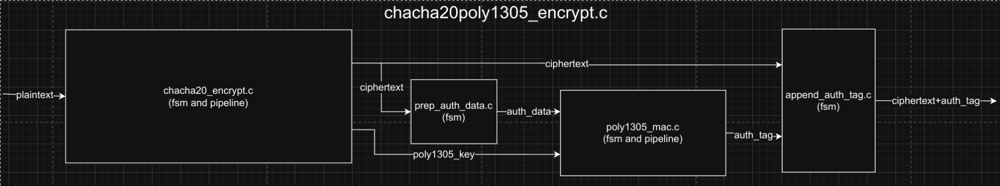
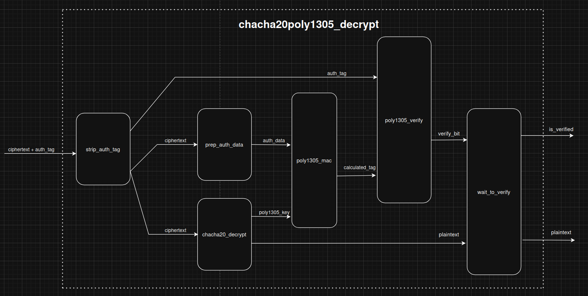

<!--
SPDX-FileCopyrightText: 2026 Chili.CHIPS*ba

SPDX-License-Identifier: BSD-3-Clause
-->

# Encryption and Decryption using PipelineC

In this section we will present the architecture of our *chacha20poly1305 encryption* and *decryption*. Both *encryption* and *decryption* have been built with [PipelineC](https://github.com/JulianKemmerer/PipelineC).
For both *encryption* and *decryption* we will present a diagram that showcases how everything is connected together, after which we will explain each block in detail.

# Encryption

    

In this section we will present the *encryption* block's structure. The architecture is displayed on the graph above. The goal of the *encryption* block is to take *plaintext* as it's input, the block will cyphere the input text and output the encrypted text. Alongside the encrypted text, as the output of this block we also have the authentiaction tag, both the tag and the encrypted text are streamed one after the other (first the ciphertext and then the tag).
As the graph above shows, the *encryption* is consisted of four blocks: *chacha20_pipeline_shared*, prep_auth_data*, *poly1305_pipeline_shared* and *append_auth_tag*. TThe *chacha20_pipeline_shared* and *poly1305_pipeline_shared* blocks are used in both *encryption* and *decryption*, that's why these blocks are pipelines shared between the two blocks. Both pipelines have a multiplexer on their respected inputs and choose which inputs they will take. This way we manage to save space by having only one block instead of having two blocks each.
A detailed description of each block used for the *encryption* is given bellow.
We will prsent the two shared blocks in this section, since they are the same for decryption we will only describe them once.

## chacha20_pipeline_shared

The `chacha20_pipeline_shared` module implements resource sharing for the highly complex and resource-intensive ChaCha20 block function. Since the core calculation logic for encryption and decryption is identical (both rely on generating a keystream), this module instantiates a single, shared hardware pipeline (`chacha20_pipeline`) and multiplexes two independent client interfaces (Encrypt and Decrypt) onto it.

The main function, `chacha20_sharing_mux`, manages the round-robin scheduling for inputs and the demultiplexing of results based on a transaction ID.

### Shared Pipeline Architecture

To enable sharing, the core `chacha20_loop_body` pipeline is wrapped to include a 1-bit identification tag (`is_encrypt`):

$$\text{Pipeline Input}: (\mathbf{data}, \mathbf{is\_encrypt})$$
$$\text{Pipeline Output}: (\mathbf{result}, \mathbf{is\_encrypt})$$

This tag is propagated through all 64 stages of the pipeline to ensure that the result is correctly routed back to the requestor upon exit.

### Global Interfaces

The module exposes two distinct, named interfaces, which allow the separate Encrypt and Decrypt FSMs to access the shared pipeline transparently:

| Interface Name | Direction | Type | Description |
| :--- | :--- | :--- | :--- |
| `chacha20_encrypt_pipeline_in` | Input | `stream(chacha20_loop_body_in_t)` | Input stream for encryption requests. |
| `chacha20_encrypt_pipeline_out` | Output | `stream(axis512_t)` | Output stream for encryption results (the 512-bit keystream block). |
| `chacha20_decrypt_pipeline_in` | Input | `stream(chacha20_loop_body_in_t)` | Input stream for decryption requests. |
| `chacha20_decrypt_pipeline_out` | Output | `stream(axis512_t)` | Output stream for decryption results. |

### Sharing and Muxing Logic (`chacha20_sharing_mux`)

The core logic manages two operations: **Input Multiplexing** and **Output Demultiplexing**.

#### 1. Input Multiplexing (Round-Robin Scheduling)

The input selection is handled by a static flip-flop (`is_encrypt`) which alternates between the two request streams on every cycle:
* The `chacha20_pipeline_in` data structure is populated with data from either `chacha20_encrypt_pipeline_in` or `chacha20_decrypt_pipeline_in` based on the current state of `is_encrypt`.
* The `is_encrypt` tag is set on the shared pipeline input to identify the owner of the transaction.
* The ready signal from the shared pipeline (`chacha20_pipeline_in_ready`) is routed back to the currently selected input stream (`_in_ready`).
* The static variable `is_encrypt` is **toggled** (`~is_encrypt`) every clock cycle, ensuring a fair round-robin scheduling policy, regardless of whether the selected input stream had valid data.

#### 2. Output Demultiplexing (ID-based Routing)

The output from the shared pipeline is routed based on the `is_encrypt` tag that was preserved throughout the pipeline stages:
* When a valid result emerges from the shared pipeline (`chacha20_pipeline_out.valid`), the module checks `chacha20_pipeline_out.data.is_encrypt`.
* If the tag is **1**, the result is routed to `chacha20_encrypt_pipeline_out`.
* If the tag is **0**, the result is routed to `chacha20_decrypt_pipeline_out`.
* The ready signal for the shared pipeline (`chacha20_pipeline_out_ready`) is asserted only when the corresponding target output stream is ready to accept the data, correctly applying back-pressure.

## prep_auth_data

The `prep_auth_data` module is a critical stream-processing component responsible for assembling and formatting the input data stream required by the Poly1305 authenticator.

It correctly concatenates the three components that Poly1305 must authenticate, ensuring each block is zero-padded to a 16-byte boundary as specified in RFC 8439 for ChaCha20-Poly1305.

### Poly1305 Data Format

The module outputs a single AXI stream in the following fixed sequence:

$$\text{Authenticated Stream} = \text{AAD}^* || \text{Ciphertext}^* || \text{Lengths}$$

Where:
* **$\text{AAD}^*$**: Additional Authenticated Data (AAD), padded with zeros to the next 16-byte boundary.
* **$\text{Ciphertext}^*$**: The Ciphertext stream, padded with zeros to the next 16-byte boundary.
* **$\text{Lengths}$**: A fixed 16-byte block containing two 64-bit little-endian integers: the actual AAD length, followed by the actual Ciphertext length.

### Inputs and Outputs

| Port Name | Direction | Type | Description |
| :--- | :--- | :--- | :--- |
| `aad` | Input | `uint8_t[AAD_MAX_LEN]` | The AAD block (read once, not streamed). |
| `aad_len` | Input | `uint8_t` | The length of the AAD block. |
| `prep_auth_data_axis_in` | Input | `stream(axis128_t)` | Input AXI stream carrying the Ciphertext. |
| `prep_auth_data_axis_in_ready` | Output | `uint1_t` | Indicates readiness to consume Ciphertext. |
| `prep_auth_data_axis_out` | Output | `stream(axis128_t)` | Output AXI stream carrying the Poly1305 authenticated data. |
| `prep_auth_data_axis_out_ready` | Input | `uint1_t` | Readiness signal from the Poly1305 core. |

### Finite State Machine (FSM) Description

The FSM uses a static `counter` to track remaining AAD bytes or accumulated Ciphertext bytes.

#### 1. `IDLE` State

* **Entry Condition:** Reset or completion of the last authentication sequence (`LENGTHS` state finish).
* **Transition:** Waits for the first valid word of the incoming Ciphertext stream (`axis_in.valid`).
* **Next State:**
    * If `aad_len > 0`: Transition to `AAD_STATE`.
    * If `aad_len == 0`: Transition to `CIPHERTEXT` (bypassing AAD).

#### 2. `AAD_STATE`

* **Function:** Streams out the AAD data, followed by necessary zero-padding to complete the current 16-byte block (if `counter` drops below 16).
* **Data Handling:** Reads from the internal `aad_reg`.
* **TLAST:** The output `tlast` is **not** asserted, as the ciphertext follows.
* **Counter:** Decremented by 16 bytes upon a successful transfer.
* **Next State:** Transitions to `CIPHERTEXT` once all AAD (and its padding) has been streamed out (`counter \le 16` and transfer completes).

#### 3. `CIPHERTEXT` State

* **Function:** Streams the incoming Ciphertext data directly to the output.
* **Padding:** Overrides any bytes in the output data to $\mathbf{0}$ where the input `tkeep` is $\mathbf{0}$ (this enforces the required zero-padding for the final block).
* **TLAST:** Output `tlast` is **de-asserted** (`tlast=0`), even if the input `axis_in.data.tlast` is high, because the `LENGTHS` block must follow.
* **Counter:** The static `counter` is incremented by the number of bytes indicated by the *input* stream's `tkeep` (the true ciphertext length).
* **Next State:** Transitions to `LENGTHS` upon seeing the `tlast` signal from the input Ciphertext stream.

#### 4. `LENGTHS` State

* **Function:** Outputs the final 16-byte block containing the lengths.
* **Data Handling:**
    * Bytes 0-7: AAD length (`aad_len`) as a 64-bit little-endian integer.
    * Bytes 8-15: Ciphertext length (`counter`) as a 64-bit little-endian integer.
* **TLAST:** Output `tlast` is **asserted** (`tlast=1`) to signal the end of the entire authenticated data stream.
* **Next State:** Transitions back to `IDLE` upon a successful transfer of the `LENGTHS` block.

## poly1305_pipeline_shared

The `poly1305_pipeline_shared` module (implemented by the `poly1305_mac_sharing_mux` function) enables area-efficient reuse of the high-latency, 320-bit Poly1305 MAC loop body pipeline. Since the iterative accumulation logic is identical for both encryption and decryption operations, a single hardware resource is instantiated and dynamically shared between the two cryptographic paths.

The core mechanism involves embedding a 1-bit transaction ID (referred to as `id` or implicitly `is_encrypt`) into the transaction envelope.

### Shared Pipeline Architecture

The module uses the `GLOBAL_PIPELINE_INST_W_VALID_ID` macro, which automatically wraps the `poly1305_mac_loop_body` core function to include a dedicated ID bit that propagates through the pipeline. This bit identifies the original requestor (Encrypt or Decrypt).

| Pipeline Component | Data Width | ID Included | Description |
| :--- | :--- | :--- | :--- |
| **Input (`_in`)** | `poly1305_mac_loop_body_in_t` | Yes (`_in_id`) | Contains block bytes, $\mathbf{r}$ key, and previous accumulator $\mathbf{a}$. |
| **Output (`_out`)** | `u320_t` | Yes (`_out_id`) | The resulting 320-bit accumulator $\mathbf{a}_{i+1}$ value. |

### Global Interfaces

The sharing module presents four distinct, synchronous global interfaces to hide the sharing mechanism from the client FSMs:

| Port Name | Direction | Data Type | Role |
| :--- | :--- | :--- | :--- |
| `poly1305_mac_encrypt_pipeline_in` | Input | `poly1305_mac_loop_body_in_t` | Input from the Encryption MAC FSM. |
| `poly1305_mac_decrypt_pipeline_in` | Input | `poly1305_mac_loop_body_in_t` | Input from the Decryption/Verification MAC FSM. |
| `poly1305_mac_encrypt_pipeline_out` | Output | `u320_t` | Output to the Encryption MAC FSM (new $\mathbf{a}$). |
| `poly1305_mac_decrypt_pipeline_out` | Output | `u320_t` | Output to the Decryption/Verification MAC FSM (new $\mathbf{a}$). |

### Sharing and Muxing Logic (`poly1305_mac_sharing_mux`)

The sharing logic manages the input selection via a round-robin approach and the output routing via the embedded ID.

#### 1. Input Multiplexing (Round-Robin)

* **Scheduler:** A static register (`is_encrypt`) toggles every clock cycle, defining which client interface is selected to drive the shared pipeline input.
* **Data Injection:** Data from the selected stream (`_encrypt_in` or `_decrypt_in`) is passed to the shared pipeline input (`poly1305_mac_pipeline_in`).
* **ID Tagging:** The `is_encrypt` register value is explicitly written to the shared pipeline's ID port (`poly1305_mac_pipeline_in_id`).
* **Ready Signal:** The ready signals for both input streams (`_in_ready`) are **unconditionally asserted (`= 1`)**. This relies on the surrounding FSM logic to handle synchronization and back-pressure, operating in a highly optimized push-based manner.

#### 2. Output Demultiplexing (ID-Based Routing)

* When a valid result emerges from the shared pipeline (`poly1305_mac_pipeline_out_valid`), the `poly1305_mac_pipeline_out_id` is inspected.
* If the ID matches the Encrypt tag (1), the result (`u320_t`) is routed to `poly1305_mac_encrypt_pipeline_out`.
* If the ID matches the Decrypt tag (0), the result is routed to `poly1305_mac_decrypt_pipeline_out`.
* The valid signal for the corresponding output stream is asserted. Back-pressure handling for the shared pipeline is implicitly managed by the output receiver's readiness, ensuring no data is dropped.

## append_auth_tag

The `append_auth_tag` module is responsible for the final stage of the ChaCha20-Poly1305 encryption process. Its sole function is to stream the received Ciphertext data from the core, and upon completion, append the 16-byte Poly1305 Authentication Tag (MAC) as the final AXI word.

This ensures the combined stream is correctly structured for the consumer as the Ciphertext followed by the MAC. The module manages the critical `tlast` signal to accurately mark the end of the entire authenticated message.

### Inputs and Outputs

The module manages two input streams and one output stream.

| Port Name | Direction | Type | Description |
| :--- | :--- | :--- | :--- |
| `append_auth_tag_axis_in` | Input | `stream(axis128_t)` | Input AXI stream carrying the Ciphertext. |
| `append_auth_tag_axis_in_ready` | Output | `uint1_t` | Ready signal to consume the Ciphertext stream. |
| `append_auth_tag_auth_tag_in` | Input | `stream(poly1305_auth_tag_uint_t)` | 16-byte Authentication Tag output from the Poly1305 core. |
| `append_auth_tag_auth_tag_in_ready` | Output | `uint1_t` | Ready signal to consume the Auth Tag. |
| `append_auth_tag_axis_out` | Output | `stream(axis128_t)` | Output AXI stream: Ciphertext followed by the 16-byte Tag. |
| `append_auth_tag_axis_out_ready` | Input | `uint1_t` | Ready signal from the consumer. |

### Finite State Machine (FSM) Description

The module uses a simple two-state FSM to sequence the Ciphertext pass-through and the final tag append.

#### 1. `CIPHERTEXT` State

* **Function:** This is the pass-through state. The module forwards the incoming Ciphertext AXI stream (`append_auth_tag_axis_in`) directly to the output (`append_auth_tag_axis_out`).
* **Ready Signal:** The input ready signal (`append_auth_tag_axis_in_ready`) is directly coupled to the output ready signal (`append_auth_tag_axis_out_ready`) to propagate back-pressure.
* **TLAST Handling (CRITICAL):** The input `tlast` signal from the Ciphertext stream is **suppressed** (`append_auth_tag_axis_out.data.tlast = 0`). This is necessary because the data block is *not* the true end of the transaction; the authentication tag must follow.
* **Transition:** Transitions to the `AUTH_TAG` state when the input `tlast` is observed and the current transfer is valid and accepted by the output consumer.

#### 2. `AUTH_TAG` State

* **Function:** This state inserts the 16-byte authentication tag as the final word of the transaction.
* **Data Mapping:** The 128-bit authentication tag data (`append_auth_tag_auth_tag_in.data`) is mapped directly to the output AXI data payload (`tdata`).
* **TLAST Assertion:** The output `tlast` signal is **asserted** (`append_auth_tag_axis_out.data.tlast = 1`) to signal the definite end of the combined stream.
* **Ready Signal:** The authentication tag input ready signal (`append_auth_tag_auth_tag_in_ready`) is driven by the output ready signal.
* **Transition:** Transitions back to the `CIPHERTEXT` state (or `IDLE` in a complete FSM, although here it is `CIPHERTEXT`) when the tag transfer is valid and accepted by the output consumer. This prepares the module for the next transaction.

# Decryption

    

The picture above presents the *Decryption* block. We can see right away that this block uses a couple more blocks than it's encryption counterpart. Still, it uses the same *chacha20_pipeline_shared* and *poly305_pipeline_shared* blocks that we described in the previous section. In this section we will showcase in detail the remaining four blocks that are used for the *decryption*: *strip_auth_tag*, *prep_auth_tag*, *poly1305_verify* and *wait_to_verify*.

## strip_auth_tag

The `strip_auth_tag` module performs the inverse operation of `append_auth_tag`. It takes an AXI stream containing the Ciphertext followed by the 16-byte Poly1305 Authentication Tag (MAC) and separates them into two distinct outputs: the Ciphertext stream and the MAC value.

This module is designed to operate in a decryption and verification pipeline, where the Ciphertext is sent to memory/storage, and the MAC is passed to the Poly1305 verification unit. A key design element is the use of an internal look-ahead buffer to determine the true `tlast` for the Ciphertext stream (i.e., the block *before* the MAC).

### Architecture: The `axis128_early_tlast` Look-Ahead

Since the MAC block is identified by the incoming stream's `tlast` signal, the block immediately preceding it is the *true* last Ciphertext block. To correctly assert `tlast` on the Ciphertext output at the right time, the module uses a custom block called `axis128_early_tlast` to buffer one AXI word.

This buffer allows the module to peek at the *next* incoming block. If the next block has `tlast=1`, the current block being processed is marked as the last Ciphertext block.

## Inputs and Outputs

| Port Name | Direction | Type | Description |
| :--- | :--- | :--- | :--- |
| `strip_auth_tag_axis_in` | Input | `stream(axis128_t)` | Input AXI stream containing the Ciphertext followed by the Tag. |
| `strip_auth_tag_axis_in_ready` | Output | `uint1_t` | Ready signal to consume the incoming stream. |
| `strip_auth_tag_axis_out` | Output | `stream(axis128_t)` | Output AXI stream containing only the Ciphertext. |
| `strip_auth_tag_axis_out_ready` | Input | `uint1_t` | Ready signal from the Ciphertext consumer. |
| `strip_auth_tag_auth_tag_out` | Output | `stream(poly1305_auth_tag_uint_t)` | Output stream containing the separated 16-byte Authentication Tag. |
| `strip_auth_tag_auth_tag_out_ready` | Input | `uint1_t` | Ready signal from the MAC consumer (Poly1305 verifier). |

### Operational Flow

#### 1. Look-Ahead and Buffer (`axis128_early_tlast`)

The input data passes through the `axis128_early_tlast` function:
* It buffers the most recently received AXI word.
* It determines if the *next* word waiting at the input has `tlast=1`. This signal (`next_axis_out_is_tlast`) is used to correctly terminate the Ciphertext output stream.
* The function ensures back-pressure is correctly applied if the buffer is full.

#### 2. Ciphertext Pass-Through (Default Operation)

* **Data:** By default, the output from the look-ahead buffer (`axis_in`) is passed directly to the Ciphertext output (`strip_auth_tag_axis_out`).
* **TLAST Correction:** The output `tlast` signal on the Ciphertext output is driven by `early_tlast.next_axis_out_is_tlast`. This asserts `tlast` on the block *before* the MAC block.
* **Ready Signal:** The ready signal for the main loop (`ready_for_axis_in`) is normally tied to the Ciphertext output's ready signal (`strip_auth_tag_axis_out_ready`).

#### 3. Auth Tag Extraction (Final Cycle)

* **Condition:** If the buffered input word (`axis_in`) has both `valid=1` and `tlast=1`, the block is the Authentication Tag.
* **Ciphertext Suppression:** The Ciphertext output stream (`strip_auth_tag_axis_out`) is suppressed (`valid = 0`).
* **MAC Output:** The data payload (`axis_in.data.tdata`) is interpreted as the 128-bit MAC using `poly1305_auth_tag_uint_from_bytes()` and driven onto the `strip_auth_tag_auth_tag_out` stream.
* **Ready Signal Update:** The main loop's ready signal is momentarily switched to be driven by the MAC consumer's ready signal (`strip_auth_tag_auth_tag_out_ready`), ensuring the MAC is only consumed when the Poly1305 verifier is ready.

## prep_auth_data

The `prep_auth_data` module (implemented by the `prep_auth_data_fsm` function) is a critical component for constructing the required input stream for the Poly1305 Message Authentication Code (MAC) calculation, adhering strictly to the format defined in RFC 8439.

The module receives the fixed Additional Authenticated Data (AAD) and the streaming Ciphertext, and then generates a single, contiguous AXI stream that Poly1305 must process.

### Poly1305 Authenticated Data Format

The module outputs a single AXI stream with the following structure, ensuring all intermediate blocks ($\text{AAD}^*$ and $\text{Ciphertext}^*$) are zero-padded to the next 16-byte boundary:

$$\text{Authenticated Stream} = \text{AAD}^* || \text{Ciphertext}^* || \text{Lengths}$$

Where:
* **$\text{AAD}^*$**: The AAD, followed by the zero-padding needed to reach a multiple of 16 bytes.
* **$\text{Ciphertext}^*$**: The Ciphertext, followed by the zero-padding needed to reach a multiple of 16 bytes.
* **$\text{Lengths}$**: A fixed 16-byte block containing two 64-bit little-endian integers: the actual AAD length, followed by the actual Ciphertext length.

### Inputs and Outputs

| Port Name | Direction | Type | Description |
| :--- | :--- | :--- | :--- |
| `_aad` | Input | `uint8_t[AAD_MAX_LEN]` | The AAD block (read once). |
| `_aad_len` | Input | `uint8_t` | The length of the AAD block. |
| `_axis_in` | Input | `stream(axis128_t)` | Input AXI stream carrying the Ciphertext. |
| `_axis_in_ready` | Output | `uint1_t` | Indicates readiness to consume Ciphertext. |
| `_axis_out` | Output | `stream(axis128_t)` | Output AXI stream carrying the Poly1305 authenticated data. |
| `_axis_out_ready` | Input | `uint1_t` | Readiness signal from the Poly1305 core. |

### Finite State Machine (FSM) Description

The FSM uses a 16-byte block-based approach for streaming and a static counter to track the true length of the Ciphertext.

| State | Action and Logic | Counter Management | Transition Condition |
| :--- | :--- | :--- | :--- |
| **IDLE** | Waits for the first valid word of the incoming Ciphertext stream (`_axis_in.valid`). Initializes internal state. | Resets `counter` to 0. | Input valid. $\rightarrow$ `AAD_STATE` (if `aad_len > 0`) or $\rightarrow$ `CIPHERTEXT` (if `aad_len == 0`). |
| **AAD\_STATE** | Streams out AAD data from the internal `aad_reg`. Output `tkeep` is fully asserted (16 bytes). Zero-padding occurs implicitly by shifting out 16 bytes per cycle until the total length is exhausted. | `counter` is initialized with `aad_len` and decremented by 16 upon each successful transfer. | `counter` $\le 16$ and the last block transfer completes. $\rightarrow$ `CIPHERTEXT` |
| **CIPHERTEXT** | Passes the incoming Ciphertext stream to the output. **Crucially, the input `tlast` is suppressed (`tlast=0`) and the output stream data is explicitly zero-filled where the input `tkeep` is low.** | `counter` accumulates the *actual* byte count of the Ciphertext using `axis128_keep_count`. | Input `tlast` is observed. $\rightarrow \text{LENGTHS}$ |
| **LENGTHS** | Outputs a single, final 16-byte AXI word containing the AAD length (64-bit LE) and the accumulated Ciphertext length (64-bit LE). | Not managed. | Output transfer completes. $\rightarrow \text{IDLE}$ |

## poly1305_verify_decrypt

The `poly1305_verify_decrypt` module is the final arbiter in the authentication process for ChaCha20-Poly1305. Its sole responsibility is to receive the Authentication Tag provided with the incoming message (`poly1305_verify_auth_tag`) and the tag calculated locally by the `poly1305_mac` module (`poly1305_verify_calc_tag`). It performs a single, atomic 128-bit comparison to determine if the message is authentic, outputting a 1-bit match result.

The verification result is critical: if the tags match (1), the decrypted ciphertext is considered valid; if they do not match (0), the ciphertext must be discarded to prevent padding oracle or related attacks.

### Inputs and Outputs

The module manages two input streams (Tags) and one output stream (Result).

| Port Name | Direction | Type | Description |
| :--- | :--- | :--- | :--- |
| `poly1305_verify_auth_tag` | Input | `stream(poly1305_auth_tag_uint_t)` | The 16-byte Authentication Tag received from the network (via `strip_auth_tag`). |
| `poly1305_verify_auth_tag_ready` | Output | `uint1_t` | Ready signal for the input received tag stream. |
| `poly1305_verify_calc_tag` | Input | `stream(poly1305_auth_tag_uint_t)` | The 16-byte Tag calculated locally by the `poly1305_mac` module. |
| `poly1305_verify_calc_tag_ready` | Output | `uint1_t` | Ready signal for the input calculated tag stream. |
| `poly1305_verify_tags_match` | Output | `stream(uint1_t)` | 1-bit result: 1 if tags are identical, 0 otherwise. |
| `poly1305_verify_tags_match_ready` | Input | `uint1_t` | Ready signal from the consumer of the verification result. |

### Finite State Machine (FSM) Description

The FSM sequentially consumes the two input tags and then performs the comparison, ensuring correct synchronization between the two independent input streams before generating the output.

| State | FSM Action | Input/Output Handshake | Next State Transition |
| :--- | :--- | :--- | :--- |
| **TAKE\_AUTH\_TAG** | Asserts readiness for the incoming Authentication Tag (`poly1305_verify_auth_tag_ready = 1`). | On valid data transfer, reads and registers the received tag (`auth_tag_reg`). | Successful transfer. $\rightarrow$ `TAKE_CALC_TAG` |
| **TAKE\_CALC\_TAG** | Asserts readiness for the locally Calculated Tag (`poly1305_verify_calc_tag_ready = 1`). | On valid data transfer, reads and registers the calculated tag (`calc_tag_reg`). | Successful transfer. $\rightarrow$ `COMPARE_TAGS` |
| **COMPARE\_TAGS** | Performs the 128-bit equality check: `tags_match_reg = (auth_tag_reg == calc_tag_reg)`. This operation is combinatorial and completes in a single clock cycle. | No I/O handshake is needed in this state, as it uses internal registers. | Unconditional transition. $\rightarrow$ `OUTPUT_COMPARE_RESULT` |
| **OUTPUT\_COMPARE\_RESULT** | Outputs the result stored in `tags_match_reg` and asserts the output stream valid signal. | Waits until the consumer asserts `poly1305_verify_tags_match_ready`. | Successful output transfer. $\rightarrow$ `TAKE_AUTH_TAG` (Reset for next transaction). |

## wait_to_verify

The `wait_to_verify` module is the final gate in the decryption pipeline. In the ChaCha20-Poly1305 scheme, plaintext is generated *before* the authentication tag is calculated and verified. This module synchronizes the plaintext output with the verification result.

It acts as a **synchronous buffer (FIFO)**:
1.  **Buffering:** It immediately buffers the incoming plaintext into a FIFO.
2.  **Waiting:** It waits until the 1-bit verification result (`wait_to_verify_verify_bit`) arrives from the comparator.
3.  **Outputting:** Once the verification result is known, it either allows the buffered plaintext to stream out (if verified) or keeps it permanently buffered (if verification failed, preventing invalid data from leaving the chip).

### Architecture and Components

The module primarily relies on an embedded **Global Stream FIFO** (`verify_fifo`) with a depth of 128 words (2KB of data), large enough to buffer several standard AXI stream packets while the Poly1305 MAC calculation completes.

### Inputs and Outputs

| Port Name | Direction | Type | Description |
| :--- | :--- | :--- | :--- |
| `wait_to_verify_axis_in` | Input | `stream(axis128_t)` | The incoming Plaintext stream (output from the ChaCha20 decryptor). |
| `wait_to_verify_axis_in_ready` | Output | `uint1_t` | Ready signal (derived from FIFO not-full status). |
| `wait_to_verify_verify_bit` | Input | `stream(uint1_t)` | 1-bit result from the `poly1305_verify_decrypt` module. |
| `wait_to_verify_verify_bit_ready` | Output | `uint1_t` | Ready signal for the verification bit input. |
| `wait_to_verify_axis_out` | Output | `stream(axis128_t)` | The outgoing Plaintext stream (released only after verification). |
| `wait_to_verify_axis_out_ready` | Input | `uint1_t` | Ready signal from the plaintext consumer. |
| `wait_to_verify_is_verified_out` | Output | `uint1_t` | Outputs the verification result (`tags_match_reg`) synchronized with the stream output. |

### Finite State Machine (FSM) Description

The FSM controls the read enable of the FIFO and manages the timing of the verification result output.

| State | FSM Action | FIFO Read/Write | Next State Transition |
| :--- | :--- | :--- | :--- |
| **WAIT\_TO\_VERIFY\_BIT** | **Input Side:** Plaintext is continuously written into the FIFO (`verify_fifo`) as long as space is available. **Output Side:** FIFO Read Enable is **de-asserted** (`verify_fifo_out_ready = 0`). Plaintext is buffered. | Asserts readiness for the single-bit verification result (`wait_to_verify_verify_bit_ready = 1`). | Verification bit received (`wait_to_verify_verify_bit.valid = 1`). $\rightarrow$ `OUTPUT_PLAINTEXT` |
| **OUTPUT\_PLAINTEXT** | **Condition:** This state is only entered once the verification bit is received. **Data Release:** FIFO Read Enable is asserted (`verify_fifo_out_ready = wait_to_verify_axis_out_ready`), allowing the plaintext to stream out. | Outputs the static verification result (`tags_match_reg`) via `wait_to_verify_is_verified_out`, synchronized with the plaintext stream valid signal. | When the output stream is valid and accepted (`wait_to_verify_axis_out.valid & wait_to_verify_axis_out_ready`) AND the stream's `tlast` signal is observed. $\rightarrow$ `WAIT_TO_VERIFY_BIT` (Reset for next transaction). |

**Security Note:** If the verification result (`tags_match_reg`) is 0 in the `OUTPUT_PLAINTEXT` state, the plaintext stream is still ready to output, but the accompanying signal `wait_to_verify_is_verified_out` will be 0. If the zero does occur the system will drop the output plaintext.
