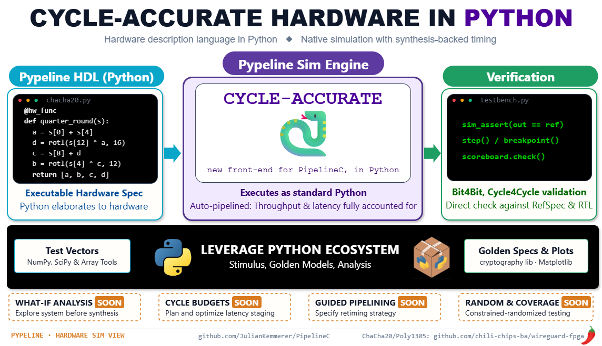

# pypeline_build — ChaCha20-Poly1305 AEAD in Pypeline

Pypeline (Python front-end for PipelineC) port of the C designs in
`../pipelinec_build/`. Same three design variants, same Artix-7
xc7a200tffg1156-2 @ 80 MHz target — but with the C originals' Poly1305 math
and ciphertext-length bugs fixed, so this port is RFC 8439-conformant and its
tags/ciphertext lengths deliberately differ from the (still-unfixed) C
designs (see "Test Vectors" below).

Each of the three design variants has **two testbench styles**: a
synthesizable-style testbench (fixed vectors, compiles through cocotb/GHDL or
real hardware) and a non-synthesizable testbench (`@sim_input`/`@sim_output`,
on-the-fly random vectors, native sim only) — see "Testbench Styles" below.

<p align="center">
  
</p>

## Build Commands

The `$PYPELINEC` environment variable must point to the PipelineC executable
(`<PipelineC repo>/src/pypelinec`) before running any build script — both the
scripts and the design files' `sys.path` bootstrap (`src/pypeline_env.py`)
use it to locate the repo (with a fallback to the sibling `../../../PipelineC`
checkout).

**Native Pypeline sim — non-synthesizable testbench (fastest to iterate on;
`@sim_input`/`@sim_output`, on-the-fly random vectors — see "Testbench
Styles" below):**
```bash
./build.py --enc --sim --comb --native     # Combinational sim, encrypt TB
./build.py --dec --sim --comb --native     # Combinational sim, decrypt TB
./build.py --shared --sim --comb --native  # Combinational sim, shared TB
./build.py --enc --sim --native            # Pipelined sim, encrypt TB (slow!)
./build.py --dec --sim --native            # Pipelined sim, decrypt TB (slow!)
./build.py --shared --sim --native         # Pipelined sim, shared TB (slow!)
```
These don't invoke GHDL/cocotb or generate real VHDL at all, and this
testbench style has no cocotb/GHDL equivalent (see "Testbench Styles" below
for why) — the `--native` (`--comb` or not) forms are the only way to run
it. Dropping `--comb` runs a real, cycle-accurate pipelined native
simulation: real autopipelining runs through the synthesis tool first to
discover each submodule's latency (like the pipelined cocotb/GHDL builds
below), then the native simulator emulates those latencies — which is what
makes it slow. Pass criteria: the build exits zero. Every testbench calls
`sim_assert(...)` on every check (correct ciphertext/plaintext bytes, `keep`
pattern, packet framing, and the tampered-tag packets' `is_verified_out`)
and `sim_finish()` once all packets are checked, so a failure raises
`AssertionError` immediately in native sim (or, downstream, a VHDL `assert
... severity failure` under cocotb/GHDL) and the process exits non-zero —
no more eyeballing console output for `ERROR`/`DONE` lines. The RNG seed in
use is printed at the start of each run (`tb_common_sim.DEFAULT_SEED` by
default) so a failing run's exact vectors can be reproduced.

**Native Pypeline sim — synthesizable-style testbench (fixed vectors; no
cocotb/GHDL, Pypeline's own Python simulator):**
```bash
./build.py --enc --sim --syn_tb --comb --native     # Combinational sim, encrypt TB
./build.py --dec --sim --syn_tb --comb --native     # Combinational sim, decrypt TB
./build.py --shared --sim --syn_tb --comb --native  # Combinational sim, shared TB
./build.py --enc --sim --syn_tb --native            # Pipelined sim, encrypt TB (slow!)
./build.py --dec --sim --syn_tb --native            # Pipelined sim, decrypt TB (slow!)
./build.py --shared --sim --syn_tb --native         # Pipelined sim, shared TB (slow!)
```
The `--comb` forms are the quickest correctness check for the
synthesizable-style testbench while iterating on the `.py` sources — run
these before the slower cocotb/GHDL variants below. Dropping `--comb` here
runs the same real-autopipelining-first, cycle-accurate native simulation as
the non-synthesizable testbench above, without needing cocotb/GHDL at all —
useful for a cycle-accurate pipelined check that's still faster to iterate
on than the full pipelined cocotb/GHDL build. Pass criteria: the build exits
zero, per the same `sim_assert`/`sim_finish` behavior described above.

**Simulate with cocotb + GHDL (the designs' acceptance tests — synthesizable-style
testbench only, see "Testbench Styles" below):**
```bash
./build.py --enc --sim --syn_tb --comb     # Combinational sim, encrypt TB
./build.py --dec --sim --syn_tb --comb     # Combinational sim, decrypt TB
./build.py --shared --sim --syn_tb --comb  # Combinational sim, shared TB (slow!)
./build.py --enc --sim --syn_tb            # Pipelined sim, encrypt TB (hours!)
./build.py --dec --sim --syn_tb            # Pipelined sim, decrypt TB (hours!)
./build.py --shared --sim --syn_tb         # Pipelined sim, shared TB (hours!)
```
Pass criteria: the build exits zero — every check in `tb_common.py`'s fixed
vectors (per side, one `Test N DONE!`-covered check per string in
`PLAINTEXT_TEST_STRS`, plus one extra decrypt-side check for the
corrupted-tag negative packet, see "Test Vectors" below) is a `sim_assert(...)`
that elaborates to a real VHDL `assert ... severity failure`, so a failing
check halts the GHDL simulation and the process exits non-zero — not just a
human scanning the log for `ERROR` lines. The pipelined (not `--comb`)
variants run real autopipelining through the synthesis tool first, which is
what takes hours.

**Generate Verilog (for FPGA synthesis):**
```bash
./build.py --enc      # Standalone encrypt
./build.py --dec      # Standalone decrypt
./build.py --shared   # Shared encrypt+decrypt
```

**Measure QoR — fmax, area, throughput, latency (see "Measuring QoR" below):**
```bash
./measure.py --label shared-80mhz   # autopipeline for 80 MHz, then measure (hours)
./measure.py --label X --reuse-syn  # re-measure, reusing the cached synthesis
./build.py --shared --perf          # the underlying build/sim on its own
./build.py --shared --perf --comb    # fast rig check (no synthesis, no area/fmax)
```

## Source Layout (mirrors ../pipelinec_build/src/)

```
src/
  pypeline_env.py               sys.path bootstrap (import first in every file)
  aead_types.py                 shared sizes/types (axis128/axis512, streams, null helpers)
  chacha20/
    chacha20.py                 ChaCha20 math + pipeline-control FSM + chacha20_instance
                                 (FSM and stream pipeline merged into one function; chacha20.h)
    chacha20_pipeline_shared.py the one shared pipeline + round-robin mux, merged into one
                                 function, plus chacha20_encrypt_shared/chacha20_decrypt_shared
                                 (the shared design's per-direction instances that read/write
                                 this file's Wires — chacha20_pipeline_shared.c)
  poly1305/
    poly1305.py                 u320 limb math + MAC FSM + poly1305_mac_instance
                                 (FSM and MCP compute merged into one function; poly1305.h)
    poly1305_verify_decrypt.py  tag comparison FSM
  prep_auth_data/
    prep_auth_data.py           AAD||ciphertext||lengths framing FSM (prep_auth_data_fsm,
                                 called directly by both directions; prep_auth_data.h)
  auth_tag/
    append_auth_tag.py          merge tag into ciphertext's final beat + a tag-tail beat
                                 (encrypt output; Xilinx-style packed framing, issue #44)
    strip_auth_tag.py           reassemble the tag from the last two input beats
                                 (decrypt input, early-tlast buffer; issue #44)
    wait_to_verify.py           128-deep FIFO + wait-for-verdict FSM, merged into one
                                 function, holding plaintext until tag verdict
  chacha20poly1305/
    chacha20poly1305_encrypt_ports.py   DUT-facing global wires (the .h wires)
    chacha20poly1305_encrypt_hw_io.py   flattened Input[]/Output[] ports + io conversion MAIN
    chacha20poly1305_decrypt_ports.py / chacha20poly1305_decrypt_hw_io.py
    encrypt_dataflow_core.py / decrypt_dataflow_core.py   make_encrypt_dataflow_core /
                                 make_decrypt_dataflow_core: factories returning the direct-call
                                 dataflow graph, parameterized by which chacha20 instance feeds
                                 it (see "Wiring Style: Old vs New" below)
    encrypt_dataflow.py / decrypt_dataflow.py            standalone wiring MAINs (80 MHz):
                                 instantiate the factory with chacha20.chacha20_instance
    encrypt_dataflow_shared.py / decrypt_dataflow_shared.py  shared design: instantiate the
                                 same factory with chacha20_pipeline_shared's
                                 chacha20_encrypt_shared / chacha20_decrypt_shared
    tb_common.py                 synthesizable-style testbench's fixed 10-string vectors,
                                  computed once at elaboration time
    tb_common_sim.py             non-synthesizable testbench's shared support: fixed
                                  KEY/NONCE/AAD + on-the-fly random-packet-length helper
                                  (no precomputed vectors — those are generated lazily,
                                  per packet, during simulation)
    aead_ref_model.py            pure-Python (no pypeline/hardware dependency) reference
                                  model both tb_common.py and tb_common_sim.py call to
                                  generate vectors — see "Test Vectors" below
    encrypt_syn_tb.py / decrypt_syn_tb.py   synthesizable-style testbench MAINs (fixed
                                  vectors, cocotb/GHDL/pipe-compatible)
    encrypt_tb.py / decrypt_tb.py           non-synthesizable testbench MAINs
                                  (@sim_input/@sim_output, on-the-fly random vectors,
                                  native sim only) — see "Testbench Styles" below
    perf_probe.py                plain-Python QoR measurement layer: per-cycle handshake/byte
                                  accounting, per-packet latency, phase sequencer + barrier,
                                  incremental JSON writer, and the internal-tap metric classes
                                  (HandshakeTap/StateTap/ArbTap/TapRegistry)
                                  (no pypeline import) — see "Measuring QoR" above
    perf_tb_common.py            the phase plan + WG_PERF_* env knobs + frame builders and the
                                  shared barrier/recorder/tap singletons (no pypeline import)
    encrypt_perf_tb.py / decrypt_perf_tb.py  performance testbench MAINs: stream the phase plan
                                  with zero source gaps and measure, while still checking every
                                  packet against the reference model (native sim only)
  perf_taps.py                  in-design perf probes (the only pypeline-importing half of
                                 the tap system): @sim_output shims the elaborator deletes, so
                                 probes inside poly1305/chacha20/prep_auth_data/... cost no
                                 hardware — see "Probing inside the design" above
  chacha20poly1305_encrypt.py / _tb.py / _syn_tb.py                    tops (hw / sim non-synth / sim synth)
  chacha20poly1305_decrypt.py / _tb.py / _syn_tb.py
  chacha20poly1305_encrypt_decrypt_shared.py / _tb.py / _syn_tb.py / _perf_tb.py
```

Measurement tooling lives next to `build.py` rather than under `src/` (it is not
part of any design):

```
build.py         --perf selects the performance testbench (implies --sim --native)
measure.py       the QoR orchestrator: build+sim, parse fmax/area, merge, emit JSON/CSV/md
bottleneck.py    internal taps -> per-block throughput/ceiling, an automated bottleneck
                 verdict, and the first-principles model cross-check (--selftest included)
vivado_area.py   this repo's Vivado report_utilization parser (--selftest included)
measurements/    one directory per measured point (results.json, summary.csv, blocks.md, …)
```

## Testbench Styles: Synthesizable vs Non-Synthesizable

Each of the three design variants has two independent testbenches, sharing
the same DUT-facing `*_ports.py` wires but differing entirely in how
stimulus is generated and outputs checked:

- **Synthesizable-style** (`encrypt_syn_tb.py`/`decrypt_syn_tb.py`, driven by
  the `_syn_tb.py` tops): a `@MAIN` hardware state machine streams/checks a
  fixed batch of test vectors — 8 plaintext strings, chosen to cover the
  partial-final-word and block-boundary corner cases — computed once via
  `aead_ref_model.py` at elaboration time and baked into fixed-size
  `Reg[uint8_t[N]]` hardware register arrays (`tb_common.py`). Because this
  testbench is itself synthesizable Pypeline, it can run through cocotb+GHDL
  against real generated VHDL, or through real autopipelining (pipelined,
  not `--comb`, builds) — these are the designs' acceptance tests.
- **Non-synthesizable** (`encrypt_tb.py`/`decrypt_tb.py`, driven by the plain
  `_tb.py` tops): uses Pypeline's `@sim_input`/`@sim_output` decorators to
  generate stimulus and check outputs as arbitrary Python, live,
  cycle-by-cycle during simulation. Each run generates 10 random-length
  (1-1024 byte) packets per direction on the fly — a few pinned to the same
  corner-case lengths as the fixed vectors, the rest uniform-random — calling
  `aead_ref_model.py` lazily, once per packet, right when that packet's
  random plaintext is generated (`tb_common_sim.py`), rather than batching
  everything up front. No fixed-size arrays, no elaboration-time
  pre-baking — packets can be any length. The decrypt side adds an 11th
  packet with a deliberately bit-flipped tag (reject-path coverage,
  mirroring the synthesizable variant's fixed tampered-tag packet). The RNG
  is seeded by default (`tb_common_sim.DEFAULT_SEED`) and the seed is printed
  at the start of each run, so a failing run's exact vectors are
  reproducible.

  `@sim_input`/`@sim_output` calls are entirely invisible to the hardware
  elaborator — skipped unconditionally, whether or not `--sim` is passed —
  so this style **only runs under Pypeline's native `--sim` mode**. Routing
  it through `--cocotb --ghdl` would first generate real VHDL with every
  `@sim_input`/`@sim_output` call site stripped out, leaving no stimulus
  generation or output checking left anywhere — there is no cocotb/GHDL
  variant of this style, `--native` is the only way to run it. Native sim
  does support a pipelined (not `--comb`) run of this style, though, via
  real autopipelining through the synthesis tool followed by native
  latency-emulated simulation (see "Build Commands" above) — no cocotb/GHDL
  needed. Use this style for fast iteration and broader random coverage; use
  the synthesizable style for the cocotb/GHDL acceptance tests.

## Native vs VHDL Cycle-Accuracy Check (`pypeline_sim_debug.py`)

`encrypt_syn_tb.py`/`decrypt_syn_tb.py` tag their per-word data prints —
each 16-byte chunk of input plaintext/ciphertext and output
ciphertext/plaintext — with `sim_print(..., debug=True)`. Each tagged print
sits inside the same `valid & ready`-gated, register-driven block that
drives the rest of that testbench's checking logic, not inside any
pipelined combinational region, satisfying `pypeline_sim_debug.py`'s rules
for probes used in a pipelined (non-`--comb`) compare.

This lets the pipelined syn_tb builds be run through `pypeline_sim_debug.py`
that compares the native
latency-emulated simulation against the real cocotb+GHDL VHDL simulation —
both post-autopipelining, cycle by cycle:

```bash
pypeline_sim_debug.py ./src/chacha20poly1305_encrypt_syn_tb.py --sim --run all
pypeline_sim_debug.py ./src/chacha20poly1305_decrypt_syn_tb.py --sim --run all
pypeline_sim_debug.py ./src/chacha20poly1305_encrypt_decrypt_shared_syn_tb.py --sim --run all
```

Each run does a full synthesis build first (both the native and VHDL sides
need the real, discovered pipeline latencies), then diffs the two runs'
`debug=True`-tagged lines cycle by cycle, reporting the first cycle where
they disagree. Agreement here confirms the native simulator's emulated
per-stage latencies actually match the real autopipelined VHDL timing, not
just that both eventually produce the same final output — a check the
ordinary `sim_assert`-based pass/fail criteria above can't provide on their
own, since assertions on final output data don't catch a data word arriving
correct but on the wrong cycle.

## Measuring QoR (fmax, area, throughput, latency)

The point of this design is to get *faster, smaller, lower latency*, so those
three have to be measurable in one automated, repeatable step rather than
eyeballed per change. `./measure.py` is that step: it produces one
machine-readable record per design variant, and the next variant's record diffs
against it directly.

```bash
./measure.py --label shared-80mhz          # THE measurement: fresh autopipelining + sim
./measure.py --label X --reuse-syn         # sim only, reusing the cached synthesis
./measure.py --label smoke --comb          # rig check in minutes (no Vivado, no area/fmax)
./measure.py --label X --parse-only        # re-merge an existing run's outputs
./measure.py --label X --sizes 64,1420 --packets 8 --peak-bytes 1920
./measure.py --label X --taps poly1305      # only the MAC's internal taps
./measure.py --label X --taps ''            # boundaries only, no internal taps
./vivado_area.py --selftest                # area parser check against logs on disk
python3 src/chacha20poly1305/perf_probe.py --selftest   # metric math check (synthetic trace)
./bottleneck.py --selftest                 # block attribution + model math check
./bottleneck.py measurements/X/results.json  # re-print a run's block tables
```

One `./measure.py` run is one `pypelinec` command line (`./build.py --shared
--perf`): it autopipelines the design for its `@MAIN(80.0)` goal through Vivado,
then runs the **native** simulation of exactly what it built, with the
discovered per-stage latencies modeled — no cocotb/GHDL needed. So fmax, area,
latency and throughput all describe the same build, and cannot drift apart.

### What is measured, and how

- **fmax + pipeline depth** come from pypelinec's own numbers, not a
  reimplementation — but from the **final per-MAIN outcome lines** the build
  prints (`met timing, N slice(s) built (M pipeline stages) … iterations=K`,
  `synthesized as written (standalone check): X MHz vs Y MHz goal - PASS`,
  `PASS <main>: X MHz … (confirmation run)`), **not** from
  `<out_dir>/top/sweep_history.json`. That file is the sweep's *iteration log*
  and stops before the iteration that finally meets timing, so its last entry is
  a mid-sweep number: reading it as the result understates fmax and reports
  timing as missed — see
  `pypeline-bugs/sweep-history-json-omits-final-timing-met-iteration.md`. The
  history is still recorded, clearly labelled, under
  `fmax.per_main[*].last_sweep_iter.mid_sweep_mhz`.
  When a MAIN meets its goal, pypelinec prints no achieved MHz for it ("no
  failing timing path reported … assuming met"), so its exact fmax is unknown and
  the goal is a *lower bound*: `design_mhz` is then the goal, with
  `design_mhz_is_lower_bound: true`, a `design_mhz_basis` string saying why, and
  `min_reported_mhz` carrying the lowest MHz anyone actually printed.
  `limiting_main` names the MAIN that set the number.
- **area** comes from `report_utilization` in that build's Vivado log, parsed by
  this repo's own `vivado_area.py` — LUTs (logic vs memory vs SRL/DRAM), FFs,
  DSP48s, BRAM (tiles / RAMB36 / RAMB18) and CARRY4 all kept separate.
  PipelineC's `VIVADO.ParsedUtilizationReport` is deliberately unused: it is
  documented upstream as diagnostic-only and reports three fields.
  `--selftest` parses two logs already in the tree and checks values read off
  them by hand, so the parser has regression cover without a Vivado run.
  `perf_probe.py --selftest` does the same for the metric math itself, against a
  hand-worked synthetic beat trace — the definitions below are what every future
  variant gets compared on, so they are checked without needing a build.
- **per-block throughput, stalls and the bottleneck verdict** come from probes
  placed inside the design's own hardware functions (`src/perf_taps.py`), rolled
  up by `bottleneck.py`. These cost **no hardware**: every probe is a
  `@sim_output` call, and the elaborator deletes those, so the elaborated logic
  is unchanged and the cached synthesis stays valid (see "Probing inside the
  design" below).
- **throughput, duty cycle and latency** come from the perf testbench
  (`src/chacha20poly1305/{encrypt,decrypt}_perf_tb.py`, measurement layer in
  `perf_probe.py`), which streams a **phase plan**: N back-to-back packets of
  one size per phase, sweeping sizes, then a single long packet whose
  steady-state rate is the peak. Encrypt and decrypt stream **concurrently**,
  held in the same phase by a barrier, so every size sees the same contention on
  the shared ChaCha20 pipeline.

Metric definitions (all per direction, per phase):

| metric | definition |
|---|---|
| `window_cycles` | first *accepted* input beat of the phase → `eod` output beat of its last packet |
| `goodput_bytes` | plaintext bytes (encrypt: in, decrypt: out); `*_line_bytes` = beats × 16 is reported separately |
| `sustained_bytes_per_cycle` | **the throughput figure.** `packet_bytes / packet_period_cycles`, where the period is the mean cycles between consecutive packet completions across the phase's same-size packets. Averaging over packets this way drops the first packet's one-off pipeline fill, so it is what a long stream of that size would sustain. `line_rate_frac` is this over the 16 B/cycle bus. Needs ≥ 2 packets; a single-packet phase falls back to `bytes_per_cycle` and says so in `throughput_basis` |
| `bytes_per_cycle` | goodput over the whole phase window (`goodput_bytes / window_cycles`) — the conservative end-to-end number, still carrying the first packet's fill cost |
| `steady_in_bytes_per_cycle` / `steady_out_bytes_per_cycle` | **diagnostics, not throughput.** Byte rate over the middle 80% of accepted input / emitted output beats. Because this design processes packets serially with gaps between them, both measure "how fast bytes move while they are moving": the input side reads ~14 B/cycle (near bus width) because a packet's beats are accepted in one burst, and on the **decrypt** side the output reads the full 16 B/cycle because `wait_to_verify` releases the buffered plaintext at line rate once Poly1305 returns its verdict. Useful for spotting burst behaviour; never quote them as throughput |
| `in_duty` / `out_duty` | accepted input beats / output beats per window cycle |
| `in_stall_cycles` | cycles with input `valid & ~ready` — the DUT backpressuring the source |
| `latency_cycles.cold_head` | packet 0: first input beat → first output beat, with an empty pipeline |
| `latency_cycles.head_*` / `total_*` | min/median/max per-packet first-in→first-out and first-in→`eod`-out |

Per-tap metrics (one internal handshake each, per phase — see "Probing inside
the design" below). Every cycle falls into exactly one of four classes, which is
what makes attribution automatic:

| metric | definition |
|---|---|
| `xfer_cycles` | `valid & ready` — a beat moved |
| `stall_cycles` | `valid & ~ready` — the **consumer** backpressured its producer. High here = this block is the slow one |
| `starved_cycles` | `~valid & ready` — the consumer was ready and the **producer** had nothing. High here = the slowness is upstream |
| `idle_cycles` | `~valid & ~ready` — neither side had work |
| `service_period_cycles` | `(xfer+stall)/xfer` — cycles per accepted beat *while work was being offered*. **The per-block throughput number**: independent of how often the block is fed, so it is that block's ceiling in situ. Poly1305's `data_in` reads ≈6.0, ChaCha20's edges ≈1.0 |
| `accept_rate` | `xfer/(xfer+stall)` — the same thing as a fraction (`1/service_period`) |
| `ceiling_bytes_per_cycle` | `bytes_per_beat / service_period_cycles` — that ceiling in bytes/cycle, which is what makes "ChaCha20 is faster than Poly1305" a measured statement rather than an inference |
| `states` / `dominant` (state taps) | cycles per FSM state, so a slow block also says *why* ("`FINISH_ITER` 83% of cycles" = waiting on the multi-cycle compute) |
| `contention` / `wasted_slot` (arbitration tap) | cycles a direction wanted the shared ChaCha20 pipeline but did not have the slot, split into "the other side wanted it too" and "the selected side had nothing" — the second kind is pure round-robin waste |

Note these are **offered/accepted ratios, not windowed rates**, deliberately:
accepts in this design are bursty (that is why `steady_in_bytes_per_cycle` reads
near the bus width), so a trimmed-window rate would not describe a block.

The testbench records **cycles, beats and bytes only**; `measure.py` multiplies
by fmax afterwards. So the same measured run can be re-expressed at a different
frequency without re-simulating, and `Gb/s @fmax` and `Gb/s @target` (80 MHz)
are both reported.

A perf run is also a functional run: every packet's ciphertext/tag (or
plaintext + `is_verified_out`) is still checked against `aead_ref_model.py`, and
`checks.functional_pass` in the results is false if any check failed — a perf
number from a run that computed garbage would be worthless. Only valid packets
are measured; the tampered-tag negative case stays in the functional
testbenches, where it cannot perturb a timing window.

### Output

`measurements/<label>/` holds everything for one measured point:

| file | what |
|---|---|
| `results.json` | the full record — config, provenance (both repos' git SHAs, Vivado version, wall times), `fmax`, `area` (incl. per-module out-of-context areas), `phases[]`, `summary`, `checks` |
| `summary.csv` | one flat row per phase × direction — the throughput-vs-packet-size curve, ready to plot or diff |
| `summary.md` | the same as a markdown table, for pasting into this README |
| `blocks.md` | the full block-level report: per-block table with FSM states, bottleneck verdicts with evidence, shared-pipeline arbitration, model cross-check (this README carries only a text summary of it) |
| `blocks.csv` | one flat row per phase × direction × block — the per-block throughput/stall curve |
| `taps.csv` | one flat row per phase × tap — the raw internal handshake counters |
| `perf_raw.json` | the testbench's own cycle-domain output, rewritten after **every** phase (so a killed run still leaves data) |
| `pypelinec.log` | the build/sim log, with the per-cycle `Clock: N` spam filtered out (counted, not kept) |

### Current results: shared design, 80 MHz

This section holds the **current** record only. Every measured point, past and
present, lives in its own `measurements/<label>/` directory; the table and the
block summary below are **generated** from the latest one by
`./measure.py … --update-readme`, so they cannot drift from its `results.json`.
The table says *how fast*; the summary under it says *which block* is setting
that, with the full per-phase, per-block tables left in the run's `blocks.md`.

<!-- MEASURED-RESULTS:BEGIN -->

_Measured by `./measure.py --label shared-80mhz-probed` on 2026-09-13T12:27:44+00:00 — wireguard-fpga `db70c9753c44`, PipelineC `32356330ec7c`, Vivado 2019.2, 11567 cycles. Regenerate with `./measure.py --label shared-80mhz-probed --parse-only --update-readme`._

Design `shared` | target 80.0 MHz | measured fmax **80.00 MHz** | limiting MAIN `chacha20_pipeline_shared`
Area (perf_tb_top): **31192 LUT** (30446 logic + 746 mem), **16049 FF**, **420 DSP48**, **11 BRAM tiles**, 5086 CARRY4

| phase | bytes | pkts | dir | sustained B/cyc | pkt period (clk) | % line rate | Gb/s @80 MHz | in stall | cold head (clk) | total lat med (clk) |
|---|---|---|---|---|---|---|---|---|---|---|
| b2b-16 | 16 | 4 | encrypt | 0.516 | 31.0 | 3.2% | 0.330 | 0.040 | 41 | 99.5 |
| b2b-16 | 16 | 4 | decrypt | 0.403 | 39.7 | 2.5% | 0.258 | 0.846 | 126 | 97.5 |
| b2b-64 | 64 | 4 | encrypt | 1.306 | 49.0 | 8.2% | 0.836 | 0.031 | 43 | 141.5 |
| b2b-64 | 64 | 4 | decrypt | 1.110 | 57.7 | 6.9% | 0.710 | 0.852 | 182 | 137.5 |
| b2b-256 | 256 | 4 | encrypt | 2.116 | 121.0 | 13.2% | 1.354 | 0.016 | 43 | 303.5 |
| b2b-256 | 256 | 4 | decrypt | 1.979 | 129.3 | 12.4% | 1.267 | 0.884 | 353 | 323.5 |
| b2b-1024 | 1024 | 4 | encrypt | 2.448 | 418.3 | 15.3% | 1.567 | 0.655 | 43 | 742.5 |
| b2b-1024 | 1024 | 4 | decrypt | 1.823 | 561.7 | 11.4% | 1.167 | 0.851 | 431 | 629.5 |
| b2b-1420 | 1420 | 4 | encrypt | 2.510 | 565.7 | 15.7% | 1.607 | 0.615 | 43 | 1060.0 |
| b2b-1420 | 1420 | 4 | decrypt | 1.656 | 857.7 | 10.3% | 1.060 | 0.869 | 582 | 852.5 |
| peak-1920 | 1920 | 4 | encrypt | 2.532 | 758.3 | 15.8% | 1.620 | 0.688 | 43 | 990.0 |
| peak-1920 | 1920 | 4 | decrypt | 1.846 | 1040.3 | 11.5% | 1.181 | 0.852 | 774 | 1130.5 |

<!-- MEASURED-RESULTS:END -->

<!-- BLOCK-RESULTS:BEGIN -->

- **encrypt**: ChaCha20 serves **≥14.22 B/cyc** when fed (@256 B), Poly1305 **2.70 B/cyc** (@1920 B) — Poly1305 is the slower block by at least **5.3x**; at 1920 B the whole datapath delivers 2.53 B/cyc, **94% of Poly1305's ceiling**.
- **decrypt**: ChaCha20 serves **6.83 B/cyc** when fed (@1920 B), Poly1305 **2.16 B/cyc** (@1920 B) — Poly1305 is the slower block by **3.2x**; at 1920 B the whole datapath delivers 1.85 B/cyc, **85% of Poly1305's ceiling**.
- **Bottleneck verdict** (per phase × direction): **poly1305** 12/12.
- **Poly1305 at 1920 B:** encrypt one beat per 5.93 cycles, stalling its producer 58% of cycles, FSM in FINISH_ITER 70%, IDLE 28%; decrypt one beat per 7.40 cycles, stalling its producer 75% of cycles, FSM in FINISH_ITER 70%, IDLE 20%.
- **ChaCha20 relay-limited** — its own output backpressured by the MAC, so its in-situ ceiling there is only a lower bound (≥): encrypt at 6/6 sizes (own output stalled up to 57%, at 1920 B).
- **Shared ChaCha20 pipeline at 1920 B:** encrypt launched on 124 of 2220 wanted cycles (pipeline not ready 47%, contention 18%, wasted slot 30%); decrypt launched on 124 of 1026 wanted cycles (pipeline not ready 40%, contention 39%, wasted slot 9%).
- **Model cross-check:** Poly1305 block count × its 6-cycle block period accounts for encrypt 77%–98% (residual 7–20 cycles per packet); decrypt 61%–88% (residual 15–306 cycles per packet) of the measured packet period.
- Full per-phase, per-block tables (FSM states, bottleneck evidence, arbitration, model): `measurements/shared-80mhz-probed/blocks.md`.

<!-- BLOCK-RESULTS:END -->

#### Analysis

- **Timing is met.** All three MAINs meet the 80 MHz goal:
  `chacha20_pipeline_shared` needs 19 slices / 20 pipeline stages (bottleneck
  `chacha20_block_step`), while `encrypt_dataflow_shared` /
  `decrypt_dataflow_shared` have nothing sliceable and pass as written. Since the
  limiting MAIN meets timing without a failing path, 80 MHz is a *lower bound* on
  the real fmax, not a measurement of it.
- **Poly1305 limits throughput, and ChaCha20 is nowhere near it.** Structurally,
  Poly1305's compute is `make_valid_ready_mcp(poly1305_mac_loop_body, 5)`, whose
  output is valid at `cycles_since_launch == ncycles+1` with `ready` re-armed that
  same cycle — 6 cycles per 16 B block, a **2.667 B/cycle** ceiling, with
  `data_in_if.ready` high only in `START_ITER`. ChaCha20 is a
  `make_stream_pipeline` (II = 1) fed 4 beats per 64 B block by its dwidth
  converter — **16 B/cycle**, full line rate. Measured: encrypt's ChaCha20 serves
  a beat every 1.12 cycles when it has slack (≥14.2 B/cycle), Poly1305 one every
  5.93 (2.70 B/cycle) — at least **5.3×** apart. The datapath's 2.53 B/cycle at
  1920 B (~16% of the bus) is **94% of the Poly1305 ceiling**: nothing else will
  move until the MAC does, which is what `src/poly1305/throughput.md`'s
  L-accumulator / II=1 redesign is for.
- **At MTU, ChaCha20's in-situ numbers are Poly1305's, not its own.** At 1920 B
  encrypt ChaCha20 appears to serve only 2.98 B/cycle, but its own output is
  stalled 57% of cycles behind the MAC, so those input stalls are relayed and its
  in-situ ceiling there is only a lower bound — which is why the summary quotes
  ChaCha20 where it has slack.
- **Decrypt loses more, mostly to the *shared* ChaCha20 pipeline reaching the MAC
  through the ciphertext fork.** At 1420 B decrypt's packet period is 857.7 cycles
  against encrypt's 565.7, and the Poly1305 model leaves 305.7 cycles per packet
  unexplained on decrypt against 13.7 on encrypt. The gap is upstream of the MAC:
  decrypt's Poly1305 is *starved* 19% of cycles (encrypt: 1%) and waits in
  `START_ITER` for data 19% of cycles (encrypt: 1%), lifting its service period
  from 5.93 to 7.55 cycles/beat. The fork (`axis128_2broadcast`) is an interlock —
  prep can only take a beat when ChaCha20 can too — and decrypt's ChaCha20 cannot
  launch: of the 1025 cycles it wants the shared pipeline it launches on 96,
  losing 43% to the pipeline not being ready, 35% to contention and 13% to wasted
  round-robin slots, while `shared/pipe.enc_out` is stalled 58% of cycles
  (decrypt's side: 3%) with encrypt's finished blocks waiting behind encrypt's own
  Poly1305. That points at **head-of-line blocking**: encrypt's MAC backpressure
  holds up the one pipeline both directions share. The counters are per-phase
  aggregates, so this is the strongly indicated mechanism rather than a
  cycle-by-cycle proof; `./measure.py --label dec-alone --reuse-syn --dirs dec`
  (sim time only) is the direct check. At small packets there is a second decrypt
  effect: prep offers AAD before ChaCha20's poly key arrives, so the MAC sits in
  `IDLE` (59% of cycles at 16 B) with data already stalled at its input.
- **Small packets fall off a cliff.** 16 B packets run at 0.516 B/cycle encrypt
  (3.2% of line rate) against 2.510 at 1420 B: per-packet fixed cost dominates
  below a few hundred bytes. The packet period puts a number on it — 31 cycles for
  a 16 B packet against the 24 the MAC alone needs (2 AAD blocks + 1 ciphertext
  block + 1 length block, 6 cycles each).
- **Encrypt latency is constant, decrypt latency scales with packet size.**
  Encrypt's cold-start head latency sits at ~43 cycles regardless of size, while
  decrypt's grows from 126 cycles (16 B) to 774 (1920 B). That is structural, not
  a bug: `wait_to_verify` holds the entire plaintext until Poly1305 returns a
  verdict, so decrypt cannot emit its first byte until the whole packet has been
  MAC'd. Lower decrypt latency needs a different contract, not pipeline tuning.
- **Area** is dominated by the ChaCha20 datapath's DSPs and the 20-stage
  pipelining. `results.json`'s `area.per_module` breaks it down per module
  (out-of-context, so folding-free but not additive).

### Re-measuring without re-synthesizing

Every stimulus knob — packet sizes, counts, payload bytes, seed — lives in
Python (`@sim_input`/`@sim_output`, configured through `WG_PERF_*` env vars set
by `measure.py`), and **nothing** about the plan is baked into hardware. The
elaborated design therefore stays bit-identical between runs, so pypelinec
re-reads its hash-named cached `vivado_*.log` files instead of re-running the
1–3 hour autopipelining sweep: `./measure.py --reuse-syn --sizes …` re-measures
in sim time alone. Sweeping more curve points is cheap; changing the *design* is
what costs a fresh sweep — and so, once, does adding or moving an internal probe,
for a reason that is purely cosmetic (see "Probing inside the design" below).

### Probing inside the design (narrowing in on a bottleneck)

Boundary probes answer "how fast is it"; internal taps answer "what is holding
it up". The taps live **inside the design's own hardware functions** — one line
per handshake, next to the signals themselves:

```python
# in poly1305.py's poly1305_mac_fsm, just before `return o`
perf_taps.hs("poly1305.data_in", data_in_if.stream.valid, o.data_in_if.ready,
             data_in_if.stream.data.frag.keep)
perf_taps.state("poly1305.fsm", state, POLY1305_STATE_NAMES)
```

**This costs no hardware.** Every `perf_taps` entry point is `@sim_output`-
decorated, and PipelineC's elaborator deletes calls to those outright
(`PY_TO_LOGIC.py`'s `_elab_stmt`), argument expressions included — so a probe may
be handed a `keep` array to popcount or a Python tuple of state names without any
of it becoming logic.

The elaborated logic is identical with or without the probes: generated Verilog
has the same modules with the same content-hash filenames, and fmax, area and
every cycle-domain result are unchanged.

What *does* move is cosmetic but worth knowing about: generated VHDL embeds
source line numbers, both in comments (`-- Source: poly1305.py:261`) and inside
generated signal names (`..._poly1305_py_l290_c7_ec37`). Adding or moving a probe
shifts those, which changes the **synthesis** hash of every module in the
enclosing hierarchy — so landing (or relocating) a probe costs one re-synthesis,
even though the logic is unchanged and fmax/area therefore are not expected to
move. Once the probes are in place the source is stable again and
`./measure.py --reuse-syn` behaves exactly as before: stimulus-only changes
(sizes, counts, seed) re-measure in sim time alone. That is the property that
matters at ~0.8 s/cycle of native sim and 1–3 hours per autopipelining sweep.

Two placement rules:

1. **Plain `@hw_func`/`@MAIN` bodies only.** An interface function's body (the
   dataflow cores) cannot host a probe — PipelineC's `interface_func` pass
   rejects any plain statement referencing an interface value. Not a real
   limitation: every signal worth probing is a local or a port inside some plain
   hw_func.
2. **Stateful, zero-latency contexts only** — never inside an AUTOPIPELINE core
   (`chacha20_loop_body`, `poly1305_mac_loop_body`), where native sim's
   delay-line model would hand the probe a stage-0 sample and the cycle
   alignment against real VHDL would be wrong.

Two details worth knowing:

- **Per-direction naming is automatic.** `poly1305_mac_fsm`, `chacha20_fsm` and
  `prep_auth_data_fsm` are each instantiated twice in the shared design, so a
  bare name would merge both. During the final pass of each cycle pypeline sets
  `_sim_current_main`, so a probe knows which graph it is inside and qualifies
  itself: `encrypt/poly1305.data_in`, `decrypt/poly1305.data_in`,
  `shared/pipe.enc_in`.
- **State probes go at the top of an FSM body, handshake probes at the bottom.**
  A `Reg` reads back the *next* state once assigned (`poly1305_mac_fsm` relies on
  exactly that for its same-cycle `FINISH_ITER`→`START_ITER` transition), so a
  state probe placed after the FSM would histogram next-states. Handshake probes
  need the opposite: every `o.*` field final.
- **Bodies that declare `Feedback[T]` re-execute.** PipelineC wraps them in a
  convergence loop, so a probe there fires several times per cycle and only the
  last firing is converged. Taps therefore buffer one sample and commit it when
  the cycle epoch changes (the epoch comes from a `@sim_input`, whose cache
  pypeline clears exactly once per simulated cycle). `chacha20_fsm` and the
  `chacha20_pipeline_shared` MAIN both need this.

Enable with `--taps all` (the default), a block or direction prefix
(`--taps poly1305`, `--taps decrypt/`), or exact names; `--taps ''` turns them
off. Anything not enabled is a `NullTap`, so an unused probe is one no-op call
per cycle. Counters are snapshotted and zeroed per phase, landing under
`"taps"`/`"blocks"`/`"bottleneck"`/`"model"` in `results.json` and in
`taps.csv`/`blocks.csv`/`blocks.md`.

To add a block to the rollup, give it an entry in `bottleneck.py`'s `BLOCKS`
naming its input handshake, its output handshake and who consumes that output —
the last is how the verdict walks past a block that is only relaying somebody
else's backpressure.

**The iteration loop.** Changing a block (the Poly1305 redesign in
`src/poly1305/throughput.md`, say) and wanting to know whether it worked does not
need the full hours-long measurement:

```bash
./measure.py --label try --comb --taps all --sizes 64,1420 --packets 2   # minutes
```

`--comb` skips Vivado entirely, so there is no fmax or area — but the FSMs, the
multi-cycle paths and the handshakes are all real, so every per-block number
above (`service_period_cycles`, `ceiling_bytes_per_cycle`, the FSM histograms,
the bottleneck verdict) is meaningful and moves the moment the block gets
faster. Use it to iterate, then spend one
`./measure.py --label <name> --reuse-syn --taps all --update-readme` to score the
result at the real pipelined timing with fmax and area attached.

### Caveats (all recorded in `results.json` too)

- **Area scope.** The measured build is the perf testbench top, which drives
  `key`/`nonce`/`aad` as constants, so Vivado folds some ChaCha20 logic away
  (`area.scope = "perf_tb_top"`, `constant_key_folding: true`). It is a
  *consistent-across-variants* number, not an absolute DUT area. For a
  folding-free cross-check: `./build.py --shared` then
  `./measure.py --area-from-dir generated-files-verilog-shared`. The per-module
  areas are out-of-context syntheses — folding-free, but they do **not** sum to
  the top-level total.
- **No output backpressure.** `AxisSimSink` always presents `ready=1`, so every
  throughput number is an upper bound with an infinitely fast consumer.
- **Packet size ceiling 2048 B.** `wait_to_verify` holds decrypt ciphertext in a
  128-deep × 16 B FIFO until Poly1305 returns a verdict, so a bigger packet
  deadlocks instead of measuring; `perf_tb_common.MAX_PACKET_BYTES` (2032 B =
  2048 − tag) asserts this at import rather than hanging.
- **Native sim costs ≈ 0.7–0.8 s per cycle** for this design (the default plan
  is ~11.6k cycles, ≈ 2.5 h), which is why it is a few thousand cycles per size
  rather than a full MTU sweep at high packet counts. A phase that sees no beat for 1000 cycles is declared
  deadlocked and reported, rather than running to the cycle cap.
- **Shared-pipeline arbitration.** `chacha20_pipeline_shared` toggles
  `is_encrypt` every cycle unconditionally, so each direction can only launch on
  alternate cycles. The concurrent phases are exactly the case that exposes it;
  `--dirs enc` / `--dirs dec` measure a direction on its own for comparison, and
  the `shared/pipe.arb` tap quantifies it directly — splitting each direction's
  lost cycles into contention (both wanted the slot) and wasted slots (the
  selected side had nothing while the other had work queued).

## Test Vectors

### Synthesizable-style Testbench

`tb_common.py` no longer hardcodes expected ciphertext/tag bytes. It defines
`KEY`/`NONCE`/`AAD_TEST_STR`/`PLAINTEXT_TEST_STRS` (plain Python data — add or
remove a string from `PLAINTEXT_TEST_STRS` and everything else, including
`NUM_PLAINTEXT_TEST_STRS` and both testbenches' array sizes/loop bounds,
follows automatically) and calls `aead_ref_model.generate_encrypt_vector(...)`
per string to compute the expected ciphertext+tag at elaboration time.

`aead_ref_model.py` is a standalone reference model — it does not import
`pypeline`/`chacha20.py`/`poly1305.py` or call into the hardware design at
all, so the DUT is never used to validate itself. It is simply standard
RFC 8439 ChaCha20-Poly1305 via the `cryptography` package, with an
import-time known-answer self-test against the official RFC 8439 §2.8.2 AEAD
test vector (so a broken `cryptography` install fails loudly at elaboration
rather than as unexplained testbench `ERROR`s).

The test strings' byte lengths (56, 71, 58, 3, 16, 17, 64, 128, 15, 79)
deliberately cover the partial-final-word and block corner cases: shorter
than one 16-byte AXIS word, exactly one word, one word plus one byte,
several mid-word endings, exactly one 64-byte ChaCha20 block, the 128-byte
maximum (a multiple of both 16 and 64), and — added for the Xilinx-style
tkeep fix (issue #44) — 15 and 79, both `r = ct_len % 16 = 15`: the maximal
tag-rotation case (only 1 tag byte merged into the ciphertext's final beat,
15 in the true final tag-only beat), the first within a single beat, the
second spanning past a 64-byte ChaCha20 block boundary. Both testbenches
compare the collected kept-byte sequence/length against the packed `ct||tag`
frame (encrypt output) or plaintext (decrypt output), and separately assert
on every beat that `tkeep` itself is Xilinx-style compliant — full keep
except a trailing-only partial `eod` beat, never a mid-packet or mid-beat
hole (see `make_axis_byte_sink`'s docstring) — not just the data bytes.

The decrypt testbench additionally replays test string 0's ciphertext with a
deliberately corrupted auth tag (`tb_common.TAMPERED_TAG`) as an extra final
packet: the DUT must still emit that packet's plaintext but with
`is_verified_out` low — exercising the Poly1305 verify path's reject case,
which the all-valid vectors never hit.

### Non-synthesizable Testbench

`tb_common_sim.py` reuses the same fixed `KEY`/`NONCE`/`AAD` as
`tb_common.py`, but does not precompute any ciphertext/tag vectors — instead
it holds `NUM_RANDOM_PACKETS = 12`, the `PACKET_LEN_MIN`/`PACKET_LEN_MAX`
range (1-1024 bytes), the stratified `CORNER_CASE_LENS` list (`[15, 16, 17,
31, 64, 128]`, matching the synthesizable variant's coverage of the
partial-final-word and block-boundary cases, including the Xilinx-style
tkeep fix's `r = 15` maximal-rotation cases) and `DEFAULT_SEED`. `encrypt_tb.py`/
`decrypt_tb.py` call `next_packet_length(rng, packet_idx)` and
`aead_ref_model.generate_encrypt_vector(...)` live, during simulation, right
when each packet's random plaintext is generated: the first
`len(CORNER_CASE_LENS)` packets each run are pinned to those lengths
(guaranteed every run), the rest are uniform-random over
`[PACKET_LEN_MIN, PACKET_LEN_MAX]`.

The decrypt testbench's 11th packet mirrors the synthesizable variant's
tampered-tag negative test: a genuinely valid packet (fresh random
plaintext, real ciphertext+tag from the reference model) with one tag bit
flipped after generation — the DUT must still emit that packet's plaintext
but with `is_verified_out` low.

The RNG (`random.Random(seed)`) is seeded by default
(`tb_common_sim.DEFAULT_SEED`); the seed actually used is printed via
`sim_print` at the start of each run, so a failing run's exact packet
lengths/content can be reproduced by re-seeding with the same value. Unlike
the fixed-vector synthesizable testbench, the exact bytes streamed differ
every run (only the pinned corner-case lengths and packet/test count are
constant) — the `ERROR`-free / `Test N DONE!` convention itself is the fixed,
diffable pass criterion here, not any particular byte sequence.

### Fixed: exact ciphertext length via real `keep` handling (was: rounded up to 16 bytes)

The design used to output `ceil(len(plaintext)/16)*16` ciphertext bytes
(encrypting its own zero padding) because the testbench marked all 16 lanes
of the final input word "kept" and `chacha20.py`'s `chacha20_loop_body` XORed
the full 64-byte block regardless of `keep`. Now the testbenches drive exact
per-lane `keep` on the final (partial) word of each packet, `keep` flows
through the whole datapath (the dwidth converters and every FSM already
passed it through correctly), `chacha20_loop_body` XORs only kept lanes
(forcing non-kept lanes to zero so raw keystream bytes never leak
downstream), and `prep_auth_data.py`'s keep-bit length accumulator therefore
authenticates the *true* ciphertext length in the Poly1305 length field, per
RFC 8439. (The auth tag's own framing at this point was a separate full
16-byte word appended after the final ciphertext word — since fixed again,
see "Fixed: Xilinx-style tkeep" below.)

### Fixed: Xilinx-style tkeep — no mid-packet null bytes ([issue #44](https://github.com/chili-chips-ba/wireguard-fpga/issues/44))

The fix above made the final ciphertext AXIS word carry a genuinely partial
`keep` (`r` kept lanes, `r = ct_len % 16`, or `16` when aligned) — but
`append_auth_tag.py` still inserted the auth tag as its own always-full-keep
word right after it:

```
word k    : ciphertext, keep = r ones,   eod = 0   <- partial keep MID-packet
word k+1  : auth tag,   keep = all ones, eod = 1
```

The `16-r` unkept lanes in word `k` are embedded null bytes: legal under
strict ARM AXI4-Stream (IHI 0051), but not under the AMD/Xilinx AXIS-interop
subset that every practical AXIS component (width converters, packet FIFOs,
DMA, the Ethernet subsystem) actually implements — those only tolerate full
keep on every beat except optional trailing nulls on the `eod`/`tlast` beat.
Since this design is meant to sit in a WireGuard datapath surrounded by
ordinary AXIS plumbing, the Xilinx subset is the standard that matters, and
the fix packs the tag into the stream instead of appending it as a separate
word:

```
word k    : r ct bytes ‖ tag[0 : 16-r],  keep = all ones, eod = 0
word k+1  : tag[16-r : 16],              keep = r ones,   eod = 1
```

`r = 16` (aligned lengths) degenerates to the pre-fix layout exactly — word
`k` is pure ciphertext, word `k+1` the whole tag — so the aligned-length test
vectors (16/64/128-byte strings) are bit- *and* cycle-identical before and
after this fix; only `r != 0` packets change. Beat count per packet is
unchanged (`ceil(ct_len/16) + 1`).

**`append_auth_tag.py`** is a 3-state FSM. `r == 16` needs no lanes merged,
so `CIPHERTEXT` forwards it immediately and jumps straight to `TAG_TAIL`;
`r < 16` must hold the beat (`MERGED_WORD`) so the tag can fill its unused
lanes:

```
r = 5  (mid-word):    CIPHERTEXT -> MERGED_WORD -> TAG_TAIL
  MERGED_WORD : ct[0:5] ‖ tag[0:11],  keep = all ones, eod = 0
  TAG_TAIL    : tag[11:16],           keep = 5 ones,   eod = 1

r = 16 (word-aligned): CIPHERTEXT -----------> TAG_TAIL
  CIPHERTEXT  : ct[0:16] (forwarded immediately, unmerged), keep = all ones, eod = 0
  TAG_TAIL    : tag[0:16],                                  keep = all ones, eod = 1
```

The `MERGED_WORD` hold is *not* gated on the tag being ready — it can't be:
that beat and the copy `poly1305_mac` consumes to produce the tag are two
ends of the same `axis128_2broadcast` interlock, so the MAC cannot even see
this word until this copy is accepted, and waiting for the tag first would
deadlock the broadcast. So the hold is unconditional, and the wait that
follows (`MERGED_WORD`/`TAG_TAIL` until `poly1305_mac`'s tag stream goes
valid) is bounded below only by the MAC's own latency from "last block
accepted" to "tag valid" — currently two `make_valid_ready_mcp` passes (the
last ciphertext block, then the length block) plus final accumulation, and
being reduced separately as part of the ongoing Poly1305 MAC optimisation.
`append_auth_tag` already reacts the same cycle the tag goes valid, so this
gap shrinks automatically as the MAC gets faster — it cannot be reduced
further from inside this module, since the merged word cannot be emitted
before the tag exists. In the limit of a single-cycle MAC, one cycle of gap
remains: the cycle needed to recognize "this beat is the last one" and
start the merge. A zero-kept final beat (empty payload) cannot occur in
practice — the dwidth converters never emit a beat whose lane 0 is unkept —
and is `sim_assert`-checked rather than special-cased.

**`strip_auth_tag.py`** reassembles the tag from the *last two* input beats
instead of reading it whole off one dedicated beat, using the existing
`axis128_early_tlast` one-word lookahead buffer (which already exposes the
buffered candidate-output beat plus the raw incoming beat, same cycle):

```
                     |<----- prev_data_reg ------>|<--- this beat (wire) --->|
final ct beat (r=5)  |  ct[0:5]  |   tag[0:11]     |
tag-tail beat                                      | tag[11:16] |  (unkept)  |
tag = window[r + i], i in [0,16), window = {prev_data_reg, this beat}, r = 5
```

The beat before the true final one has its `keep` truncated to `r` (its
data latched into `prev_data_reg`), and reuses the *tag-tail* beat's own
`keep` as-is rather than re-deriving it via `keep_count` + `count_to_keep`:
that beat is sitting on `axis_in_if` this same cycle and, by construction,
already carries exactly `r` kept lanes as a Xilinx-style prefix, so the
round trip is an identity for it — skipping it keeps this fan-out (into
`axis128_2broadcast`'s consumers, each of which recomputes its own
keep_count downstream anyway) off a path that would otherwise stack two
16-lane popcounts and a decode with no register between them. As a side
effect, the *internal* decrypt ciphertext stream is now Xilinx-style
compliant too, which it was not before.

No changes were needed anywhere else in the crypto path — `prep_auth_data.py`
already zeroed unkept lanes and counted keep bits (now always a
trailing-only partial), `chacha20.py` already XORed only kept lanes with its
dwidth converters inferring chunk validity from thermometer keep, and
`poly1305.py`/`wait_to_verify.py` never touch keep at all.

This is a Pypeline-only fix — the C reference sources
(`../pipelinec_build/src/auth_tag/{append_auth_tag.c,strip_auth_tag.c}`)
still use the old separate-tag-word framing, joining the Poly1305 math bugs
and exact-length framing below as another place this port deliberately
diverges from the C. The shared PipelineC testbench library
(`include/pypeline/axi/axis.py`'s `make_axis_byte_source`/
`make_axis_byte_sink`, `include/pypeline/axi/axis_sim.py`'s
`AxisSimSource`/`AxisSimSink`) was converted to Xilinx-style-only as part of
this fix: the `use_keep_mask`/`keep_mask` escape hatch that let a caller mark
arbitrary padding gaps as not-kept (previously used by this repo's decrypt
testbenches to frame ciphertext-then-tag input) has been removed, and both
sinks now assert Xilinx-style compliance on every beat they accept.

### Fixed: Poly1305 320-bit math is now RFC 8439-correct

`poly1305.py`'s limb math (originally ported line-for-line from
`../pipelinec_build/src/poly1305/poly1305.h`) had three interlocking bugs
that made its tag a non-standard MAC — internally self-consistent between
this design's own encrypt and decrypt paths, but not interoperable with any
spec-compliant ChaCha20-Poly1305 peer:

1. `uint320_mul` truncated each 64×64-bit limb-pair product to its low 64
   bits, discarding the high word (only addition-overflow carries propagated
   between limbs).
2. `uint320_mod_prime` used a wrong "bits below 2^130 within limb 2" mask
   (`0x3FFFFFFFFFF`, 42 bits, instead of `0x3` — 2^130 is bit 2 of limb 2).
3. `uint320_mod_prime` discarded limbs 3 and 4 outright instead of folding
   them back in (harmless while bug 1 kept products artificially small, but
   a real bug once the multiply is correct and products reach limb 3).

All three are fixed here: `uint320_mul` now accumulates the full 128-bit
product per limb pair with a standard carry chain, and `uint320_mod_prime`
does three `uint320_fold` partial-reduction passes (`x = q*2^130 + rem ->
rem + 5*q`, folding *all* bits at/above 2^130 from every limb) which bring
any 320-bit value strictly below 2^130 before the final conditional subtract
of `2^130 - 5`. The fixed math was validated against a big-integer Poly1305
reference on thousands of random inputs and, end-to-end through the
testbenches, against the `cryptography` package and the RFC 8439 §2.8.2
known-answer vector (see `aead_ref_model.py`).

**The C original still has all of these bugs** —
`../pipelinec_build/src/poly1305/poly1305.h` (math bugs) and the C
testbenches' padded-length framing — so this pypeline port now deliberately
diverges from the C: the two produce different tags and different ciphertext
lengths, and the C design's hardcoded test vectors do not apply here.

## Wiring Style: Old vs New

This port originally followed the same style as the C source in
`../pipelinec_build/`: every "module" was a set of module-level `Wire[T]`
globals plus one or more `@MAIN`s, and modules were wired together by an
outer `@MAIN` reading one module's output globals and writing them into
another module's input globals. Two variants of this existed:

- **Cross-module wiring**: `encrypt_dataflow.py`/`decrypt_dataflow.py` took
  ~20 scalar arguments' worth of globals from chacha20/prep_auth_data/
  poly1305_mac/append_auth_tag and scattered results back onto other files'
  globals — the actual dataflow graph was only visible by reading the
  field-name conventions, not a normal call graph.
- **Same-module FSM+datapath split**: chacha20, poly1305_mac, and
  wait_to_verify were each *two* `@MAIN`s (an FSM plus a separate pipelined/
  FIFO datapath instance) joined by more `Wire`s, when they could be one
  function with the datapath call inlined directly.

Pypeline's plain-function-call model replaces both: a normal (non-`@MAIN`)
function call already instantiates a hardware submodule, with each call site
getting its own independent state — no global wires required. The current
source uses this directly:

- **Direct calls, with the backward edges generated**: `encrypt_dataflow_core.py`/
  `decrypt_dataflow_core.py` call `chacha_func`, `prep_auth_data.prep_auth_data_fsm`,
  `poly1305.poly1305_mac_instance`, `append_auth_tag.append_auth_tag` (etc. for
  decrypt) directly, chaining struct fields from one call into the next call's
  arguments. Data flows forward through the chain but backpressure (`ready`)
  flows backward, so wherever a downstream call's reverse output is needed as
  an upstream call's input, a `Feedback[T]` local — a same-cycle combinational
  signal whose driving assignment textually follows its first read — is needed.
  Both cores used to declare those by hand; they are now interface functions
  and the pass emits them (see *The dataflow cores* below).
- **FSM+datapath merges**: `chacha20.chacha20_instance`,
  `poly1305.poly1305_mac_instance`, and `wait_to_verify.wait_to_verify` each
  merge what used to be an FSM `@MAIN` and a datapath `@MAIN` into one
  function, using the same `Feedback[T]` pattern for the pair's mutual
  same-cycle dependency. This is safe because `make_stream_pipeline`/
  `make_valid_ready_mcp`/`make_stream_fifo` (the library wrappers backing
  the datapath side) already do their own internal `autopipeline(...)`
  wrapping and expose purely `Reg`-driven `ready` outputs — so this is an
  ordering fix, not a new combinational loop.
- **Factory functions for the one real axis of variation**: chacha20 is the
  only component whose concrete instance differs between the standalone
  build (owns a private pipeline) and the shared build (uses an arbitrated
  pipeline shared between encrypt and decrypt). Rather than keep it as a
  special external-argument exception, `encrypt_dataflow_core.py`/
  `decrypt_dataflow_core.py` are `make_encrypt_dataflow_core(chacha_func)`/
  `make_decrypt_dataflow_core(chacha_func)` factories — elaboration-time
  Python closures, the same idiom `chacha20.py`'s `make_quarter_round` and
  Pypeline's own `make_stream_pipeline`/`make_valid_ready_mcp` already use.
  `encrypt_dataflow.py` instantiates the factory once with
  `chacha20.chacha20_instance`; `encrypt_dataflow_shared.py` instantiates the
  same factory with `chacha20_pipeline_shared.chacha20_encrypt_shared`.
- **The one deliberate remaining `Wire` boundary**: `chacha20_pipeline_shared.py`
  still exposes 8 `Wire`s and stays a separate `@MAIN`, because it's a
  genuinely arbitrated resource shared across two otherwise-independent
  dataflow graphs (encrypt and decrypt don't call each other or share any
  other state) — not an artifact of the old wiring style.

### Interface ports and generated reverse wiring

Handshake ports are now declared as the two halves of a Pypeline `@interface`
(`include/pypeline/interface/interface.py`): plain fields travel feedforward,
`Feedback[T]` fields travel reverse. A port's two halves share the **same
name** across a function's args and its return struct — an input port takes
its feedforward half as an arg and returns its reverse half, an output port
does the reverse. This replaced the old `ready_for_<name>` naming convention,
which this design had already outgrown (`chacha20_fsm` mixed
`ready_for_from_pipeline` with `to_pipeline_ready`). Every such shared-name
port variable carries a `_if` suffix (`axis_in_if`, `axis_out_if`, `key_if`,
`to_pipeline_if`, ...) so the same identifier appearing on both the arg side
and the return side reads as *one bidirectional port*, not two same-named
directional signals — the `@interface` TYPE itself instead gets an `_intrf`
suffix, so the two never collide. Shared stream types live in `aead_types.py`
as `axis128_intrf` / `axis128_t` / `axis128_fb_t` triples.

`chacha20_instance` and `poly1305_mac_instance` are no longer hand-written.
Each is an **interface function**: the body names only the feedforward
direction, and the reverse wiring is generated. The FSM and its private
pipeline/compute form a loop — the FSM consumes a value the pipeline produces,
and the pipeline is called after it — so the generated wiring places a
`Feedback` on the *feedforward* edge as well as the reverse edge, reproducing
exactly the `pipeline_out` / `pipeline_in_ready` pair these used to thread by
hand:

```python
def chacha20_instance_wiring(key, nonce, axis_in_if: axis128_intrf) -> chacha20_ports:
    fsm_out = chacha20_fsm(
        key=key, nonce=nonce, axis_in_if=axis_in_if, from_pipeline_if=pipe.stream_out
    )
    pipe = pipeline_func(stream_in=fsm_out.to_pipeline_if)
    return chacha20_ports(key_if=fsm_out.key_if,
                          axis_out_if=fsm_out.axis_out_if)
```

Calls inside an interface function body accept keyword arguments like any other
Pypeline call — bound by the callee's own parameter names, positional and
keyword args may mix, and only a callee's feedforward parameters are
caller-suppliable (the reverse half of an output port, e.g. `pipeline_func`'s
`stream_out`, is synthesized by the pass and cannot be named at the call site).

The FSMs themselves stay hand-written: their reverse signals are computed from
state, which is not forwardable wiring. Only the merge layer is generated.
`chacha20_{encrypt,decrypt}_shared` keep the same
`chacha20.chacha20_stream_out_t` contract as `chacha20_instance`, so a
dataflow core can still be handed either.

### The dataflow cores

`encrypt_dataflow_core.py` and `decrypt_dataflow_core.py` are the two files
that hand-threaded the most `Feedback` in this design, and both are now
interface functions. The decrypt body is the whole graph:

```python
def decrypt_dataflow_core(axis_in_if: axis128_intrf, key, nonce, aad, aad_len
                          ) -> decrypt_dataflow_core_ports:
    strip  = strip_auth_tag.strip_auth_tag(axis_in=axis_in_if)
    bcast  = axis128_2broadcast(axis_in=strip.axis_out)
    chacha = chacha_func(key=key, nonce=nonce, axis_in_if=bcast.axis_out[1])
    prep   = prep_auth_data.prep_auth_data_fsm(
        aad=aad, aad_len=aad_len, axis_in=bcast.axis_out[0])
    mac    = poly1305.poly1305_mac_instance(key_if=chacha.key_if, data_in_if=prep.axis)
    verify = poly1305_verify_decrypt.poly1305_verify_decrypt(
        auth_tag=strip.auth_tag_out, calc_tag=mac.auth_tag_if)
    wtv    = wait_to_verify.wait_to_verify(
        axis_in=chacha.axis_out_if, verify_bit=verify.tags_match)
    return decrypt_dataflow_core_ports(axis_out_if=wtv.axis_out,
                                       is_verified_out=wtv.is_verified_out)
```

Nine `Feedback` declarations are generated from that (six for encrypt). Three
things beyond plain chaining show up here:

- **Fan-out** goes through `axis128_2broadcast`, whose `axis_out` is an
  **array interface port** (`axis_t[2]` paired with `axis_fb_t[2]`). Each fork
  is back-pressured independently and the reverse array is assembled for you,
  so the hand-built `sink_ready_s: uint1_t[2]` arrays are gone.
- **Plain values pass through** untouched: `key`, `nonce`, `aad`, `aad_len`
  get no reverse companion, and `is_verified_out` is a plain field riding in
  the same return bundle as the `axis_out` interface port.
- **Factory parameterization still works.** Both cores are factories over
  `chacha_func`, so the generated module names fold in that parameter — the
  standalone and shared builds instantiate four distinct cores from two
  factories without a canonical-name collision.

The four `@MAIN`s (`{encrypt,decrypt}_dataflow{,_shared}.py`) then cross back
out of the implied-feedback world by hand, which is what a top level always
does — the DUT-facing `Wire`s in `chacha20poly1305_*_ports.py` are still flat
scalars driven by the testbench and the hardware top:

```python
r = decrypt_dataflow_core(
    ports.axis_in, ports.key, ports.nonce, ports.aad, ports.aad_len,
    axis128_fb_t(ports.axis_out_ready),  # reverse half of the output port
)
ports.axis_in_ready = r.axis_in_if.ready      # implied feedback -> explicit
ports.axis_out = r.axis_out_if
ports.is_verified_out = r.is_verified_out
```

(The reverse half is built into a local rather than inline: a struct constructor
elaborates only as a whole assignment's right-hand side, not nested in a call's
arguments.)

Everything the cores instantiate — `strip_auth_tag`, `prep_auth_data_fsm`,
`append_auth_tag`, `wait_to_verify`, `poly1305_verify_decrypt` — kept its
hand-written body and changed only its port declarations, since each computes
its ready from state. Declaring one half of a port and not the other is now a
hard error naming the port; it used to be half-recognized and fail much later
with an unrecognizable message.

One caveat worth knowing: interface port names become VHDL identifiers, so
they can collide with enum literals (a port named `poly_key` collided with the
`POLY_KEY` member of `chacha20_state_t`; it is now `key_if`). Native sim and
elaboration do not catch this — only real synthesis does.

## Conventions vs the C sources:

- C's `#define INST_NAME` + re-`#include` per-instance trick, where it still
  applies (the ports/hw_io modules, and `chacha20_pipeline_shared.py`'s
  Wires), becomes a module-name prefix on the global wire name (e.g.
  `chacha20_pipeline_shared.py`'s `encrypt_pipeline_in` elaborates as
  `chacha20_pipeline_shared_encrypt_pipeline_in`). Elsewhere it's gone
  entirely — plain function calls give each call site its own independent
  state without needing per-instance wires at all (see "Wiring Style: Old vs
  New" above).
- C's `#ifndef SIMULATION` hardware ports become separate `*_hw_io.py` modules
  imported only by the hardware tops (the sim TB tops omit them).
- `GLOBAL_VALID_READY_PIPELINE_INST` / `GLOBAL_VALID_READY_MCP_INST` /
  `GLOBAL_STREAM_FIFO` become `make_stream_pipeline` / `make_valid_ready_mcp` /
  `make_stream_fifo` instances, called directly from the function they back
  (`chacha20.chacha20_instance`, `poly1305.poly1305_mac_instance`,
  `wait_to_verify.wait_to_verify`) rather than wired up in a separate `@MAIN`
  — except `chacha20_pipeline_shared.py`, which is the one case that
  legitimately stays a dedicated `@MAIN` (see above).
- Every top `.py` imports ALL hardware modules explicitly (sub-module imports
  are not followed for hardware elaboration).
- MAINs compute into locals and drive each global wire exactly once at the end
  (a function may not both read and write the same wire).
- Cross-module wire references (`module.wire`) support nested field/array
  access (`module.wire.field`, `other_module.wire.arr[i]`) directly, at
  arbitrary depth. An earlier version of this port avoided that syntax (a
  compiler limitation at the time restricted cross-module access to whole
  wires only), staging a local copy of the wire first purely to read/write
  its fields; that limitation is fixed upstream and the local-copy workaround
  has been removed.
