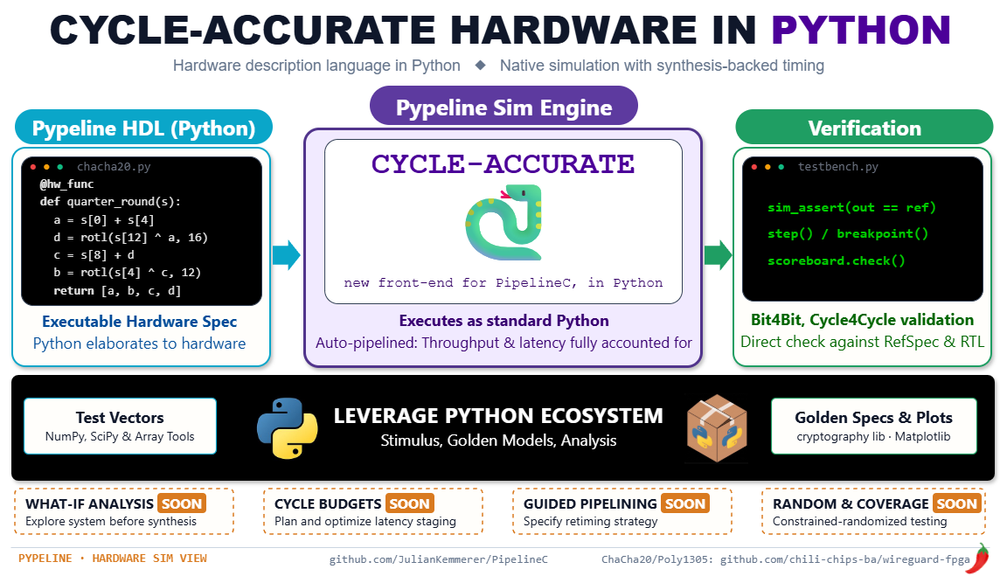

# pypeline_build — ChaCha20-Poly1305 AEAD in Pypeline

Pypeline (Python front-end for PipelineC) port of the C designs in
`../pipelinec_build/`. Three design variants target Artix-7
xc7a200tffg1156-2: **pipelined Poly1305, sharing both at 60 MHz by default**, or the
selectable **legacy Poly1305 at 80 MHz**. The C originals' Poly1305 math
and ciphertext-length bugs are fixed, so this port is RFC 8439-conformant and its
tags/ciphertext lengths deliberately differ from the (still-unfixed) C
designs (see "Test Vectors" below).

Each of the three design variants has **two testbench styles**: a
synthesizable-style testbench (fixed vectors, compiles through cocotb/GHDL or
real hardware) and a non-synthesizable testbench (`@sim_input`/`@sim_output`,
on-the-fly random vectors, native sim only) — see "Testbench Styles" below.

Combined builds share both ChaCha20 and the Poly1305 setup/finalization
resources by default. Sharing is independently selectable; standalone
encrypt/decrypt builds keep their compute resources private. Sharing-both
defaults to the verified **60 MHz** point; other pipelined selections retain
their **30 MHz** defaults. The sharing-both configuration has a passing
external-port hardware checkpoint at 30 MHz and native fixed-vector plus QoR
testbench results at a **60 MHz** goal.

The latest six-size QoR run (2026-10-07) passed all **48 packet checks**,
synthesis timing, capacity, and archived-evidence integrity. At 1920 bytes it
sustains **6.255 Gb/s encrypt / 6.269 Gb/s decrypt at 60 MHz**; at 1420 bytes,
**5.842 / 5.859 Gb/s**. The performance top's synthesis estimate is
**63.032 MHz**, using **704 of 740 DSPs**. Both authentication bodies accept
one block per cycle. These are performance-testbench results, **not new
external-port hardware timing/area at 60 MHz or routed sign-off**. The
external-port hardware has passed at 30 MHz, where sharing the Poly1305
setup/finalization MCPs cut DSPs from 512 to 320
([hardware evidence](measurements/shared-30mhz-poly1305-pipelined-share-chacha20-poly1305-20261003/hardware-evidence.json)).

See the [component design and validation](src/poly1305/throughput.md#independent-mcp-sharing)
for arithmetic, arbitration, latency sizing, every confirmed checkpoint and
deferred higher-clock issues. The latest packet results are below.

Pipelined decrypt buffers ciphertext on its authentication fork, before
framing. Its memory depth is derived from the selected ChaCha pipeline's
credits and bounded authentication setup, then rounded to a power of two;
the retained 60 MHz depths give 128 memory beats plus one FIFO output beat.
ChaCha can advance while authentication waits for its key/setup. See the
[sizing derivation](src/poly1305/throughput.md#automatic-authentication-fifo-sizing).
Pipelined encrypt has a two-slot,
II=1 output register slice (one unstalled output cycle) to hold external AXIS
words stable under backpressure. Legacy has neither buffer. The
[recovery comparison](measurements/shared-60mhz-poly1305-pipelined-share-chacha20-poly1305-decrypt-recovery-20261005/comparison.md)
separates compiler-wrapper changes from the FIFO's measured benefit and
explains the scope of the remedy for
[Issue #39](https://github.com/chili-chips-ba/wireguard-fpga/issues/39).

<p align="center">
  
</p>

## Build Commands

Run from `3.build/pypeline_build` in the primary WireGuard checkout. Set
`PYPELINEC` to `<PipelineC checkout>/src/pypelinec`, or put it on PATH.
`measure.py` and `bottleneck.py` also discover a sibling PipelineC
checkout (`../../../PipelineC`). Both repositories' revisions and
design-source hashes are preserved with each measurement. The latest QoR used
Vivado 2019.2 and an isolated, clean PipelineC
`7f96bc54c6dafc673b75d512ba44ff07df807c9f`;
exact frozen design/include hashes are retained with its evidence. Use the
archived source hashes for the exact tested code rather than assuming a
revision alone implies a clean tree.

Every build and measurement writes its own output directory under
`generated-files/` (ignored by git). Names include the build kind,
implementation, sharing selection and clock, so switching profiles never
reuses another profile's cache.

**Native Pypeline sim — non-synthesizable testbench (fastest to iterate on;
`@sim_input`/`@sim_output`, on-the-fly random vectors — see "Testbench
Styles" below):**
```bash
./build.py --enc --sim --comb --native     # Combinational sim, encrypt TB
./build.py --dec --sim --comb --native     # Combinational sim, decrypt TB
./build.py --shared --sim --comb --native  # Combinational sim, shared TB
./build.py --enc --sim --native            # Pipelined sim, encrypt TB (slow!)
./build.py --dec --sim --native            # Pipelined sim, decrypt TB (slow!)
./build.py --shared --sim --native         # Pipelined sim, shared TB (slow!)
```
These don't invoke GHDL/cocotb or generate real VHDL at all, and this
testbench style has no cocotb/GHDL equivalent (see "Testbench Styles" below
for why) — the `--native` (`--comb` or not) forms are the only way to run
it. Dropping `--comb` runs a real, cycle-accurate pipelined native
simulation: real autopipelining runs through the synthesis tool first to
discover each submodule's latency (like the pipelined cocotb/GHDL builds
below), then the native simulator emulates those latencies — which is what
makes it slow. Pass criteria: the build exits zero. This testbench prints an
`ERROR:` line for each mismatch (ciphertext/plaintext bytes, `keep` pattern,
packet framing, the tampered-tag packet's `is_verified_out`) and calls
`sim_finish()` once all packets are checked; an `@final(sim=True)` hook then
runs once, however the simulation ended, and asserts there were zero errors
and every packet was checked, so any failure exits non-zero — no eyeballing
console output for `ERROR`/`DONE` lines. The RNG seed in use is printed by an
`@initial(sim=True)` hook before the first cycle (`tb_common_sim.DEFAULT_SEED`
by default) so a failing run's exact vectors can be reproduced.

**Native Pypeline sim — synthesizable-style testbench (fixed vectors; no
cocotb/GHDL, Pypeline's own Python simulator):**
```bash
./build.py --enc --sim --syn_tb --comb --native     # Combinational sim, encrypt TB
./build.py --dec --sim --syn_tb --comb --native     # Combinational sim, decrypt TB
./build.py --shared --sim --syn_tb --comb --native  # Combinational sim, shared TB
./build.py --enc --sim --syn_tb --native            # Pipelined sim, encrypt TB (slow!)
./build.py --dec --sim --syn_tb --native            # Pipelined sim, decrypt TB (slow!)
./build.py --shared --sim --syn_tb --native         # Pipelined sim, shared TB (slow!)
```
The `--comb` forms are the quickest correctness check for the
synthesizable-style testbench while iterating on the `.py` sources — run
these before the slower cocotb/GHDL variants below. Dropping `--comb` here
runs the same real-autopipelining-first, cycle-accurate native simulation as
the non-synthesizable testbench above, without needing cocotb/GHDL at all —
useful for a cycle-accurate pipelined check that's still faster to iterate
on than the full pipelined cocotb/GHDL build. Pass criteria: the build exits
zero — every check is a `sim_assert(...)`, so a failure raises immediately.

**Simulate with cocotb + GHDL (the designs' acceptance tests — synthesizable-style
testbench only, see "Testbench Styles" below):**
```bash
./build.py --enc --sim --syn_tb --comb     # Combinational sim, encrypt TB
./build.py --dec --sim --syn_tb --comb     # Combinational sim, decrypt TB
./build.py --shared --sim --syn_tb --comb  # Combinational sim, shared TB (slow!)
./build.py --enc --sim --syn_tb            # Pipelined sim, encrypt TB (hours!)
./build.py --dec --sim --syn_tb            # Pipelined sim, decrypt TB (hours!)
./build.py --shared --sim --syn_tb         # Pipelined sim, shared TB (hours!)
```
Pass criteria: the build exits zero — every check in `tb_common.py`'s fixed
vectors (per side, one check per string in `PLAINTEXT_TEST_STRS`, plus one
extra decrypt-side check for the corrupted-tag negative packet, see "Test
Vectors" below) is a `sim_assert(...)` that elaborates to a real VHDL
`assert ... severity failure`, so a failing check halts the GHDL simulation
and the process exits non-zero. The pipelined (not `--comb`) variants run
real autopipelining through the synthesis tool first, which is what takes
hours.

**Generate Verilog (for FPGA synthesis):**
```bash
./build.py --enc      # Standalone encrypt
./build.py --dec      # Standalone decrypt
./build.py --shared   # Shared encrypt+decrypt
```

**Measure QoR** — fmax, area, throughput, latency; see "Measuring QoR" below.

### Design and sharing selection

| Selection (also accepted by `measure.py` for combined designs) | ChaCha20 shared | Poly1305 setup/finalization shared |
| --- | --- | --- |
| No sharing flags, or `--shared` | Yes | Yes |
| `--share-chacha20` | Yes | No |
| `--share-poly1305` | No | Yes |
| Both sharing flags | Yes | Yes |
| `--enc` or `--dec` (`build.py` only) | No | No |

A supplied sharing flag selects the complete set, not an extra resource added
to the default. Sharing flags cannot be combined with `--enc`/`--dec`.
Explicit selections override `WG_SHARE_CHACHA20` / `WG_SHARE_POLY1305`
(0 or 1); direct compiler invocation uses those variables. Legacy combined
builds require `--share-chacha20 --poly1305 legacy`: the implicit sharing-both
default and `--shared` are rejected with legacy.

| Hardware command | Default clock | Output directory |
| --- | ---: | --- |
| `./build.py` or `./build.py --shared` | 60 MHz | `generated-files/verilog-shared-poly1305-pipelined-share-chacha20-poly1305-60mhz` |
| `./build.py --share-chacha20` | 30 MHz | `generated-files/verilog-shared-poly1305-pipelined-share-chacha20-30mhz` |
| `./build.py --share-poly1305` | 30 MHz | `generated-files/verilog-shared-poly1305-pipelined-share-poly1305-30mhz` |
| `./build.py --share-chacha20 --poly1305 legacy` | 80 MHz | `generated-files/verilog-shared-poly1305-legacy-share-chacha20` |

An explicit
`--target-mhz {30,40,50,60,70,80}` overrides the profile clock. Both
`build.py` and `measure.py` support `--poly1305 {pipelined,legacy}`; explicit
selection overrides `WG_POLY1305_IMPL`, otherwise it selects the implementation
(default `pipelined`). Their clock defaults follow the selected implementation and sharing set
and override inherited `WG_TARGET_MHZ`. Direct compiler invocation instead
honors `WG_TARGET_MHZ`, falling back to those clocks using `WG_SHARE_*`
(both enabled by default); use an explicit clock or disable both sharing flags
when invoking a standalone private design directly. `build.py --enc`/`--dec`
default to 30 MHz. Only the chosen
MAC module is imported: the selector adds no hardware mux or unused legacy FSM.

Output directory names carry the implementation, sharing selection and,
except for the historical 80 MHz naming, the clock suffix — for hardware and
every simulation mode. Separate encrypt/decrypt variants passed the
integration tests; the archived DUT-only area is for shared.

Implementation details and standalone unit testbench commands are documented
in the [Poly1305 design](src/poly1305/throughput.md#standalone-testbenches).
`build.py` only selects the encrypt, decrypt, or shared top, with the existing
hardware, correctness-testbench and shared-performance modes.

### Automatic starting guesses

All automatic compute blocks take `start_latency` hints from the
clock-indexed table in [src/poly1305_config.py](src/poly1305_config.py), selected
alongside the clock in `wireguard_env.py`. The shared-design hints come from
the confirmed 30 MHz hardware builds; the shared Poly1305 services use the
same one/two-cycle seeds as their private two-lane counterparts. The 60 MHz
entry uses the confirmed sharing-both fixed-vector build, and the latest
60 MHz QoR confirmed it (ChaCha core 17, both authentication body cores 3,
shared MCP setup cycles 6/5). Private-resource hints and other
uncharacterized clocks fall back to the 30 MHz values. These are neither
fixed latencies nor maximum limits: the sweep still checks timing and can
change them, and latency-dependent storage is sized from the actual pipeline
depth. To add a characterized clock, add a complete entry to
`START_LATENCIES_BY_MHZ`: pipeline values count core registers, excluding I/O
registers, and MCP values count setup cycles, excluding the handshake cycle.

Use `--out-dir` to compare a fresh build without disturbing the previous cache:

```sh
./build.py --shared --target-mhz 30 -j 1 \
  --out-dir generated-files/verilog-shared-poly1305-pipelined-share-chacha20-poly1305-30mhz-seeded
```

An explicitly selected output directory must be empty for a fresh build;
`--continue --out-dir ...` resumes it without clearing files. Keep separate caches
when comparing clocks, architectures or starting-guess profiles.

### Clock declarations

Every design and testbench `@MAIN` declares `wireguard_env.TARGET_MHZ`,
including simulation finish checkers. A bare checker whose `@sim_output`
call disappears during hardware elaboration has no shared wires from which
the compiler can infer its clock. Previously this produced an unused
`clk_None` top port and a fallback 1000 MHz constraint. The historical recovery
HDL contains that name only in the port declaration; Vivado reports the port
as unconnected and zero register pins without clocks. Explicit rates remove
the phantom clock. The fresh 60 MHz build has only `clk_60p0`, no missing-frequency
warning, zero unclocked register pins, and zero unconstrained internal pins.

### Acceptance testing

The integration/fallback matrix, using ordinary builds (stop on the first
failure):

```sh
set -e
for design in enc dec share-chacha20; do
  ./build.py --"$design" --sim --comb --native --continue
  ./build.py --"$design" --sim --comb --syn_tb --native --continue
  ./build.py --"$design" --poly1305 legacy --sim --comb --syn_tb --native --continue
  ./build.py --"$design" --sim --native --continue -j 1
  ./build.py --"$design" --sim --syn_tb --continue -j 1
done
```

Sharing validation uses both native testbench styles for standalone enc/dec
and all three sharing configurations, plus a legacy ChaCha-only smoke test.
The component's directed sharing test is documented separately. The sharing-both
60 MHz native synthesis-backed testbench passed 10 encrypt and 11 decrypt
fixed-vector tests. For the decrypt-buffering change, 11 native combinational
builds passed 205 packet checks across the selections/styles and legacy smoke;
the sharing-both stress run passed 16 encrypt and 17 decrypt checks. The
latest QoR passed all 48 reference-checked packets at its actual converged
depths. Automatic sizing and explicit clocks also passed the 11-case native
matrix, AAD boundaries at 0/1/16/17/32 bytes, and the stress case. A matched-depth
comparison with explicit 64-beat storage passed 32 packet checks and retained
identical goodput at 1420/1920 bytes. Current test records are retained in the
[workflow record](measurements/shared-60mhz-auto-auth-fifo-explicit-clocks-20261006/workflow-evidence.json);
the earlier [recovery record](measurements/shared-60mhz-poly1305-pipelined-share-chacha20-poly1305-decrypt-recovery-20261005/workflow-evidence.json)
preserves the original buffering qualification.

The random native testbenches also support `WG_TB_STRESS=1`. This selects
16 directed packets through 1920 bytes, input gaps and prolonged/periodic
output backpressure (plus decrypt's tampered-tag packet). Sources present
words in `@sim_input` but commit only converged handshakes in `@sim_output`;
sinks count only `valid && ready` and assert that a stalled output's data,
keep, last and verification status remain stable. The performance testbench
does **not** use these pauses.

```sh
WG_TB_STRESS=1 ./build.py --shared --sim --comb --native --continue
```

`--continue` keeps build caches; `measure.py --reuse-syn` gives measurements
the same behavior. An empty cache still requires synthesis. Hardware and
pipelined simulation builds pass `--stop_on_over_capacity`. Use `-j 1` on
low-RAM systems: it serializes vendor-tool jobs, including automatic MCP
characterization, but does not limit Vivado's internal threads. A single MCP
synthesis can still consume several GiB.

`validation/` is an ignored, disposable workspace, not commit evidence; so
are `generated-files/` and the earlier standalone smoke measurements. For
background synthesis:

```sh
mkdir -p validation
nohup ./build.py --shared --continue -j 1 \
  > validation/shared-build.log 2>&1 < /dev/null &
```

After an interruption, inspect the precise failing vendor log. Rename only an
identified incomplete/error cache log before using `--continue`; preserve good
synthesis caches and do not restart the long sweep unnecessarily. A source or
compiler change requires reviewing whether those cached observations still
match the design; continuation is not permission to ignore source drift.

Changing the clock uses the ordinary `--target-mhz` option; there are no
special diagnostic builds or hidden shared-clock overrides. Generic compiler
regressions belong in PipelineC's own suite, not a WireGuard test-runner directory.

## Source Layout (mirrors ../pipelinec_build/src/)

```
src/
  wireguard_env.py              sys.path bootstrap + architecture/sharing/clock profile
  poly1305_config.py            implementation/clock/sharing profiles, starting latencies,
                                 output-directory naming (no hardware imports)
  aead_types.py                 shared sizes/types, probed auth FIFO and output-slice factories
  chacha20/
    chacha20.py                 ChaCha20 math + pipeline-control FSM + chacha20_instance
                                 (FSM and stream pipeline merged into one function; chacha20.h)
    chacha20_pipeline_shared.py the one shared pipeline + round-robin mux, merged into one
                                 function, plus chacha20_encrypt_shared/chacha20_decrypt_shared
                                 (the shared design's per-direction instances that read/write
                                 this file's Wires — chacha20_pipeline_shared.c)
  poly1305/
    poly1305.py                 selectable legacy MAC FSM + MCP (poly1305.h)
    poly1305_math.py            shared corrected limb and 130-bit-residue arithmetic
    poly1305_mac_pipelined.py   interleaved II=1 MAC, private body/packet context
    poly1305_mcp_shared.py      independent tagged prologue/epilogue round-robin services
    poly1305_select.py          conditional import and per-direction metadata
    poly1305_verify_decrypt.py  tag comparison FSM
  prep_auth_data/
    prep_auth_data.py           AAD||ciphertext||lengths framing FSM (prep_auth_data_fsm,
                                 called directly by both directions; prep_auth_data.h)
  auth_tag/
    append_auth_tag.py          merge tag into ciphertext's final beat + a tag-tail beat
                                 (encrypt output; Xilinx-style packed framing, issue #44)
    strip_auth_tag.py           reassemble the tag from the last two input beats
                                 (decrypt input, early-tlast buffer; issue #44)
    wait_to_verify.py           128-deep FIFO + wait-for-verdict FSM, merged into one
                                 function, holding plaintext until tag verdict
  chacha20poly1305/
    chacha20poly1305_encrypt_ports.py   DUT-facing global wires (the .h wires)
    chacha20poly1305_encrypt_hw_io.py   flattened Input[]/Output[] ports + io conversion MAIN
    chacha20poly1305_decrypt_ports.py / chacha20poly1305_decrypt_hw_io.py
    encrypt_dataflow_core.py / decrypt_dataflow_core.py   make_encrypt_dataflow_core /
                                 make_decrypt_dataflow_core: factories returning the direct-call
                                 dataflow graph, parameterized by ChaCha20 instance and optional
                                 MAC instance (see "Wiring Style" below)
    encrypt_dataflow.py / decrypt_dataflow.py            standalone wiring MAINs (selected clock):
                                 instantiate the factory with chacha20.chacha20_instance
    encrypt_dataflow_shared.py / decrypt_dataflow_shared.py  shared design: instantiate the
                                 same factories with independently selected private/shared
                                 ChaCha20 and authentication resources
    tb_common.py                 synthesizable-style testbench's fixed 10-string vectors,
                                  computed once at elaboration time
    tb_common_sim.py             non-synthesizable testbench's shared support: fixed
                                  KEY/NONCE/AAD, random lengths, stress pauses, and the
                                  converged AXIS source/sink (PipelineC axi/axis_sim.py)
                                  (no precomputed vectors — those are generated lazily,
                                  per packet, during simulation)
    aead_ref_model.py            pure-Python (no pypeline/hardware dependency) reference
                                  model both tb_common.py and tb_common_sim.py call to
                                  generate vectors — see "Test Vectors" below
    encrypt_syn_tb.py / decrypt_syn_tb.py   synthesizable-style testbench MAINs (fixed
                                  vectors, cocotb/GHDL/pipe-compatible)
    encrypt_tb.py / decrypt_tb.py           non-synthesizable testbench MAINs
                                  (@sim_input/@sim_output, on-the-fly random vectors,
                                  native sim only) — see "Testbench Styles" below
    perf_tb_common.py            the phase plan + WG_PERF_* env knobs + frame builders, the
                                  MAIN-to-direction tap labels, and the shared barrier/
                                  recorder/runners from PipelineC's stream_perf library
    encrypt_perf_tb.py / decrypt_perf_tb.py  performance testbench MAINs: stream the phase plan
                                  with zero source gaps and measure, while still checking every
                                  packet against the reference model (native sim only)
  chacha20poly1305_encrypt.py / _tb.py / _syn_tb.py                    tops (hw / sim non-synth / sim synth)
  chacha20poly1305_decrypt.py / _tb.py / _syn_tb.py
  chacha20poly1305_encrypt_decrypt_shared.py / _tb.py / _syn_tb.py / _perf_tb.py
  poly1305_pipelined_syn_tb.py  standalone pipelined-MAC testbench top (see throughput.md)
```

Measurement tooling lives next to `build.py` rather than under `src/` (it is not
part of any design):

```
build.py         --perf selects the performance testbench (implies --sim --native)
measure.py       the QoR orchestrator: build+sim, parse fmax/area, merge, emit JSON/CSV/md
bottleneck.py    WireGuard's block graph, Poly1305/ChaCha20 cost model and report wording
                 over PipelineC's stream_bottleneck (--selftest included)
                 Vivado utilization, MCP HDL audit and evidence integrity live in measure.py
measurements/    one directory per measured point (results.json, summary.csv, blocks.md, …)
generated-files/ build and measurement caches, one directory per configuration (ignored)
```

## Testbench Styles: Synthesizable vs Non-Synthesizable

Each of the three design variants has two independent testbenches, sharing
the same DUT-facing `*_ports.py` wires but differing entirely in how
stimulus is generated and outputs checked:

- **Synthesizable-style** (`encrypt_syn_tb.py`/`decrypt_syn_tb.py`, driven by
  the `_syn_tb.py` tops): a `@MAIN` hardware state machine streams/checks a
  fixed batch of test vectors — 10 plaintext strings, chosen to cover the
  partial-final-word and block-boundary corner cases — computed once via
  `aead_ref_model.py` at elaboration time and baked into fixed-size
  `Reg[uint8_t[N]]` hardware register arrays (`tb_common.py`). Because this
  testbench is itself synthesizable Pypeline, it can run through cocotb+GHDL
  against real generated VHDL, or through real autopipelining (pipelined,
  not `--comb`, builds) — these are the designs' acceptance tests.
- **Non-synthesizable** (`encrypt_tb.py`/`decrypt_tb.py`, driven by the plain
  `_tb.py` tops): uses Pypeline's `@sim_input`/`@sim_output` decorators to
  generate stimulus and check outputs as arbitrary Python, live,
  cycle-by-cycle during simulation. Each run generates 12 random-length
  (1-1024 byte) packets per direction on the fly — a few pinned to the same
  corner-case lengths as the fixed vectors, the rest uniform-random — calling
  `aead_ref_model.py` lazily, once per packet, right when that packet's
  random plaintext is generated (`tb_common_sim.py`), rather than batching
  everything up front. No fixed-size arrays, no elaboration-time
  pre-baking — packets can be any length. The decrypt side adds a 13th
  packet with a deliberately bit-flipped tag (reject-path coverage,
  mirroring the synthesizable variant's fixed tampered-tag packet). The RNG
  is seeded by default (`tb_common_sim.DEFAULT_SEED`) and the seed is printed
  at the start of each run, so a failing run's exact vectors are
  reproducible.

  `@sim_input`/`@sim_output` calls are entirely invisible to the hardware
  elaborator — skipped unconditionally, whether or not `--sim` is passed —
  so this style **only runs under Pypeline's native `--sim` mode**. Routing
  it through `--cocotb --ghdl` would first generate real VHDL with every
  `@sim_input`/`@sim_output` call site stripped out, leaving no stimulus
  generation or output checking left anywhere — there is no cocotb/GHDL
  variant of this style, `--native` is the only way to run it. Native sim
  does support a pipelined (not `--comb`) run of this style, though, via
  real autopipelining through the synthesis tool followed by native
  latency-emulated simulation (see "Build Commands" above) — no cocotb/GHDL
  needed. Use this style for fast iteration and broader random coverage; use
  the synthesizable style for the cocotb/GHDL acceptance tests.

## Native vs VHDL Cycle-Accuracy Check (`pypeline_sim_debug.py`)

`encrypt_syn_tb.py`/`decrypt_syn_tb.py` tag their per-word data prints —
each 16-byte chunk of input plaintext/ciphertext and output
ciphertext/plaintext — with `sim_print(..., debug=True)`. Each tagged print
sits inside the same `valid & ready`-gated, register-driven block that
drives the rest of that testbench's checking logic, not inside any
pipelined combinational region, satisfying `pypeline_sim_debug.py`'s rules
for probes used in a pipelined (non-`--comb`) compare.

This lets the pipelined syn_tb builds be run through `pypeline_sim_debug.py`
that compares the native
latency-emulated simulation against the real cocotb+GHDL VHDL simulation —
both post-autopipelining, cycle by cycle:

```bash
pypeline_sim_debug.py ./src/chacha20poly1305_encrypt_syn_tb.py --sim --run all
pypeline_sim_debug.py ./src/chacha20poly1305_decrypt_syn_tb.py --sim --run all
pypeline_sim_debug.py ./src/chacha20poly1305_encrypt_decrypt_shared_syn_tb.py --sim --run all
```

Each run does a full synthesis build first (both the native and VHDL sides
need the real, discovered pipeline latencies), then diffs the two runs'
`debug=True`-tagged lines cycle by cycle, reporting the first cycle where
they disagree. Agreement here confirms the native simulator's emulated
per-stage latencies actually match the real autopipelined VHDL timing, not
just that both eventually produce the same final output — a check the
ordinary `sim_assert`-based pass/fail criteria above can't provide on their
own, since assertions on final output data don't catch a data word arriving
correct but on the wrong cycle.

## Measuring QoR (fmax, area, throughput, latency)

The point of this design is to get *faster, smaller, lower latency*, so those
three have to be measurable in one automated, repeatable step rather than
eyeballed per change. `./measure.py` is that step: it produces one
machine-readable record per design variant, and the next variant's record diffs
against it directly.

The design-agnostic half of this tooling — the in-design probes, the
boundary meter and phase runner, the bottleneck rollup and the report math — is
PipelineC's stream performance library; its
[guide](https://github.com/JulianKemmerer/PipelineC/blob/master/include/pypeline/stream/pypeline_stream_perf_guide.md)
defines every metric and probe rule. This repo adds the AEAD block graph, the
Poly1305 cost model, Vivado fmax/area parsing, acceptance checks and evidence.

The full sharing-both sweep matching the latest record:

```bash
./measure.py --shared --poly1305 pipelined --target-mhz 60 -j 1 \
  --label shared-60mhz-poly1305-pipelined-new-run --reuse-syn \
  --sizes 16,64,256,1024,1420,1920 --packets 4 --peak-bytes 0 \
  --dirs both --taps all --seed 8439 --save-evidence
```

This reports perf-top area/timing only. Add `--area-from-dir <hardware out_dir>`
only after the external-port hardware top has independently passed at the
same goal. Other forms:

```bash
./measure.py --label X --reuse-syn         # sim only, reusing the cached synthesis
./measure.py --label smoke --comb          # rig check in minutes (no Vivado, no area/fmax)
./measure.py --label X --parse-only        # re-merge an existing run's outputs
./measure.py --label X --sizes 64,1420 --packets 8 --peak-bytes 1920
./measure.py --label X --out-dir generated-files/perf-X # isolated fresh cache
./measure.py --label X --taps poly1305      # only the MAC's internal taps
./measure.py --label X --taps ''            # boundaries only, no internal taps
./measure.py --selftest                   # area, acceptance, model and archive checks
./bottleneck.py --selftest                 # block attribution + model math check
./bottleneck.py measurements/X/results.json  # re-print a run's block tables
./build.py --shared --perf [--comb]        # the underlying build/sim on its own
```

The metric math itself is regression-tested in PipelineC
([`stream_perf_test.py`](https://github.com/JulianKemmerer/PipelineC/blob/master/src/tests/pypeline_tests/inst/stream_perf_test.py)
and its probe/testbench siblings). Use a new label for a new architecture;
`shared-80mhz` and `shared-80mhz-probed` are retained legacy snapshots.

One `./measure.py` run is one `pypelinec` command line (`./build.py --shared
--perf`): it autopipelines the design for its selected clock goal through Vivado,
then runs the **native** simulation of exactly what it built, with the
discovered per-stage latencies modeled — no cocotb/GHDL needed. So fmax, area,
latency and throughput all describe the same build, and cannot drift apart.

Failed/incomplete runs retain diagnostic artifacts but cannot replace README
results or return measurement success. Non-combinational measurements require
both timing and area evidence, and audit the selected MAC's emitted
arithmetic; `--area-from-dir` also requires a confirmed hardware-top timing
pass and available DUT-only area. Timing/capacity acceptance uses each top's
own confirmed report, never hardware timing in place of perf-top timing. Known
resource over-capacity, inconsistent tap cycle counts or inconsistent buffer
occupancy fail the measurement, even if a synthesis-only timing estimate
passes. `results.json` records these checks under `validation`.
`--parse-only` retains saved build provenance and DUT-only area when
regenerating reports.

`--save-evidence` packages retained hardware/perf logs, input manifests,
sweep histories, frozen design/include source hashes when available,
hash-matched constraints and an artifact checksum inventory
into the measurement directory. Use a fresh label; committed records
remain historical evidence. Check one without rewriting it:

```sh
./measure.py --check-record measurements/shared-60mhz-auto-auth-fifo-explicit-clocks-20261006
```

### What is measured, and how

- **fmax + pipeline depth** come from pypelinec's own numbers, not a
  reimplementation: the per-MAIN **`final` records** in
  `<out_dir>/<top-name>/sweep_history.json` (schema 3, with schema 2 supported;
  default name `top`). They describe the design as
  built, after any pin-and-confirm confirmation run, restored best/met
  snapshot or as-written check. The build's printed outcome lines
  (`met timing, N slice(s) built …`,
  `synthesized as written (standalone check): X MHz vs Y MHz goal - PASS`,
  `PASS <main>: X MHz … (confirmation run)`, `TIMING NOT MET …`) are parsed
  only as a cross-check, and any disagreement is listed under
  `fmax.source.cross_check_mismatches`. `fmax.source.final_basis` says which
  source was used. An older schema-1 history is only an iteration log that
  could stop before the iteration that met timing, so for those the printed
  lines stay authoritative and the log's last entry is kept, clearly labelled,
  under `fmax.per_main[*].last_sweep_iter.mid_sweep_mhz`.
  When a MAIN meets its goal but no MHz was ever measured for it (no failing
  timing path named it), its `final` record has `achieved_mhz: null` and
  `mhz_is_lower_bound: true`. Its exact fmax is unknown and the goal is only a
  *lower bound*: `design_mhz` is then the goal, with
  `design_mhz_is_lower_bound: true`, a `design_mhz_basis` string saying why, and
  `min_reported_mhz` carrying the lowest MHz actually measured.
  `limiting_main` names the MAIN that set the number.
- **area** comes from `report_utilization` in that build's Vivado log, parsed by
  this repo's own parser in `measure.py` — LUTs (logic vs memory vs SRL/DRAM), FFs,
  DSP48s, BRAM (tiles / RAMB36 / RAMB18) and CARRY4 all kept separate.
  PipelineC's `VIVADO.ParsedUtilizationReport` is deliberately unused: it is
  documented upstream as diagnostic-only and reports three fields.
  `measure.py --selftest` parses the two retained shared logs and checks values read off
  them by hand, so the parser has regression cover without a Vivado run.
- **throughput, duty cycle and latency** come from the perf testbench
  (`src/chacha20poly1305/{encrypt,decrypt}_perf_tb.py`), which streams a
  **phase plan** through the library's `PhaseRunner`: N back-to-back packets
  of one size per phase, sweeping sizes. Encrypt and decrypt stream
  **concurrently**, held in the same phase by a `PhaseBarrier`, so every size
  sees the same contention on the shared resources. `sustained_bytes_per_cycle`
  (packet size over the mean completion period) is the throughput figure;
  the guide defines the rest.
- **per-block throughput, stalls and the bottleneck verdict** come from probes
  placed inside the design's own hardware functions, rolled up by
  `bottleneck.py` (see "Probing inside the design" below). These cost **no
  hardware**: every probe is a `@sim_output` call, and the elaborator deletes
  those.

WireGuard-specific readings of the guide's metrics:

- `steady_in_bytes_per_cycle` / `steady_out_bytes_per_cycle` are diagnostics,
  never throughput: the input side reads ~14 B/cycle because a packet's beats
  are accepted in one burst, and the **decrypt** output reads the full
  16 B/cycle because `wait_to_verify` releases the buffered plaintext at line
  rate once Poly1305 returns its verdict.
- `service_period_cycles` on `poly1305.data_in` reads 1.0 for the pipelined
  body (the legacy body read ≈6.0); packet-boundary stalls remain visible at
  the public ports.
- `throughput_comparison` also reports a common contention window when there
  are enough samples: after both directions' second completion and before
  either's last ChaCha admission. Only completion intervals wholly inside it
  count. Short four-packet bursts can have no eligible intervals; their
  sustained rates remain the completion-period metric, not a
  steady-contention proof.
- The `Poly1305 lifecycle`, `Shared Poly1305 MCP service` and `Model
  cross-check` sections of `blocks.md` are this repo's own: FSM phase cycles
  per packet, shared-MCP occupancy, and the Poly1305 block count × body II
  against the measured packet period.

The testbench records **cycles, beats and bytes only**; `measure.py` multiplies
by fmax afterwards. So the same measured run can be re-expressed at a different
frequency without re-simulating, and `Gb/s @fmax` and `Gb/s @target` (selected clock)
are both reported.

A perf run is also a functional run: every packet's ciphertext/tag (or
plaintext + `is_verified_out`) is still checked against `aead_ref_model.py`, and
`checks.functional_pass` in the results is false if any check failed — a perf
number from a run that computed garbage would be worthless. Only valid packets
are measured; the tampered-tag negative case stays in the functional
testbenches, where it cannot perturb a timing window.

### Output

`measurements/<label>/` holds everything for one measured point:

| file | what |
|---|---|
| `results.json` | the full record — config, provenance (both repos' git SHAs, Vivado version, wall times), `fmax`, `area` (incl. per-module out-of-context areas), `phases[]`, `summary`, `checks`, `validation` |
| `summary.csv` | one flat row per phase × direction — the throughput-vs-packet-size curve, ready to plot or diff |
| `summary.md` | the same as a markdown table, for pasting into this README |
| `blocks.md` | the full block-level report: per-block table with FSM states, bottleneck verdicts with evidence, shared-resource arbitration, model cross-check, Poly1305 lifecycle, buffers (this README links to it) |
| `blocks.csv` | one flat row per phase × direction × block — the per-block throughput/stall curve |
| `taps.csv` | one flat row per phase × tap — the raw internal handshake counters |
| `perf_raw.json` | the testbench's own cycle-domain output, rewritten after **every** phase (so a killed run still leaves data) |
| `pypelinec.log` | the build/sim log, with the per-cycle `Clock: N` spam filtered out (counted, not kept) |
| `perf-*.json` / `perf-vivado.log` / `perf-clocks.xdc`, `artifact-manifest.json` | with `--save-evidence`: input manifests, sweep history, source provenance, the timing log, constraints and a checksum inventory (`--check-record` verifies them) |

### Current results: sharing-both design, automatic FIFO sizing, 60 MHz

The latest shared run is
[sharing-both 60 MHz with automatic FIFO sizing and explicit clocks](measurements/shared-60mhz-auto-auth-fifo-explicit-clocks-20261006/summary.md).
It started on 2026-10-06 and completed on 2026-10-07: 48 packets, six sizes, four per size per direction,
all taps, 2459 cycles. Raw measurements, frozen design/include hashes and
retained synthesis observations are archived alongside the record.
The table below comes directly from that record's `results.json`; the
[validation notes](measurements/shared-60mhz-auto-auth-fifo-explicit-clocks-20261006/validation.md)
explain the sizing, clock audit and simulation recovery.

The historical [buffering comparison](measurements/shared-60mhz-poly1305-pipelined-share-chacha20-poly1305-decrypt-recovery-20261005/comparison.md)
keeps the pre-buffering 60 MHz, ChaCha-only 30 MHz and legacy 80 MHz records separate.
Neither historical QoR nor legacy DUT-only area was rerun. The legacy 80 MHz
timing number was a lower bound, not a measured maximum.

<!-- MEASURED-RESULTS:BEGIN -->

_Measured by `./measure.py --label shared-60mhz-auto-auth-fifo-explicit-clocks-20261006` on 2026-10-07T09:15:56+00:00 — wireguard-fpga `0df483d239c0`, PipelineC `7f96bc54c6da`, Vivado 2019.2, 2459 cycles. Regenerate with `./measure.py --label shared-60mhz-auto-auth-fifo-explicit-clocks-20261006 --parse-only --update-readme`._

Design `shared` | target 60.0 MHz | measured fmax **63.03 MHz** | limiting MAIN `chacha20_pipeline_shared`
Area (perf_tb_top): **48498 LUT** (47750 logic + 748 mem), **20541 FF**, **704 DSP48**, **13.5 BRAM tiles**, 6752 CARRY4
Shared resources: `chacha20-poly1305`.
Buffer `decrypt/auth_fifo`: 128 memory beats + 1 output beat; 129 total capacity.
Automatic sizing: 115 required beats; ChaCha core=17, credits=22 blocks, prologue MCP=6 cycles.
Register slice `encrypt/output_slice`: mode `full`, 2 slots, 1 unstalled cycle(s), II=1.
Poly1305 implementation: `pipelined`.

| phase | bytes | pkts | dir | sustained B/cyc | pkt period (clk) | % line rate | Gb/s @fmax | Gb/s @target | in stall | cold head (clk) | total lat med (clk) |
|---|---|---|---|---|---|---|---|---|---|---|---|
| b2b-16 | 16 | 4 | encrypt | 0.578 | 27.7 | 3.6% | 0.292 | 0.278 | 0.038 | 32 | 88.0 |
| b2b-16 | 16 | 4 | decrypt | 0.436 | 36.7 | 2.7% | 0.220 | 0.209 | 0.479 | 58 | 82.0 |
| b2b-64 | 64 | 4 | encrypt | 2.087 | 30.7 | 13.0% | 1.052 | 1.002 | 0.035 | 32 | 90.0 |
| b2b-64 | 64 | 4 | decrypt | 1.574 | 40.7 | 9.8% | 0.794 | 0.755 | 0.417 | 61 | 91.0 |
| b2b-256 | 256 | 4 | encrypt | 6.000 | 42.7 | 37.5% | 3.026 | 2.880 | 0.026 | 32 | 102.0 |
| b2b-256 | 256 | 4 | decrypt | 4.151 | 61.7 | 25.9% | 2.093 | 1.993 | 0.241 | 73 | 134.5 |
| b2b-1024 | 1024 | 4 | encrypt | 11.212 | 91.3 | 70.1% | 5.654 | 5.382 | 0.166 | 32 | 147.0 |
| b2b-1024 | 1024 | 4 | decrypt | 11.253 | 91.0 | 70.3% | 5.674 | 5.401 | 0.135 | 121 | 217.0 |
| b2b-1420 | 1420 | 4 | encrypt | 12.171 | 116.7 | 76.1% | 6.138 | 5.842 | 0.133 | 32 | 173.0 |
| b2b-1420 | 1420 | 4 | decrypt | 12.206 | 116.3 | 76.3% | 6.155 | 5.859 | 0.108 | 146 | 267.5 |
| b2b-1920 | 1920 | 4 | encrypt | 13.032 | 147.3 | 81.4% | 6.571 | 6.255 | 0.105 | 32 | 203.0 |
| b2b-1920 | 1920 | 4 | decrypt | 13.061 | 147.0 | 81.6% | 6.586 | 6.269 | 0.084 | 177 | 329.0 |

<!-- MEASURED-RESULTS:END -->

<!-- BLOCK-RESULTS:BEGIN -->

Detailed per-block service/stall, shared arbitration and lifecycle measurements
are in the [block report](measurements/shared-60mhz-auto-auth-fifo-explicit-clocks-20261006/blocks.md).

<!-- BLOCK-RESULTS:END -->

#### Interpretation

At 1920 bytes the latest run sustains **6.255/6.269 Gb/s** at 60 MHz
(encrypt/decrypt); at 1420 bytes it sustains **5.842/5.859 Gb/s**. These match
the earlier buffered 64-beat record. A matched-depth native comparison of
automatic 128-beat and explicit 64-beat storage passed all 32 packet checks
with identical goodput in both directions at both sizes. Small-packet
setup/framing costs remain, and decrypt still withholds plaintext until
verification; equal sustained goodput does not imply equal cold latency.

The automatic budget is **115 beats**, derived from 22 selected ChaCha
pipeline credits and bounded widening, fork, setup and framing overhead.
Power-of-two allocation gives **128 memory beats plus one output beat**.
This covers the structural bound; the previous 64-beat allocation was
sufficient for the measured workload. High water reaches 56 of 129 slots;
every phase conserves transfers and ends empty. The resolved derivation is
saved in the record and checked by measurement acceptance.

The fresh performance top passes synthesis timing at **63.032 MHz** and uses
**48,498 LUTs, 20,541 FFs, 704 DSPs and 13.5 BRAM tiles**. Relative to the
earlier buffered performance record, that is one additional LUT and FF,
with unchanged DSP and BRAM totals. Both bodies retain core depth 3/local
L=5 and II=1. Area includes the fixture and its constant-folding context.
External-port shared hardware remains validated at the earlier 30 MHz
checkpoint; this run provides performance-top synthesis and native QoR,
without a new external-port 60 MHz build or routed sign-off.

All 23 WireGuard MAINs now declare the target clock, including the isolated
simulation finish checker. Fresh HDL/XDC has only `clk_60p0`; the missing-frequency
warning is gone, and Vivado reports zero unclocked register pins and zero
unconstrained internal pins. The old `clk_None` belonged to an unused checker
port, rather than clocked hardware missing its timing constraint.

The initial native phase failed before checking packets after the live
PipelineC checkout changed during synthesis. Simulation was completed using
an isolated checkout of the original compiler revision, verified frozen
source hashes, and the exact retained automatic pipeline/MCP latencies.
Synthesis was reused. The [recovery record](measurements/shared-60mhz-auto-auth-fifo-explicit-clocks-20261006/recovery.json)
and failed-attempt log preserve that distinction.

### Re-measuring without re-synthesizing

Every stimulus knob — packet sizes, counts, payload bytes, seed — lives in
Python (`@sim_input`/`@sim_output`, configured through `WG_PERF_*` env vars set
by `measure.py`), and **nothing** about the plan is baked into hardware. The
elaborated design therefore stays bit-identical between runs, so pypelinec
re-reads its hash-named cached `vivado_*.log` files instead of re-running the
1–3 hour autopipelining sweep: `./measure.py --reuse-syn --sizes …` re-measures
in sim time alone. Sweeping more curve points is cheap; changing the *design* is
what costs a fresh sweep — and so, once, does adding or moving an internal probe,
because generated VHDL names embed source line numbers.

### Probing inside the design (narrowing in on a bottleneck)

Boundary probes answer "how fast is it"; internal taps answer "what is holding
it up". The taps live **inside the design's own hardware functions** — one line
per handshake, next to the signals themselves. Each probed file imports the
library as `from stream import stream_perf_probe as perf_taps`:

```python
# in poly1305_mac_pipelined.py's MAC FSM: state at the top, handshakes at the bottom
perf_taps.state("poly1305.fsm", state, STATE_NAMES)
...
perf_taps.hs("poly1305.data_in", data_in_if.stream.valid, o.data_in_if.ready,
             data_in_if.stream.data.frag.keep)
```

The probes cost no hardware; the guide's
[probe section](https://github.com/JulianKemmerer/PipelineC/blob/master/include/pypeline/stream/pypeline_stream_perf_guide.md#probes-stream_perf_probe)
covers the placement rules (plain `@hw_func`/`@MAIN` bodies only, never inside
an AUTO_PIPELINE core such as `chacha20_loop_body`, state probes at the top of
an FSM body and handshake probes at the bottom). WireGuard-specific details:

- **Per-direction naming.** `perf_tb_common.py` maps each MAIN to a label in
  `stream_perf_probe.MAIN_LABELS`, so the FSMs instantiated once per direction
  stay separate: `encrypt/poly1305.data_in`, `decrypt/poly1305.data_in`,
  `shared/pipe.enc_in`.
- **Once per cycle.** Probes fire once per cycle, including inside
  `Feedback[T]` bodies (`chacha20_fsm`, the `chacha20_pipeline_shared` MAIN):
  pypeline runs `@sim_output` only in each cycle's final converged pass, the
  taps' per-cycle epoch guards against double counting, and every phase's
  `taps_check` verifies that all taps saw the same cycle count.
- **Buffers.** `aead_types.make_aead_fifo` / `make_aead_output_slice` build the
  decrypt `auth_fifo` and encrypt `output_slice` with the library's probed
  FIFO/skid buffer; `measure.py` checks their occupancy against the recorded
  capacity metadata.

Enable with `--taps all` (the default), a block or direction prefix
(`--taps poly1305`, `--taps decrypt/`), or exact names; `--taps ''` turns them
off. Counters are snapshotted and zeroed per phase, landing under
`"taps"`/`"blocks"`/`"bottleneck"`/`"model"` in `results.json` and in
`taps.csv`/`blocks.csv`/`blocks.md`.

To add a block to the rollup, give it an entry in `bottleneck.py`'s `BLOCKS`
naming its input handshake, its output handshake and who consumes that output —
the last is how the verdict walks past a block that is only relaying somebody
else's backpressure.

**The iteration loop.** Changing a block (the Poly1305 redesign in
`src/poly1305/throughput.md`, say) and wanting to know whether it worked does not
need the full hours-long measurement:

```bash
./measure.py --label try --comb --taps all --sizes 64,1420 --packets 2   # minutes
```

`--comb` skips Vivado entirely, so there is no fmax or area — but the FSMs, the
multi-cycle paths and the handshakes are all real, so every per-block number
(`service_period_cycles`, `ceiling_bytes_per_cycle`, the FSM histograms,
the bottleneck verdict) is meaningful and moves the moment the block gets
faster. Use it to iterate, then spend one
`./measure.py --label <name> --reuse-syn --taps all --update-readme` to score the
result at the real pipelined timing with fmax and area attached.

### Caveats (all recorded in `results.json` too)

- **Area scope.** The measured build is the perf testbench top, which drives
  `key`/`nonce`/`aad` as constants, so Vivado folds some ChaCha20 logic away
  (`area.scope = "perf_tb_top"`, `constant_key_folding: true`). It is a
  fixture-specific number, not absolute DUT area or a controlled comparison
  when the wrapper changes. For a folding-free cross-check, build the external
  ports at the same goal, then supply its exact output directory with
  `--area-from-dir`. The per-module
  areas are out-of-context syntheses — folding-free, but they do **not** sum to
  the top-level total. The perf top retains the decrypt verification bit as a
  real output; historical perf archives did not, and may also have removed
  unobserved authentication arithmetic, so their area/timing are not a
  controlled comparison with the current wrapper.
- **No output backpressure in QoR.** Performance sinks always present `ready=1`, so every
  throughput number is an upper bound with an infinitely fast consumer.
- **Packet size ceiling 2048 B.** `wait_to_verify` holds decrypt plaintext in a
  128-deep × 16 B FIFO until Poly1305 returns a verdict, so a bigger packet
  deadlocks instead of measuring; `perf_tb_common.MAX_PACKET_BYTES` (2032 B =
  2048 − tag) asserts this at import rather than hanging.
- **Payload seeding.** `--seed` reproduces payload bytes from records whose
  config has `payload_seeding` (the stream-perf library seeds each phase with
  the string `<seed>/<phase>/<direction>`). Records made before that used a
  tuple seed whose hash varied per process, so their payload bytes are not
  reproducible. Cycle results are unaffected either way: the datapath is
  constant-time in payload content, and every packet is reference-checked.
- **Native sim cost depends on compiler and machine load.** The latest sweep
  simulated 2459 cycles in 4039.6 seconds (about 1.6 s/cycle), which is why
  packet counts are modest rather than a full MTU sweep. A phase that sees no beat for 1000 cycles is declared
  deadlocked and reported, rather than running to the cycle cap.
- **Shared-pipeline arbitration.** `chacha20_pipeline_shared` serves a lone
  requester immediately and uses round-robin priority when both request.
  Priority advances only on an accepted launch; a stalled grant is held until
  acceptance. Each direction's ready is independent of its own valid, and both
  see pipeline readiness while idle. The `shared/pipe.arb` tap reports the actual
  grant and separates contention from wasted slots, which should now be zero.
  Historical archives may use previous unconditional alternation, which could
  waste every other slot when only one direction had work.

## Test Vectors

### Synthesizable-style Testbench

`tb_common.py` defines `KEY`/`NONCE`/`AAD_TEST_STR`/`PLAINTEXT_TEST_STRS`
(plain Python data — add or remove a string from `PLAINTEXT_TEST_STRS` and
everything else, including `NUM_PLAINTEXT_TEST_STRS` and both testbenches'
array sizes/loop bounds, follows automatically) and calls
`aead_ref_model.generate_encrypt_vector(...)` per string to compute the
expected ciphertext+tag at elaboration time.

`aead_ref_model.py` is a standalone reference model — it does not import
`pypeline`/`chacha20.py`/`poly1305.py` or call into the hardware design at
all, so the DUT is never used to validate itself. It is simply standard
RFC 8439 ChaCha20-Poly1305 via the `cryptography` package, with an
import-time known-answer self-test against the official RFC 8439 §2.8.2 AEAD
test vector (so a broken `cryptography` install fails loudly at elaboration
rather than as unexplained testbench `ERROR`s).

The test strings' byte lengths (56, 71, 58, 3, 16, 17, 64, 128, 15, 79)
deliberately cover the partial-final-word and block corner cases: shorter
than one 16-byte AXIS word, exactly one word, one word plus one byte,
several mid-word endings, exactly one 64-byte ChaCha20 block, the 128-byte
maximum (a multiple of both 16 and 64), and 15 and 79, both
`r = ct_len % 16 = 15`: the maximal tag-rotation case of the packed framing
below (only 1 tag byte merged into the ciphertext's final beat, 15 in the
true final tag-only beat), the first within a single beat, the second
spanning past a 64-byte ChaCha20 block boundary. Both testbenches compare the
collected kept-byte sequence/length against the packed `ct||tag` frame
(encrypt output) or plaintext (decrypt output), and separately assert on
every beat that `tkeep` itself is Xilinx-style compliant — full keep except a
trailing-only partial `eod` beat, never a mid-packet or mid-beat hole (see
`make_axis_byte_sink`'s docstring) — not just the data bytes.

The decrypt testbench additionally replays test string 0's ciphertext with a
deliberately corrupted auth tag (`tb_common.TAMPERED_TAG`) as an extra final
packet: the DUT must still emit that packet's plaintext but with
`is_verified_out` low — exercising the Poly1305 verify path's reject case,
which the all-valid vectors never hit.

### Non-synthesizable Testbench

`tb_common_sim.py` reuses the same fixed `KEY`/`NONCE`/`AAD` as
`tb_common.py`, but does not precompute any ciphertext/tag vectors — instead
it holds `NUM_RANDOM_PACKETS = 12` (16 with `WG_TB_STRESS=1`), the
`PACKET_LEN_MIN`/`PACKET_LEN_MAX` range (1-1024 bytes), the stratified
`CORNER_CASE_LENS` list (`[15, 16, 17, 31, 64, 128]`, matching the
synthesizable variant's coverage of the partial-final-word and block-boundary
cases, including the `r = 15` maximal-rotation cases) and `DEFAULT_SEED`.
`encrypt_tb.py`/`decrypt_tb.py` call `next_packet_length(rng, packet_idx)` and
`aead_ref_model.generate_encrypt_vector(...)` live, during simulation, right
when each packet's random plaintext is generated: the first
`len(CORNER_CASE_LENS)` packets each run are pinned to those lengths
(guaranteed every run), the rest are uniform-random over
`[PACKET_LEN_MIN, PACKET_LEN_MAX]`.

The decrypt testbench's 13th packet mirrors the synthesizable variant's
tampered-tag negative test: a genuinely valid packet (fresh random
plaintext, real ciphertext+tag from the reference model) with one tag bit
flipped after generation — the DUT must still emit that packet's plaintext
but with `is_verified_out` low.

The RNG (`random.Random(seed)`) is seeded by default
(`tb_common_sim.DEFAULT_SEED`); the seed actually used is printed via
`sim_print` at the start of each run, so a failing run's exact packet
lengths/content can be reproduced by re-seeding with the same value. Unlike
the fixed-vector synthesizable testbench, the exact bytes streamed depend on
the seed (only the pinned corner-case lengths and packet count are constant),
so the pass criterion is the `@final(sim=True)` hook's assertion — zero
errors and every packet checked — not any particular byte sequence.

### Packet framing: exact length and Xilinx-style tkeep ([issue #44](https://github.com/chili-chips-ba/wireguard-fpga/issues/44))

Ciphertext length is exact, not rounded up to 16 bytes: the testbenches drive
per-lane `keep` on the final (partial) word of each packet, `keep` flows
through the whole datapath, `chacha20_loop_body` XORs only kept lanes
(forcing non-kept lanes to zero so raw keystream bytes never leak
downstream), and `prep_auth_data.py`'s keep-bit length accumulator
authenticates the *true* ciphertext length in the Poly1305 length field, per
RFC 8439.

The auth tag is packed into the stream so the output follows the AMD/Xilinx
AXIS-interop subset: full keep on every beat except optional trailing nulls on
the `eod`/`tlast` beat. (Strict ARM AXI4-Stream permits mid-packet null bytes,
but practical AXIS components — width converters, packet FIFOs, DMA, the
Ethernet subsystem — do not, and this design sits in a WireGuard datapath of
ordinary AXIS plumbing.) With `r = ct_len % 16` (16 when aligned):

```
word k    : r ct bytes ‖ tag[0 : 16-r],  keep = all ones, eod = 0
word k+1  : tag[16-r : 16],              keep = r ones,   eod = 1
```

`r = 16` degenerates to a pure-ciphertext word followed by the whole tag.
Beat count per packet is `ceil(ct_len/16) + 1`.

**`append_auth_tag.py`** is a 3-state FSM. `r == 16` needs no lanes merged,
so `CIPHERTEXT` forwards it immediately and jumps straight to `TAG_TAIL`;
`r < 16` must hold the beat (`MERGED_WORD`) so the tag can fill its unused
lanes:

```
r = 5  (mid-word):    CIPHERTEXT -> MERGED_WORD -> TAG_TAIL
  MERGED_WORD : ct[0:5] ‖ tag[0:11],  keep = all ones, eod = 0
  TAG_TAIL    : tag[11:16],           keep = 5 ones,   eod = 1

r = 16 (word-aligned): CIPHERTEXT -----------> TAG_TAIL
  CIPHERTEXT  : ct[0:16] (forwarded immediately, unmerged), keep = all ones, eod = 0
  TAG_TAIL    : tag[0:16],                                  keep = all ones, eod = 1
```

The `MERGED_WORD` hold is *not* gated on the tag being ready — it can't be:
that beat and the copy the MAC consumes to produce the tag are two ends of the
same `axis128_2broadcast` interlock, so the MAC cannot even see this word
until this copy is accepted, and waiting for the tag first would deadlock the
broadcast. So the hold is unconditional, and the wait that follows
(`MERGED_WORD`/`TAG_TAIL` until the MAC's tag stream goes valid) is bounded
below only by the MAC's latency from "last block accepted" to "tag valid":
for the pipelined MAC, the body drain plus the epilogue MCP (see the
`Poly1305 lifecycle` table in `blocks.md`). `append_auth_tag` reacts the same
cycle the tag goes valid, so this gap shrinks automatically as the MAC gets
faster; in the limit of a single-cycle MAC, one cycle remains: the cycle
needed to recognize "this beat is the last one" and start the merge. A
zero-kept final beat (empty payload) cannot occur in practice — the dwidth
converters never emit a beat whose lane 0 is unkept — and is
`sim_assert`-checked rather than special-cased.

**`strip_auth_tag.py`** reassembles the tag from the *last two* input beats
instead of reading it whole off one dedicated beat, using the
`axis128_early_tlast` one-word lookahead buffer (which exposes the buffered
candidate-output beat plus the raw incoming beat, same cycle):

```
                     |<----- prev_data_reg ------>|<--- this beat (wire) --->|
final ct beat (r=5)  |  ct[0:5]  |   tag[0:11]     |
tag-tail beat                                      | tag[11:16] |  (unkept)  |
tag = window[r + i], i in [0,16), window = {prev_data_reg, this beat}, r = 5
```

The beat before the true final one has its `keep` truncated to `r` (its
data latched into `prev_data_reg`), and reuses the *tag-tail* beat's own
`keep` as-is rather than re-deriving it via `keep_count` + `count_to_keep`:
that beat is sitting on `axis_in_if` this same cycle and, by construction,
already carries exactly `r` kept lanes as a Xilinx-style prefix, so the
round trip is an identity for it — skipping it keeps this fan-out (into
`axis128_2broadcast`'s consumers, each of which recomputes its own
keep_count downstream anyway) off a path that would otherwise stack two
16-lane popcounts and a decode with no register between them. The internal
decrypt ciphertext stream is therefore Xilinx-style compliant too.

`prep_auth_data.py` zeroes unkept lanes and counts keep bits (always a
trailing-only partial), `chacha20.py` XORs only kept lanes with its dwidth
converters inferring chunk validity from thermometer keep, and the MAC and
`wait_to_verify.py` never touch keep at all.

This framing is Pypeline-only — the C reference sources
(`../pipelinec_build/src/auth_tag/{append_auth_tag.c,strip_auth_tag.c}`)
still use a separate tag word, joining the Poly1305 math bugs and exact-length
framing as places this port deliberately diverges from the C. PipelineC's
AXIS testbench library (`include/pypeline/axi/axis.py`'s
`make_axis_byte_source`/`make_axis_byte_sink`, `include/pypeline/axi/axis_sim.py`'s
`AxisSimSource`/`AxisSimSink`) is Xilinx-style-only: both sinks assert
compliance on every beat they accept.

### Arithmetic compatibility with the C originals

This port fixes the original limb arithmetic and ciphertext-length bugs, so
its tags and output lengths deliberately differ from the unfixed C designs.
The full AEAD testbenches check interoperability with independent RFC 8439
references. See the [arithmetic history](src/poly1305/throughput.md#legacy-arithmetic-corrections)
for the component-level corrections.

## Wiring Style

The C source in `../pipelinec_build/` wires every "module" as module-level
`Wire[T]` globals plus `@MAIN`s, joined by outer `@MAIN`s that copy one
module's output globals into another's input globals. This port instead uses
Pypeline's plain-function-call model: a normal (non-`@MAIN`) function call
instantiates a hardware submodule, with each call site getting its own
independent state — no global wires required.

- **Direct calls, with the backward edges generated**: `encrypt_dataflow_core.py`/
  `decrypt_dataflow_core.py` call `chacha_func`, `prep_auth_data.prep_auth_data_fsm`,
  the selected MAC, `append_auth_tag.append_auth_tag` (etc. for decrypt)
  directly, chaining struct fields from one call into the next call's
  arguments. Data flows forward through the chain but backpressure (`ready`)
  flows backward, so wherever a downstream call's reverse output is needed as
  an upstream call's input, a `Feedback[T]` local — a same-cycle combinational
  signal whose driving assignment textually follows its first read — is needed.
  Both cores are interface functions, so the pass emits those (see *The
  dataflow cores* below).
- **FSM+datapath in one function**: `chacha20.chacha20_instance`,
  `poly1305.poly1305_mac_instance`, and `wait_to_verify.wait_to_verify` each
  hold an FSM and its datapath in one function, using the same `Feedback[T]`
  pattern for the pair's mutual same-cycle dependency. This is safe because
  `make_stream_auto_pipeline`/`make_stream_auto_multi_cycle`/`make_stream_fifo`
  (the library wrappers backing the datapath side) do their own internal
  `AUTO_PIPELINE` wrapping and expose purely `Reg`-driven `ready` outputs — so
  this is an ordering fix, not a new combinational loop.
- **Factory functions for selected resources**: `encrypt_dataflow_core.py` /
  `decrypt_dataflow_core.py` take a `chacha_func` and optional `mac_func`.
  Standalone builds use private instances. Combined builds select private or
  shared resources independently, without a run-time architecture mux.
  These are elaboration-time Python closures, like the library's stream
  factories; omitted `mac_func` retains the standalone default.
- **Deliberate shared-resource `Wire` boundaries**:
  `chacha20_pipeline_shared.py` and `poly1305_mcp_shared.py` expose the
  request/response wires owned by their separate arbitration MAINs.
  They bridge otherwise-independent encrypt/decrypt graphs; packet contexts
  remain private.

### Interface ports and generated reverse wiring

Handshake ports are declared as the two halves of a Pypeline `@interface`
(`include/pypeline/interface/interface.py`): plain fields travel feedforward,
`Feedback[T]` fields travel reverse. A port's two halves share the **same
name** across a function's args and its return struct — an input port takes
its feedforward half as an arg and returns its reverse half, an output port
does the reverse. Every such shared-name port variable carries a `_if` suffix
(`axis_in_if`, `axis_out_if`, `key_if`, `to_pipeline_if`, ...) so the same
identifier appearing on both the arg side and the return side reads as *one
bidirectional port*, not two same-named directional signals — the
`@interface` TYPE itself instead gets an `_intrf` suffix, so the two never
collide. Shared stream types live in `aead_types.py` as `axis128_intrf` /
`axis128_t` / `axis128_fb_t` triples.

`chacha20_instance` and `poly1305_mac_instance` are **interface functions**:
the body names only the feedforward direction, and the reverse wiring is
generated. The FSM and its private pipeline/compute form a loop — the FSM
consumes a value the pipeline produces, and the pipeline is called after it —
so the generated wiring places a `Feedback` on the *feedforward* edge as well
as the reverse edge:

```python
def chacha20_instance_wiring(key, nonce, axis_in_if: axis128_intrf) -> chacha20_ports:
    fsm_out = chacha20_fsm(
        key=key, nonce=nonce, axis_in_if=axis_in_if, from_pipeline_if=pipe.stream_out
    )
    pipe = pipeline_func(stream_in=fsm_out.to_pipeline_if)
    return chacha20_ports(key_if=fsm_out.key_if,
                          axis_out_if=fsm_out.axis_out_if)
```

Calls inside an interface function body accept keyword arguments like any other
Pypeline call — bound by the callee's own parameter names, positional and
keyword args may mix, and only a callee's feedforward parameters are
caller-suppliable (the reverse half of an output port, e.g. `pipeline_func`'s
`stream_out`, is synthesized by the pass and cannot be named at the call site).

The FSMs themselves are hand-written: their reverse signals are computed from
state, which is not forwardable wiring. Only the merge layer is generated.
`chacha20_{encrypt,decrypt}_shared` keep the same
`chacha20.chacha20_stream_out_t` contract as `chacha20_instance`, so a
dataflow core can be handed either.

### The dataflow cores

`encrypt_dataflow_core.py` and `decrypt_dataflow_core.py` are interface
functions. The decrypt body is the whole graph; `prep_func` is framing
preceded by the authentication FIFO for pipelined MACs, or the plain framing
function for legacy:

```python
def decrypt_dataflow_core(axis_in_if: axis128_intrf, key, nonce, aad, aad_len
                          ) -> decrypt_dataflow_core_ports:
    strip  = strip_auth_tag.strip_auth_tag(axis_in=axis_in_if)
    bcast  = axis128_2broadcast(axis_in=strip.axis_out)
    chacha = chacha_func(key=key, nonce=nonce, axis_in_if=bcast.axis_out[1])
    prep   = prep_func(
        aad=aad, aad_len=aad_len, axis_in=bcast.axis_out[0])
    mac    = mac_func(key_if=chacha.key_if, data_in_if=prep.axis)
    verify = poly1305_verify_decrypt.poly1305_verify_decrypt(
        auth_tag=strip.auth_tag_out, calc_tag=mac.auth_tag_if)
    wtv    = wait_to_verify.wait_to_verify(
        axis_in=chacha.axis_out_if, verify_bit=verify.tags_match)
    return decrypt_dataflow_core_ports(axis_out_if=wtv.axis_out,
                                       is_verified_out=wtv.is_verified_out)
```

The required `Feedback` declarations are generated from the selected graph.
Three things beyond plain chaining show up here:

- **Fan-out** goes through `axis128_2broadcast`, whose `axis_out` is an
  **array interface port** (`axis_t[2]` paired with `axis_fb_t[2]`). Each fork
  is back-pressured independently and the reverse array is assembled for you.
- **Plain values pass through** untouched: `key`, `nonce`, `aad`, `aad_len`
  get no reverse companion, and `is_verified_out` is a plain field riding in
  the same return bundle as the `axis_out` interface port.
- **Factory parameterization works.** Both cores are factories over
  `chacha_func` and the selected MAC instance. Generated module names fold in
  those parameters, isolating independent sharing selections without a
  canonical-name collision.

The four `@MAIN`s (`{encrypt,decrypt}_dataflow{,_shared}.py`) then cross back
out of the implied-feedback world by hand, which is what a top level always
does — the DUT-facing `Wire`s in `chacha20poly1305_*_ports.py` are flat
scalars driven by the testbench and the hardware top:

```python
r = decrypt_dataflow_core(
    ports.axis_in, ports.key, ports.nonce, ports.aad, ports.aad_len,
    axis128_fb_t(ports.axis_out_ready),  # reverse half of the output port
)
ports.axis_in_ready = r.axis_in_if.ready      # implied feedback -> explicit
ports.axis_out = r.axis_out_if
ports.is_verified_out = r.is_verified_out
```

(The reverse half is built into a local rather than inline: a struct constructor
elaborates only as a whole assignment's right-hand side, not nested in a call's
arguments.)

Everything the cores instantiate — `strip_auth_tag`, `prep_auth_data_fsm`,
`append_auth_tag`, `wait_to_verify`, `poly1305_verify_decrypt` — has a
hand-written body, since each computes its ready from state. Declaring one
half of a port and not the other is a hard error naming the port.

One caveat worth knowing: interface port names become VHDL identifiers, so
they can collide with enum literals (a port named `poly_key` collided with the
`POLY_KEY` member of `chacha20_state_t`; it is now `key_if`). Native sim and
elaboration do not catch this — only real synthesis does.

## Conventions vs the C sources

- C's `#define INST_NAME` + re-`#include` per-instance trick, where it still
  applies (the ports/hw_io modules and the shared-resource modules'
  Wires), becomes a module-name prefix on the global wire name (e.g.
  `chacha20_pipeline_shared.py`'s `encrypt_pipeline_in` elaborates as
  `chacha20_pipeline_shared_encrypt_pipeline_in`). Elsewhere it's gone
  entirely — plain function calls give each call site its own independent
  state without needing per-instance wires at all (see "Wiring Style" above).
- C's `#ifndef SIMULATION` hardware ports become separate `*_hw_io.py` modules
  imported only by the hardware tops (the sim TB tops omit them).
- `GLOBAL_VALID_READY_PIPELINE_INST` / `GLOBAL_VALID_READY_MCP_INST` /
  `GLOBAL_STREAM_FIFO` become `make_stream_auto_pipeline` / `make_stream_auto_multi_cycle` /
  `make_stream_fifo` instances, called directly from the function they back
  (`chacha20.chacha20_instance`, `poly1305.poly1305_mac_instance`,
  `wait_to_verify.wait_to_verify`) rather than wired up in a separate `@MAIN`
  — except the shared arbitration services, which legitimately remain
  dedicated MAINs (see above).
- Resource modules that own MAINs must be reachable through module-level
  imports. The combined dataflows conditionally import the selected service
  modules there; importing a MAIN owner only inside a function is rejected.
- MAINs compute into locals and drive each global wire exactly once at the end
  (a function may not both read and write the same wire).
- Cross-module wire references (`module.wire`) support nested field/array
  access (`module.wire.field`, `other_module.wire.arr[i]`) directly, at
  arbitrary depth.
