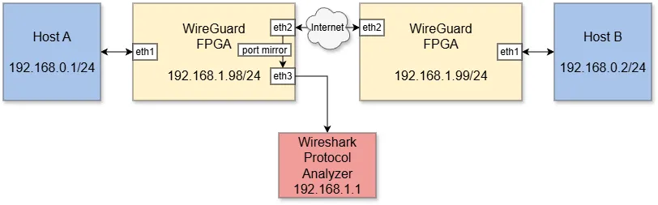
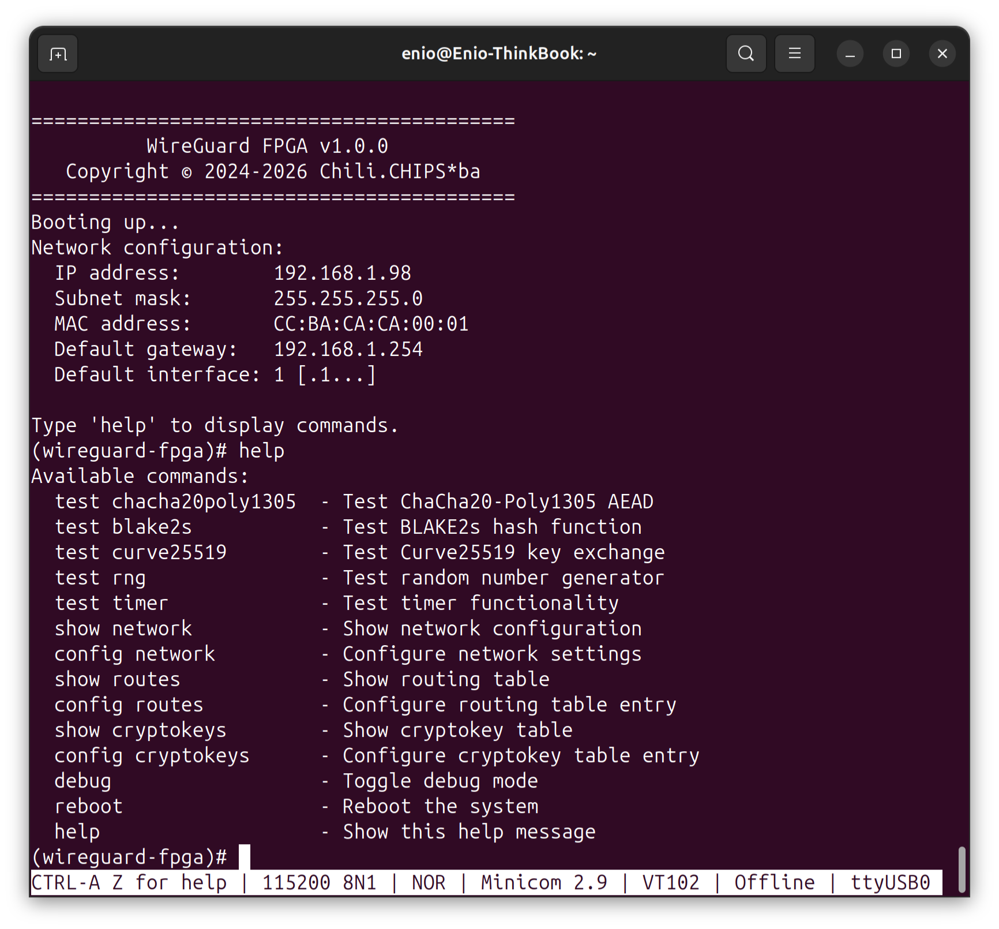
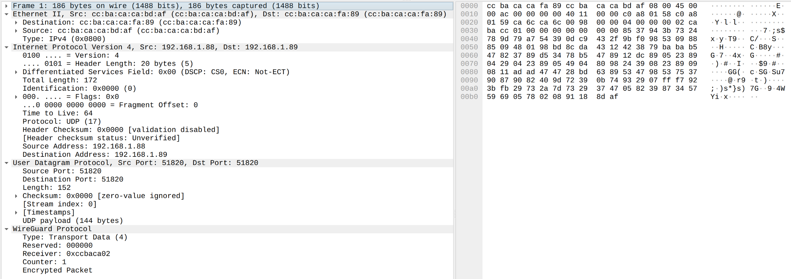

<!--
SPDX-FileCopyrightText: 2026 Chili.CHIPS*ba

SPDX-License-Identifier: BSD-3-Clause
-->

## Lab Test and Validation Setup

After connecting the Alinx AX7201 boards with cables according to the topology, the FPGA must programmed as described in
[build process](../3.build/README.md#hw-compilation---vivado).

<p align="center">
  
</p>

The AX7201 board provides a USB UART interface, which is used as the WireGuard CLI. A connection to the CLI can be established using a serial terminal application such as minicom:

```
minicom -D /dev/ttyUSB0
```

Once connected to the CLI, the FPGA can be reset (or reconfigured). This will generate a welcome message on the terminal, as shown in the figure below.

<p align="center">
  
</p>

We will now go through the steps to configure the WireGuard-FPGA nodes using the CLI.

First, we configure network settings for the left node:

```
(wireguard-fpga)# config network
Enter new network configuration:
  IP address [192.168.1.98]: 
  Subnet mask [255.255.255.0]: 
  Generate new MAC address? (y/n) [n]: y
  Default gateway [192.168.1.254]: 
  Default interface (0-7) [1]: 
Network configuration updated.
Network configuration:
  IP address:        192.168.1.98
  Subnet mask:       255.255.255.0
  MAC address:       CC:BA:CA:CA:BD:AF
  Default gateway:   192.168.1.254
  Default interface: 1 [.1...]
(wireguard-fpga)# 
```

Since the MAC address of the right node will be needed later, we configure it right now:

```
(wireguard-fpga)# config network
Enter new network configuration:
  IP address [192.168.1.98]: 192.168.1.99
  Subnet mask [255.255.255.0]: 
  Generate new MAC address? (y/n) [n]: y
  Default gateway [192.168.1.254]: 
  Default interface (0-7) [1]: 
Network configuration updated.
Network configuration:
  IP address:        192.168.1.99
  Subnet mask:       255.255.255.0
  MAC address:       CC:BA:CA:CA:FA:89
  Default gateway:   192.168.1.254
  Default interface: 1 [.1...]
(wireguard-fpga)#
```

Now we return to the configuration of the left WireGuard-FPGA node. First, we will configure the routing table:

```
(wireguard-fpga)# config routes
Enter new routing table entry:
  Entry index (0-63) [0]: 0
  Destination IP address [0.0.0.0]: 192.168.0.0
  Subnet mask [0.0.0.0]: 255.255.255.0
  Peer index (0-63) [0]: 1
  Destination interface (0-7) [0]: 6
Routing table entry updated.
  (0) IP: 192.168.0.0, Mask: 255.255.255.0, Peer index: 1, Destination interface: 6 [..2.4]
(wireguard-fpga)# 
```

Next, we still need to configure the WireGuard peer:

```
(wireguard-fpga)# config cryptokeys
Enter new cryptokey table entry:
  Entry index (1-63) [1]:
  Local MAC address [000000000000]: CCBACACABDAF
  Local IP address [0.0.0.0]: 192.168.1.98
  Local port (0-65535) [0]: 51820
  Local ID (8 hex digits) [00000000]: CCBACA01
  Remote MAC address [000000000000]: CCBACACAFA89
  Remote IP address [0.0.0.0]: 192.168.1.99
  Remote port (0-65535) [0]: 51820
  Remote ID (8 hex digits) [00000000]: CCBACA02
  Encryption key (1st 8 hex digits) [00000000]: 01234567
  Encryption key (2nd 8 hex digits) [00000000]: 89ABCDEF
  Encryption key (3rd 8 hex digits) [00000000]: 01234567
  Encryption key (4th 8 hex digits) [00000000]: 89ABCDEF
  Encryption key (5th 8 hex digits) [00000000]: 01234567
  Encryption key (6th 8 hex digits) [00000000]: 89ABCDEF
  Encryption key (7th 8 hex digits) [00000000]: 01234567
  Encryption key (8th 8 hex digits) [00000000]: 89ABCDEF
  Decryption key (1st 8 hex digits) [00000000]: FEDCBA98
  Decryption key (2nd 8 hex digits) [00000000]: 76543210
  Decryption key (3rd 8 hex digits) [00000000]: FEDCBA98
  Decryption key (4th 8 hex digits) [00000000]: 76543210
  Decryption key (5th 8 hex digits) [00000000]: FEDCBA98
  Decryption key (6th 8 hex digits) [00000000]: 76543210
  Decryption key (7th 8 hex digits) [00000000]: FEDCBA98
  Decryption key (8th 8 hex digits) [00000000]: 76543210
  Reset send/recv counters? (y/n) [n]: y
Cryptokey table entry updated.
  (1) Local MAC: CCBACACABDAF, Local IP: 192.168.1.98, Local port: 51820, Local ID: 0xCCBACA01
    Remote MAC: CCBACACAFA89, Remote IP: 192.168.1.99, Remote port: 51820, Remote ID: 0xCCBACA02
    Encryption key: 0x0123456789ABCDEF0123456789ABCDEF0123456789ABCDEF0123456789ABCDEF
    Decryption key: 0xFEDCBA9876543210FEDCBA9876543210FEDCBA9876543210FEDCBA9876543210
    Send counter: 0x0000000000000000
    Recv counter: 0x0000000000000000
(wireguard-fpga)#
```

Now we will complete the configuration of the right node. First, we will configure the routing table:

```
(wireguard-fpga)# config routes
Enter new routing table entry:
  Entry index (0-63) [0]: 0
  Destination IP address [0.0.0.0]: 192.168.0.0
  Subnet mask [0.0.0.0]: 255.255.255.0
  Peer index (0-63) [0]: 1
  Destination interface (0-7) [0]: 2
Routing table entry updated.
  (0) IP: 192.168.0.0, Mask: 255.255.255.0, Peer index: 1, Destination interface: 6 [..2..]
(wireguard-fpga)#
```

Finally, we need to configure the WireGuard peer:

```
(wireguard-fpga)# config cryptokeys
Enter new cryptokey table entry:
  Entry index (1-63) [1]:
  Local MAC address [000000000000]: CCBACACAFA89
  Local IP address [0.0.0.0]: 192.168.1.99
  Local port (0-65535) [0]: 51820
  Local ID (8 hex digits) [00000000]: CCBACA02
  Remote MAC address [000000000000]: CCBACACABDAF
  Remote IP address [0.0.0.0]: 192.168.1.98
  Remote port (0-65535) [0]: 51820
  Remote ID (8 hex digits) [00000000]: CCBACA01
  Encryption key (1st 8 hex digits) [00000000]: FEDCBA98
  Encryption key (2nd 8 hex digits) [00000000]: 76543210
  Encryption key (3rd 8 hex digits) [00000000]: FEDCBA98
  Encryption key (4th 8 hex digits) [00000000]: 76543210
  Encryption key (5th 8 hex digits) [00000000]: FEDCBA98
  Encryption key (6th 8 hex digits) [00000000]: 76543210
  Encryption key (7th 8 hex digits) [00000000]: FEDCBA98
  Encryption key (8th 8 hex digits) [00000000]: 76543210
  Decryption key (1st 8 hex digits) [00000000]: 01234567
  Decryption key (2nd 8 hex digits) [00000000]: 89ABCDEF
  Decryption key (3rd 8 hex digits) [00000000]: 01234567
  Decryption key (4th 8 hex digits) [00000000]: 89ABCDEF
  Decryption key (5th 8 hex digits) [00000000]: 01234567
  Decryption key (6th 8 hex digits) [00000000]: 89ABCDEF
  Decryption key (7th 8 hex digits) [00000000]: 01234567
  Decryption key (8th 8 hex digits) [00000000]: 89ABCDEF
  Reset send/recv counters? (y/n) [n]: y
Cryptokey table entry updated.
  (1) Local MAC: CCBACACAFA89, Local IP: 192.168.1.99, Local port: 51820, Local ID: 0xCCBACA02
    Remote MAC: CCBACACABDAF, Remote IP: 192.168.1.98, Remote port: 51820, Remote ID: 0xCCBACA01
    Encryption key: 0xFEDCBA9876543210FEDCBA9876543210FEDCBA9876543210FEDCBA9876543210
    Decryption key: 0x0123456789ABCDEF0123456789ABCDEF0123456789ABCDEF0123456789ABCDEF
    Send counter: 0x0000000000000000
    Recv counter: 0x0000000000000000
(wireguard-fpga)#
```

Now we can test the communication between hosts A and B, for example by pinging node B from node A:

```
ping 192.168.1.99
```

The image shows the first encrypted packet (ICMP Echo Request) captured on the node 192.168.1.1.

<p align="center">
  
</p>

## WireGuard Test Scripts

Here are the scripts for testing certain functionalities of the complete build (HW + SW) and for debugging:
- `loopback.UART.py` - For loopback testing of the UART controller and peripheral hardware (CP2102), the script generates data blocks consisting of repeating characters A–Z and sends them over the serial port to the FPGA. Once the data is received back from the FPGA, it is compared with the originally sent data to verify correctness.
- `imwr.UART.py` - For replacing a single instruction in IMEM (as described in the [UART Data Flow](/1.hw/README.md#uart-data-flow)), the script sends the C_IMWR command followed by a 4-byte address and a 4-byte instruction. This allows precise modification of the program in real time without resetting the CPU.
- `busr.UART.py` - Used for reading data from the DMEM/CSR address space (as described in the [UART Data Flow](/1.hw/README.md#uart-data-flow)). Includes an example of reading the GPIO register.
- `busw.UART.py` - Used for writing data to the DMEM/CSR address space (as described in the [UART Data Flow](/1.hw/README.md#uart-data-flow)). Includes an example of writing to the GPIO register.
- `dump_packet.UART.py` - For reading an entire Ethernet packet (structure `eth_raw_packet_t`) from DMEM, including both hexadecimal and textual display of the payload.

