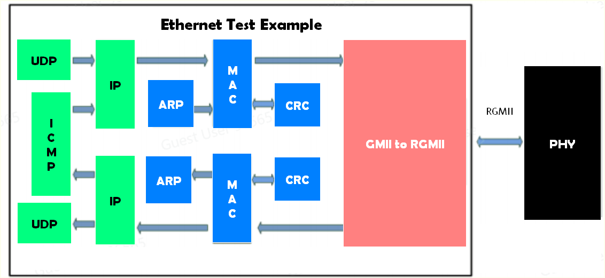

# Ethernet Test

## Intro

This example is about achieving data communication between FPGA and PC, using 1Gbps Ethernet UDP communication protocol.

The FPGA talks to the Realtek RT8211EG PHY chip over RGMII interface. The PHY in turns sends data to the PC via RJ45 connector and Unshielded Twisted Pair (UTP) cable.

The example implements ARP, UDP and PING functions, as well as 100/1000Mbps self-adaptation.

## Block Diagram



## Test Setup

We tested 2 parts of the system, ICMP (ping) and UDP (data transfer). For this we've connected the development board with the PC via ethernet cable and ethenet-to-usb adapter. The whole system is shown below.


On the software side, you will need Wireshark to capture the traffic between PC and the board. But before that, one must configure the ethernet adapter and it's subnet to "192.168.0.3" and "255.255.255.0" (this was specified in the RTL). The IP address of the board will be "192.168.0.2". 

The following instructions outline how to configure a static IPv4 address and subnet mask using Command Prompt.
1. **Check the interface name**  
   Execute the following command to display all network interfaces and identify the name of your Ethernet adapter:  
   
   ```cmd
   netsh interface show interface
   
  

3. **Set the IP address and subnet mask**  
   Use the command below to assign the desired IP address and subnet mask to the identified interface:
   > **Note**: Use the Interface Name from step 1 for the parameter "name".
   ```cmd
   netsh interface ip set address name="Ethernet" static 192.168.0.3 255.255.255.0

5. **Verify the configuration**  
   Confirm that the IP address and subnet mask have been applied correctly by executing:
   ```cmd
   ipconfig


## Test Demo

The thing we tested is "pinging" or ICMP protocol, and the results are shown below:


The next functionality is UDP transfer, which we captured with Wireshark. The data we send every second is set in **mac_test.v** file:


Wireshark traffic capture is shown below:


## Resource Utilization

As you can see, not much of the FPGAs resources are used, so this gives us the opportunity to develop much more complex systems that are based on this one.


### End-of-File
