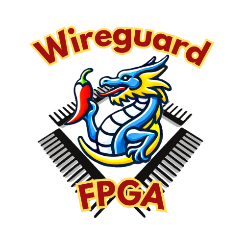
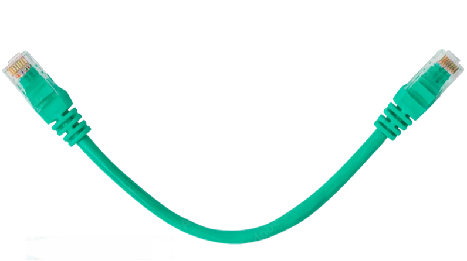

# Wireguard FPGA
Virtual Private Networks (VPNs) are the central and indispensable component of Internet security. They comprise a set of technologies that connect geographically dispersed, heterogeneous networks through encrypted tunnels, creating the impression of a homogenous private network on the public shared physical medium. 

  
  
  

With traditional solutions (such as OpenVPN / IPSec) starting to run out of steam, Wireguard is increasingly coming to the forefront as a modern, secure data tunneling and encryption method, one that's also easier to manage than the incumbents. Both software and hardware implementations of Wireguard already exist. However, the software performance is far below the speed of wire. Existing hardware approaches are both prohibitively expensive and based on proprietary, closed-source IP blocks and tools.  

- The intent of this project is to bridge these gaps with an FPGA open-source implementation of Wireguard, written in SystemVerilog HDL.

## A Glimpse into History 
We have contributed to the **Blackwire** project, which is a 100Gbps hardware implementation of Wireguard switch based on AMD/Xilinx-proprietary AlveoU50 PC-accelerator card (SmartNIC form-factor), and implementable only with proprietary Vivado toolchain. 

While working on the _Blackwire_, we have touched multiple sections, and focused on the novel algorithm for [_Balanced Binary Tree Search_](0.doc/Wireguard/Scalable-Balanced-Pipelined-IPv6-Lookup.pdf) of IP tables. However, the _Blackwire_ hardware platform is expensive and priced out of reach of most educational institutions. Its gateware is written in SpinalHDL, a nice and powerfull but a niche HDL, which has not taken roots in the industry. While _Blackwire_ is now released to open-source, that decision came from their financial hardship -- It was originaly meant for sale. Moreover, the company behind it is subject to disputes and obligations that bring into question the legality of ownership over the codebase they "donated" to the open source community. 

## Back to the Future
To make the hardware Wireguard truly accessible in the genuine spirit of open-source movement, this project implements it:
-	for an [inexpensive hardware platform](https://www.alinx.com/en/detail/611) with four 1000Base-T ports
-	in a self-sufficient way, i.e. w/o requiring PC host
-	using a commodity Artix7 FPGA
-	which is supported by open-source tools  
-	and with all gateware written in the ubiquitous Verilog / System Verilog

  
  

## References

**[Ref1]** Wireguard implementations in software:
>- [Netbird](https://github.com/netbirdio/netbird)
>- [Tailscale](https://tailscale.com/blog/more-throughput)
>- [Linux Kernel](https://thenewstack.io/Wireguard-vpn-protocol-coming-to-a-linux-kernel-near-you)
  
**[Ref2]** 100Gbps [_Blackwire_](https://github.com/brightai-nl/BrightAI-Blackwire) Wireguard 
  
**[Ref3]** [Corundum](https://github.com/corundum/corundum), open-source FPGA-NIC platform 
  
**[Ref4]** [ChaCha20-Poly1305](https://github.com/mrdcvlsc/ChaCha20-Poly1305) open-source Crypto RTL 
  
**[Ref5]** Cookie Cutter [SOC](https://github.com/chili-chips-ba/openXC7-TetriSaraj)

**[Ref6]** [RISC-V ISS](https://github.com/wyvernSemi/riscV/tree/main/iss)

**[Ref7]** [10Gbps Ethernet Switch](https://github.com/ZipCPU/eth10g)
  
**[Ref8]** [OpenXC7](https://github.com/openXC7) open-source tools for Xilinx Series7

# Project Outline

## Scope
The Phase1 (This!) is primarily **Proof of Concept**, i.e. not full-featured, and definitely not a deployable product. It is envisoned as a mere on-ramp, a springboard for future build-up and optimizations.

The Phase2 continuation project is therefore also in the plans, to maximize efficiency and overall useability, such as by increasing the number of channels, facilitating management with GUI apps, or something else as identified by the community feedback.

## Recognized Challenges 
1) HW/SW partitioning, interface, interactions and workload distribution
> - While, contrary to _Blackwire_, we don’t rely on an external PC connected via PCIE, we will still have an on-chip RISC-V CPU with intricate hardware interface and significant Embedded Software component that controls the backbone of wire-speed datapath

2) HW/SW co-development, integration and debugging
> - Standard simulation is impractical for the project of this size and complexity. We therefore intend to put to test and good use the very promissing new [VProc ISS](https://www.linkedin.com/posts/simon-southwell-7684482_riscv-iss-embeddedsoftware-activity-7217116220754411520-08xZ?utm_source=share&utm_medium=member_desktop) [Ref6]
> - It’s also impractical and expensive to provide full test systems with real traffic generators and checkers to all developers. We therefore plan to rent some space for a central lab that will host two test systems, then provide remote access to all developers
3)	Real-life, at-speed testing
4)	Extent of open-source tools support for SystemVerilog and all needed FPGA primitives and IP functions
5)	QOR of the (still maturing) open-source tools
> - _Blackwire_ used commercial, AMD/Xilinx-proprietary Vivado toolchain, as well as high-end Alveo U50 FPGA silicon. Even then, they ran into multiple timing closure, utilization and routing congestion challenges.
6) Financial resources
> - Given that this is a complex, multi-disciplinary dev effort, the available funding may not be sufficient to bring it to completion. _Blackwire_, despite a larger allocated budget, ended up with funding crisis and abrupt cessation of dev activities.

# Project Execution Plan / Tracking

This project is WIP at the moment. The checkmarks below indicate our status. Until all checkmarks are in place, anything you get from here is w/o guaranty -- Use at own risk, as you see fit, and don't blame us if it is not working 🌤️

## Take1
**Board bring up. In-depth review of Wireguard ecosystem and prior art. Design Blueprint**

While the board we're using is low cost, it is also not particularly known in the open-source community. We certainly don’t have prior experience with it. In this opening take we will build a solid foundation for efficient project execution. Good preparation is crucial for a smooth run. We thus seek to first _`understand and document what we will be designing: SOC Architecture, Datapath Microarchitecture, Hardware/Software Partitioning, DV and Validation Strategy`_. 

Getting a good feel for our Fmax is also a goal of this take. Artix-7 does not support High-Performance (HP) I/O. Consequently, we cannot push its I/O beyond 600MHz, nor its core logic beyond 100 MHz. 

- [ ] Familiarization with HW platform
- Create our first FPGA program that blinks LEDs
- Verify pinouts and connectivity using simple test routines
- Generate a few Ethernet test patterns 

- [ ] Familiarization with SW platform
- Initial bring up of embedded CPU within a _cookie-cutter_ SOC, such as [Ref5]
- Design and test a simple SW interface to rudimentary HW Ethernet datapath

- [x] Detailed analysis and comparisons of:
- Wireguard [White Papers](https://www.ndss-symposium.org/wp-content/uploads/2017/09/ndss2017_04A-3_Donenfeld_paper.pdf)
- existing implementations in software [Ref1]
- vs. _Blackwire_ hardware implementation [Ref2]
- [cryptographic algorithms](https://eprint.iacr.org/2018/080.pdf) used for Wireguard, esp. **ChaCha20** for encryption, **Poly1305** for authentication [Ref4] and, to a lesser extent, _Curve25519_ for key exchange and _blake2_ for hashing
  
- [x] Identification and assimilation of prior art and building IP blocks, in particular **Corundum** [Ref3] and, to a lesser extent, _10GE Switch_ [Ref7] 

- [x] Architecture/uArch Design. HW/SW Partitioning. Verification Plan

- [x] Creation of sufficient initial documentation for project divide-and-conquer across a multi-disciplinary team of half a dozen developers

## Take2
**Implementation of a basic, statically pre-configured Wireguard link**

It it in this take that we start creating hardware Datapath and hardening Wireguard encryption protocols, all using Vivado and Xilinx primitives.

- [ ] Integration of collected RTL blocks into a coherent HW system that implements the basic Wireguard datapath for a handful of manually pre-configured channels.
- Corundum FPGA-based NIC and platform for opensource Ethernet development [Ref3]
-	IP Core for **ChaCha20-Poly1305** [Ref4] -- Definitely in hardware from the get-go
> - https://github.com/Goshik92/FpgaCha
> - https://github.com/secworks/ChaCha20-Poly1305
- _Curve25519_ module for key exchange -- Likely in software at this point
> - https://github.com/kazkojima/x25519-fpga
- _blake2_ module for hashing -- Likely in software at this point
> - https://github.com/secworks/blake2
- [ ] Timing closure. Resolution of FPGA device utilization and routing congestion issues
- [ ] Creation of cocoTB DV in the CI/CD environmenT, and representative test cases for datapath simulation

## Take3
**Development and integration of embedded management software (Control Plane)**

This work package is about hardware/software codesign and integration. The firmware will run on a soft RISC V processor, inside the FPGA. Our vanilla SOC is at this point starting to be customized to Wireguard needs. This work can to some extent go on in parallel with hardware activities of Take2. 

- [ ]	SW design for the embedded on-chip processor
- Code is to be written in the bare-metal C with, as necessary, few sections in Assembly
- SW is responsible for configuration and management of hardware blocks
- SW must not participate in the bulk datapath transfers
- SW may however intercept the low-frequency management packets
- For quick bring up, the IP Address Search (using novel balanced binary tree algorithm) may initially be hosted in software, then ported to hardware at a later point
- SW will also cover KMM function -- Key Management Module

- [ ] HW/SW Integration

## Take4
**VPN Tunnel: Session initialization, maintenance, and secure closure**

This is about managing the bring-up, maintenance and tear-down of VPN tunnels between two devices.
- [ ] Session Initialization: Starting the handshake process to establish secure communication with another device
- [ ] Session Maintenance: Keeping the session active through the regular exchange of control messages, which allows detection and recovery from problems such as connection interruptions
- [ ] Session Closure: Securely close the VPN tunnel when communication is no longer needed, ensuring that all temporary keys and sensitive data are deleted

## Take5
**Testing, Profiling and Porting to OpenXC7**

- [ ] Functional testing on the real system. Does it work as intended? Bug fixes

- [ ] Performance testing. HW/SW profiling, updates and enhancements to ensure the design indeed operates at close to the wire speed on all preconfigured channels

- [ ] Porting to openXC7 [Ref8] using [SV2V](https://github.com/zachjs/sv2v), in the GoCD CI/CD setting 
> This is challenging, as openXC7 has thus far been crashing for NES SV

- [ ] Timing closure with openXC7
> This is definitely challenging, given that openXC7 is currently without accurate timing-driven STA

- [ ] Filing bug tickets with open source developers for issues found in their tools, supporting them all the way to the resolution
      
- [x] Creation and maintenance of an attractive and well-documented Github repo, to entice community interest
      
- [ ] Ongoing documentation updates and CI/CD script maintenance to keep it valid in the light of inevitable design mutations compared to the original Design Blueprint.

## Take6 (time-permitting Bonus)
**Flow control module for efficient and stable VPN tunnel data management**

The objective of this optional deliverable is to ensure stable and efficient links, thus taking this project one step closer to a deployable product.

- [ ] Develop software components for management of data flow within VPN tunnels

# Design Blueprint (WIP)
[//]: 

## HW/SW Partitioning
Since the Wireguard node essentially functions as an IP router with Wireguard protocol support, we have decided to design the system according to a two-layer architecture: a control plane responsible for managing IP routing processes and executing the Wireguard protocol (managing remote peers, sessions, and keys), and a data plane that will perform IP routing and cryptography processes at wire speed. The control plane will be implemented as software running on a soft CPU, while the data plane will be fully realized in RTL on an FPGA.

In the HW/SW partitioning diagram, we can observe two types of network traffic: control traffic, which originates from the control plane and goes toward the external network (and vice versa), and data traffic, which arrives from the external network and, after processing in the data plane, returns to the external network. Specifically, control traffic represents Wireguard protocol handshake messages, while data traffic consists of end-user traffic, either encrypted or in plaintext, depending on the perspective.

## Hardware Architecture
### HW Block Diagram

### HW Theory of Operation
The hardware architecture essentially follows the HW/SW partitioning and consists of two domains: a soft CPU for the control plane and RTL for the data plane.

The soft CPU is equipped with a Boot ROM and a DDR3 SDRAM controller for interfacing with off-chip memory. External memory is exclusively used for control plane processes and does not store packets. The connection between the control and data planes is established through a CSR-based HAL.

The data plane consists of several IP cores, which are listed and explained in the direction of network traffic propagation:
- _PHY Controller_ - initial configuration of Realtek PHYs and monitoring link activity (link up/down events)
- _1G MAC_ - execution of the 1G Ethernet protocol (framing, flow control, FCS, etc.)
- _Rx FIFOs_ - clock domain crossing, bus width conversion, and store & forward packet handling
- _Per-Packet Round Robin Multiplexer_ - servicing Rx FIFOs on a per-packet basis using a round-robin algorithm
- _Header Parser_ - extraction of Wireguard-related information from packet headers (IP addresses, UDP ports, Wireguard message type, peer ID, etc.)
- _Wireguard/UDP Packet Disassembler_ - decapsulation of the payload from the Wireguard data packet for decryption of tunneled traffic
- _ChaCha20-Poly1305 Decryptor_ - decryption and authentication of tunneled traffic
- _IP Lookup Engine_ - routing/forwarding table lookup, mapping packets to the appropriate Wireguard peer, and making packet accept/reject decisions
- _ChaCha20-Poly1305 Encryptor_ - encryption and authentication of traffic to be tunneled
- _Wireguard/UDP Packet Assembler_ - encapsulation of the encrypted packet into a Wireguard data packet for tunneling to the remote peer
- _Per-Packet Demultiplexer_ - forwarding packets to Tx FIFOs based on packet type and destination
- _Tx FIFOs_ - clock domain crossing, bus width conversion, and store & forward packet handling

_ChaCha20-Poly1305 Encryptor/Decryptor_ are using [RFC7539's](https://datatracker.ietf.org/doc/html/rfc7539) AEAD (Authenticated Encryption Authenticated Data) construction based on [ChaCha20](http://cr.yp.to/chacha.html) for symmetric encryption and [Poly1305](http://cr.yp.to/mac.html) for authentication.

## Software Architecture
### SW Conceptual Class Diagram

### SW Theory of Operation
The conceptual class diagram provides an overview of the components in the software part of the system without delving into implementation details. The focus is on the Wireguard Agent, which implements the protocol's handshake procedures, along with the following supplementary components:
- [Curve25519](http://cr.yp.to/ecdh.html) - an ECDH algorithm implementation for establishing a shared secret using a public-private key pair between two remote parties connected via an insecure channel, such as the Internet
- ChaCha20-Poly1305 - an AEAD algorithm implementation for encryption and authentication of static keys and nonce values to prevent replay attacks
- XChaCha20-Poly1305 - a XAEAD algorithm implementation for encrypting and authenticating nonce values in Cookie Replay messages to mitigate potential DoS attacks
- [BLAKE2s](https://www.blake2.net) - an implementation of the BLAKE2s hash function for MAC authentication and keyed hashing, per [RFC7693](https://datatracker.ietf.org/doc/html/rfc7693)
- RNG - a random number generator used to initialize the DH key generator and generate peer identifiers
- Timer - timers for rekey, retry, and keepalive procedures
- [HKDF](https://eprint.iacr.org/2010/264) - an implementation of the algorithm for expanding the ECDH result
- RTC - a real-time clock used to generate the TAI64N timestamp
- [SipHash](https://en.wikipedia.org/wiki/SipHash) - a simple non-cryptographic function used for implementing a hashtable for fast lookup of decrypted static public keys of remote peers
- Routing DB Updater - a subsystem for maintaining the cryptokey routing table content and deploying it to the data plane via the HAL/CSR interface
- ICMP - implementing basic ICMP protocol functions (echo request/reply, TTL exceeded, etc.)
- CLI - a USB/UART-based command-line interface for configuring the Wireguard node (setting the local IP address, remote peer IP addresses, network addresses, keys, etc.)
- HAL/CSR Driver - a CSR-based abstraction for data plane components with an interface for reading/writing the corresponding registers

## Hardware Data Flow
### HW Flow Chart, Throughputs and Pushbacks
The hardware architecture features three clock signal domains:
- 125 MHz domain with an 8-bit bus for interfacing data plane with 1G MAC cores (marked in blue)
- 80 MHz domain with a 32-bit bus for interfacing data plane with the CPU (marked in red)
- 80 MHz domain with a 128-bit bus for the packet transfer through the data plane pipeline (marked in green)

The blue domain is defined based on the SDR GMII interface, which operates at 125 MHz and connects the Realtek PHY controller with the MAC cores on the FPGA.

The red domain encompasses the entire CSR with all peripherals. The clock signal frequency and bus width are defined based on the assumption that Wireguard peers exchange handshake messages sporadically—during connection initialization and periodically, typically every few minutes, for key rotation. Since handshake signaling does not significantly impact network traffic, we decided to implement the connection between the data and control planes without DMA, utilizing direct CPU interaction with Tx/Rx FIFOs through a CSR interface.

Although the Data Plane Engine (green domain) transfers packets at approximately 10 Gbps, the cores in the DPE pipeline are not expected to process packets at such a rate. Given that we have 4 x 1Gbps Ethernet interfaces, the cryptographic cores must process packets at a rate of at least 4 Gbps to ensure the system works at wire speed. For some components, such as the _IP Lookup Engine_, packet rate is more critical than data rate because their processing focuses on the packet headers rather than the payload. Assuming that, in the worst-case scenario, the smallest packets (64 bytes) arrive via the 1 Gbps Ethernet interface, the packet rate for each Ethernet interface would be 1,488,096 packets per second (pps). Therefore, in the worst-case scenario, such components must process packets at approximately 6 Mpps rate (e.g. 6 million IP table lookups per second).

The cores within the DPE transmit packets via the AXI4-Stream interface. Although data transfer on the TDATA bus is organized as little-endian, it is important to note that the internal organization of fields within the headers of Ethernet, IP, and UDP protocols follows big-endian format (also known as network byte order). On the other hand, the fields within the headers of the Wireguard protocol are transmitted in little-endian format.

## Software Control Flow

### SW Flow Chart, Messages and HW Intercepts

During the initial Wireguard handshake and subsequent periodic key rotations,  the control plane must update the cryptokey routing table implemented in register memory within the CSR. Since the CSR manages the operation of the DPE, such changes must be made atomically to prevent unpredictable behavior in the DPE.
One way to achieve this is by using [write-buffered registers](https://peakrdl-regblock.readthedocs.io/en/latest/udps/write_buffering.html) (WBR). However, implementing 1 bit of WBR  memory requires three flip-flops: one to store the current value, one to hold the future value, and one for the write-enable signal. Therefore, we consider an alternative mechanism for atomic CSR updates based on flow control between the CPU and the DPE. Suppose the CPU needs to update the contents of a routing table implemented using many registers. Before starting the update, the CPU must pause packet processing within the DPE. However, such a pause cannot be implemented using the inherent stall mechanism supported by the AXI protocol (by deactivating the TREADY signal at the end of the pipeline), as a packet that has already entered the DPE must be processed according to the rules in effect at the time of its entry. We introduce a graceful flow control mechanism coordinated through a dedicated Flow Control Register (FCR) to address this.

The atomic CSR update mechanism works as follows:
1. When the CPU needs to update the routing table, it activates the PAUSE signal by writing to the FCR.P register.
2. The active FCR.P signal instructs the input multiplexer to transition into the PAUSED state after completing the servicing of the current queue. The CPU periodically checks the ready bits in the FCR register.
3. Once the first component finishes processing its packet and clears its datapath, it deactivates the TVALID signal and transitions to the IDLE state. The CPU continues to check the ready bits in the FCR register.
4. The processing of remaining packets and datapath clearing continues until all components transition to the IDLE state. The CPU monitors the ready bits in the FCR register, which now indicates that the DPE has been successfully paused.
5. The CPU updates the necessary registers (e.g., the routing table) over multiple cycles.
6. Upon completing the updates, the CPU deactivates the PAUSE signal (FCR.P).
7. The multiplexer returns to its default operation mode and begins accepting packets from the next queue in a round-robin fashion.
8. As packets start arriving, all components within the DPE gradually transition back to their active states.

## HW/SW Working Together as a Coherent System
The example is based on a capture of real Wireguard traffic, recorded and decoded using the Wireshark tool ([encrypted](https://gitlab.com/wireshark/wireshark/-/blob/master/test/captures/wireguard-ping-tcp.pcap) and [decrypted](https://gitlab.com/wireshark/wireshark/-/blob/master/test/captures/wireguard-ping-tcp-dsb.pcapng)). The experimental topology consists of four nodes:
- 10.10.0.2 - the end-user host at site A
- 10.9.0.1 - Wireguard peer A
- 10.9.0.2 - Wireguard peer B
- 10.10.0.1 - the end-user host at site B

To illustrate the operation of the system as a whole, we will follow the step-by-step passage of packets through the system in several phases:
- Sending a Handshake Initiation from peer A
- Receiving the Handshake Initiation on peer B and sending a Handshake Response back to peer A
- Receiving the Handshake Response on peer A
- Encryption and tunneling of the ICMP Echo Request packet (from host A to host B via peer A)
- Detunneling and decryption of the ICMP Echo Request packet (from host A to host B via peer B)

1. The Wireguard Agent on peer A initiates the establishment of the VPN tunnel by generating the contents of the _Handshake Initiation_ packet.
2. The CPU transfers the _Handshake Initiation_ packet from RAM to the Rx FIFO via the CSR interface towards the data plane.
3. Once the entire packet is stored in the Rx FIFO, the Round Robin Multiplexer services the packet from the FIFO and injects it into the data plane pipeline.
4. In the first three cycles of the packet transfer, the Header Parser extracts important information from the packet header (including the destination IP address and type of Wireguard message) and supplements the extracted metadata to the packet before passing it along. Now, knowing the message type (_Handshake Initiation_), the Wireguard/UDP Packet Disassembler and ChaCha20-Poly1305 Decryptor forward the packet without any further processing.
5. The IP Lookup Engine searches the routing table based on the destination IP address and determines the outgoing Ethernet interface, supplementing this information to the packet before forwarding it. Similar to the previous step, the Wireguard/UDP Packet Assembler and ChaCha20-Poly1305 Encryptor forward the packet without any additional processing.
6. Based on the accompanying metadata, the Demultiplexer directs the packet to the corresponding Tx FIFO (to _if1_).
7. Once the entire packet is stored in the Tx FIFO, it is dispatched to the MAC core of the outgoing interface _if1_, provided that the corresponding 1 Gbps link is active and ready.
8. The 1G MAC writes its MAC address as the source address, calculates the FCS on the fly, adds it to the end of the Ethernet frame, and sends it to peer B.

9. On peer B, the 1G MAC receives the incoming Ethernet frame and calculates the FCS on the fly. If the frame is valid, it is forwarded to the Rx FIFO (from _if1_).
10. Once the entire packet is stored, the Rx FIFO signals the Round-Robin Multiplexer.
11. The Round-Robin Multiplexer services the packet from the FIFO and injects it into the data plane pipeline.
12. The Header Parser extracts important information from the packet header (including the destination IP address and type of Wireguard message) and supplements the extracted metadata to the packet before passing it along. Now, knowing the message type (_Handshake Initiation_), the Wireguard/UDP Packet Disassembler and ChaCha20-Poly1305 Decryptor forward the packet without any further processing.
13. The IP Lookup Engine searches the routing table based on the destination IP address and determines that the control plane is the destination, supplementing this information to the packet before forwarding it. Similar to the previous step, the Wireguard/UDP Packet Assembler and ChaCha20-Poly1305 Encryptor forward the packet without any additional processing.
14. Based on the accompanying metadata, the Demultiplexer directs the packet to the corresponding Tx FIFO (toward the CPU).
15. Once the entire packet is stored in the Tx FIFO, the CPU transfers the packet from the FIFO to RAM via the CSR-based interface and hands it over to the Wireguard Agent for further processing.
16. The Wireguard Agent processes the _Handshake Initiation_ request and generates the _Handshake Response_.
17. The Routing DB Updater updates the routing table per the Wireguard Agent's instructions (adding the peer's IP address and Wireguard-related data).
18. The CPU updates the registers from which the data plane reads the routing table and the corresponding cryptographic keys via the CSR interface.
19. The CPU transfers the _Handshake Response_ packet from RAM to the Rx FIFO (to the data plane) via the CSR interface.
20. The Round-Robin Multiplexer services the packet from the FIFO and injects it into the data plane pipeline.
21. The Header Parser extracts important information from the packet header (including the destination IP address and type of Wireguard message) and supplements the extracted metadata to the packet before passing it along. Now, knowing the message type (_Handshake Response_), the Wireguard/UDP Packet Disassembler and ChaCha20-Poly1305 Decryptor forward the packet without any further processing.
22. The IP Lookup Engine searches the routing table based on the destination IP address and determines the outgoing Ethernet interface, supplementing this information to the packet before forwarding it. Similar to the previous step, the Wireguard/UDP Packet Assembler and ChaCha20-Poly1305 Encryptor forward the packet without any additional processing.
23. Based on the accompanying metadata, the Demultiplexer directs the packet to the corresponding Tx FIFO (toward _if1_).
24. Once the entire packet is stored in the Tx FIFO, it is dispatched to the MAC core of the outgoing interface _if1_, provided that the corresponding 1 Gbps link is active and ready.
25. The 1G MAC writes its MAC address as the source address, calculates the FCS on the fly, adds it to the end of the Ethernet frame, and sends it to peer A.

26. On peer A, the 1G MAC receives the incoming Ethernet frame and calculates the FCS on the fly. If the frame is valid, it is forwarded to the Rx FIFO (from _if1_).
27. Once the entire packet is stored, the Rx FIFO signals the Roung-Robin Multiplexer.
28. The Round-Robin Multiplexer services the packet from the FIFO and injects it into the data plane pipeline.
29. The Header Parser extracts important information from the packet header (including the destination IP address and type of Wireguard message) and supplements the extracted metadata to the packet before passing it along. Now, knowing the message type (_Handshake Response_), the Wireguard/UDP Packet Disassembler and ChaCha20-Poly1305 Decryptor forward the packet without any further processing.
30. The IP Lookup Engine searches the routing table based on the destination IP address and determines that the control plane is the destination, supplementing this information to the packet before forwarding it. Similar to the previous step, the Wireguard/UDP Packet Assembler and ChaCha20-Poly1305 Encryptor forward the packet without any additional processing.
31. Based on the accompanying metadata, the Demultiplexer directs the packet to the corresponding Tx FIFO (toward the CPU).
32. Once the entire packet is stored in the Tx FIFO, the CPU transfers the packet from the FIFO to RAM via the CSR-based interface and hands it over to the Wireguard Agent for further processing.
33. The Wireguard Agent processes the _Handshake Response_.
34. The Routing DB Updater updates the routing table per the Wireguard Agent's instructions (adding the peer's IP address and Wireguard-related data).
35. The CPU updates the registers from which the data plane reads the routing table and the corresponding cryptographic keys. The session is now officially established, and the exchange of user data over the encrypted VPN tunnel can commence.

36. On peer A, an end-user packet (_ICMP Echo Request_) arrives via the _if2_ Ethernet interface. The 1G MAC receives the incoming Ethernet frame and calculates the FCS on the fly. If the frame is valid, it is forwarded to the Rx FIFO (from _if2_).
37. Once the entire packet is stored, the Rx FIFO signals the Round-Robin Multiplexer.
38. The Round-Robin Multiplexer services the packet from the FIFO and injects it into the data plane pipeline.
39. The Header Parser extracts important information from the packet header (including the destination IP address and protocol type) and supplements the extracted metadata to the packet before passing it along. Now, knowing the protocol type (ICMP), the Wireguard/UDP Packet Disassembler and ChaCha20-Poly1305 Decryptor forward the packet without any further processing.
40. The IP Lookup Engine searches the routing table based on the destination IP address and determines the target Wireguard peer and the outgoing Ethernet interface, supplementing this information to the packet before forwarding it.
41. Based on the information about the target peer and the corresponding key, the ChaCha20-Poly1305 Encryptor encrypts the packet and adds an authentication tag.
42. The Wireguard/UDP Packet Assembler adds Wireguard, UDP, IP, and Ethernet headers filled with the appropriate data to the encrypted packet and forwards it.
43. Based on the accompanying metadata, the Demultiplexer directs the packet to the corresponding Tx FIFO (toward _if1_).
44. Once the entire packet is stored in the Tx FIFO, it is sent to the MAC core of the outgoing interface _if1_, provided that the corresponding 1 Gbps link is active and ready.
45. The 1G MAC writes its MAC address as the source, calculates the FCS on the fly, which it ultimately appends to the end of the Ethernet frame, and then sends it to peer B.

46. On peer B, the 1G MAC receives the incoming Ethernet frame and calculates the FCS on the fly. If the frame is valid, it is forwarded to the Rx FIFO (from _if1_).
47. Once the entire packet is stored, the Rx FIFO signals the Round-Robin Multiplexer.
48. The Round-Robin Multiplexer services the packet from the FIFO and injects it into the data plane pipeline.
49. The Header Parser extracts important information from the packet header (including source/destination IP addresses and the type of Wireguard message) and supplements the extracted metadata to the packet before passing it along.
50. Based on the destination IP address, the Wireguard/UDP Packet Disassembler knows that the packet is intended for this peer, extracting the encrypted payload and forwarding it for further processing.
51. The ChaCha20-Poly1305 Decryptor decrypts the packet and, after verifying the authentication tag, forwards it further.
52. The IP Lookup Engine now receives the decrypted plaintext user packet (_ICMP Echo Request_). After searching the cryptokey routing table based on the source IP address of the decrypted plaintext packet, a decision is made to accept or reject the packet. If the packet correspondingly routes, it is forwarded.
53. Based on the accompanying metadata, the Demultiplexer directs the packet to the corresponding Tx FIFO (toward _if2_).
54. Once the entire packet is stored in the Tx FIFO, it is sent to the MAC core of the outgoing interface _if2_, provided that the corresponding 1 Gbps link is active and ready.
55. The 1G MAC writes its MAC address as the source, calculates the FCS on the fly, which it ultimately appends to the end of the Ethernet frame, and then sends it to the end-user host of peer B.

## Simulation Test Bench

The [Wireguard FPGA test bench](4.sim/README) aims to have a flexible approach to simulation which allows a common test environment to be used whilst selecting between alternative CPU components, one of which uses the [_VProc_ virtual processor](https://github.com/wyvernSemi/vproc) co-simulation element. This allows simulations to be fully HDL, with a RISC-V processor RTL implementation such as picoRV32, IBEX or EDUBOS5, or to co-simulate software using the virtual processor, with a significant speed up in simulation times. The test bench has the following features:

* A [_VProc_](https://github.com/wyvernSemi/vproc) virtual processor based [`soc_cpu.VPROC`](4.sim/models/README.md#soc-cpu-vproc) component
  * [Selectable](4.sim/README.md#auto-selection-of-soc_cpu-component) between this or an RTL softcore
  * Can run natively compiled test code
  * Can run the application compiled natively with the [auto-generated co-sim HAL](3.build/README.md#co-simulation-hal)
  * Can run RISC-V compiled code using the [rv32 RISC-V ISS model](4.sim/models/rv32/README.md)
* Uses a C [sparse memory model](https://github.com/wyvernSemi/mem_model)
  * An [HDL component](4.sim/models/cosim/README.md) instantiated in logic gives logic access to this memory
  * An API is provided to _VProc_ running code for direct access
* The [_udpIpPg VIP_](https://github.com/wyvernSemi/udpIpPg) is used to drive the logic's four ethernet ports in a four port [`bfm_ethernet`](4.sim/models/README.md#bfm_phy_ethernet) block.
  * An [MDIO slave interface](4.sim/models/README.md#bfm_phy_mdio) is also provided that maps *mem_model* memory areas to the registers with instantiated *mem_model* components

The figure below shows an oveview block diagram of the test bench HDL.

More details on the architecture and usage of the Wireguard test bench can be found in the [README.md](4.sim/README.md) in the `4.sim` directory.

## Co-simulation HAL

The Wireguard control and status register harware abstraction layer (HAL) software is [auto-generated](3.build/README.md#co-simulation-hal), as is the CSR RTL, using [`peakrdl`](https://peakrdl-cheader.readthedocs.io/en/latest/). For co-simulation purposes an additional layer is auto-generated from the same SystemRDL specification using [`systemrdl-compiler`](https://systemrdl-compiler.readthedocs.io/en/stable/) that accompanies the `peakrdl` tools. This produces two header files that define a common API to the application layer for both the RISC-V platform and the *VProc* based co-simulation verification environment. The details of the HAL generation can be found in the [README.md](./3.build/README.md#co-simulation-hal) in the `3.build/` directory.

## Lab Test and Validation Setup
TODO

## Shared Linux Server with tools
**WIP**

### Tool Versions
#### Simulation
* _Verilator_ **v5.024**
* _VProc_ **v1.12.2**
* _Mem Model_ **v1.0.0**
* _rv32_ ISS **v1.1.4**
* _udpIpPg_ **v1.0.3**

## Build process
### Hardware
TODO
### Software
TODO

## CPU Live debug and reload
TODO

## Closing Notes
TODO

### Acknowledgements
We are grateful to **NLnet Foundation** for their sponsorship of this development activity.

   
   

The **wyvernSemi**'s wisdom and contribution made a great deal of difference -- Thank you, we are honored to have you on the project.

 

### Public posts:
- [2025-01-18](https://www.linkedin.com/feed/update/urn:li:activity:7283512029850533888?commentUrn=urn%3Ali%3Acomment%3A%28activity%3A7283512029850533888%2C7286441731925966848%29&replyUrn=urn%3Ali%3Acomment%3A%28activity%3A7283512029850533888%2C7286511091923202048%29&dashCommentUrn=urn%3Ali%3Afsd_comment%3A%287286441731925966848%2Curn%3Ali%3Aactivity%3A7283512029850533888%29&dashReplyUrn=urn%3Ali%3Afsd_comment%3A%287286511091923202048%2Curn%3Ali%3Aactivity%3A7283512029850533888%29)
- [2024-10-27](https://www.linkedin.com/posts/simon-southwell-7684482_riscv-iss-embeddedsoftware-activity-7256311551178027008-1nlZ?utm_source=share&utm_medium=member_desktop)
- [2024-09-19](https://www.linkedin.com/posts/chili-chips_fpga-cpu-ethernet-activity-7242729037771522048-as-C?utm_source=share&utm_medium=member_desktop)

#### End of Document
