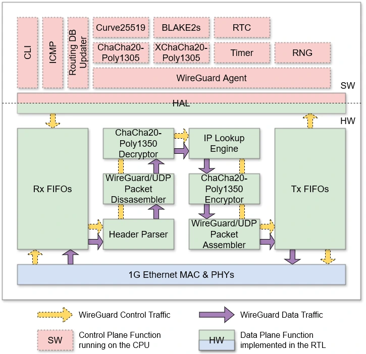
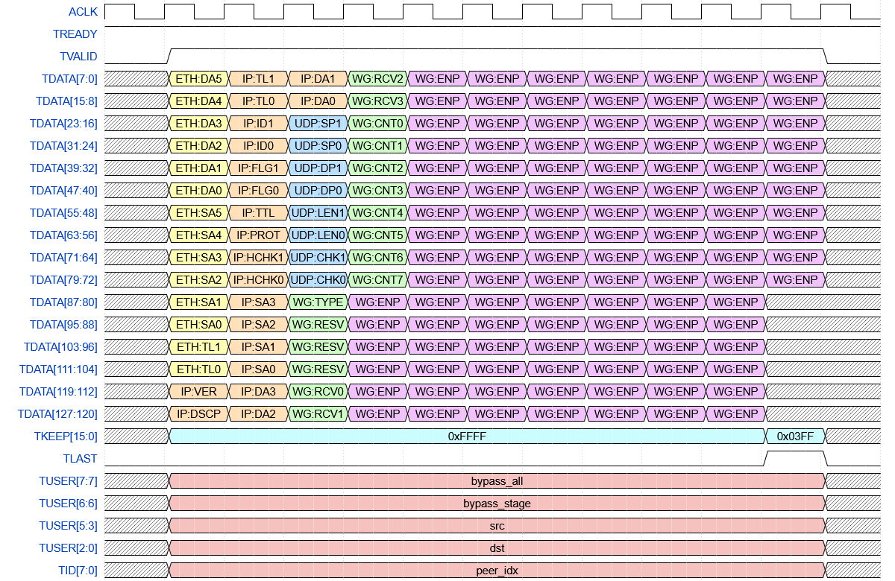
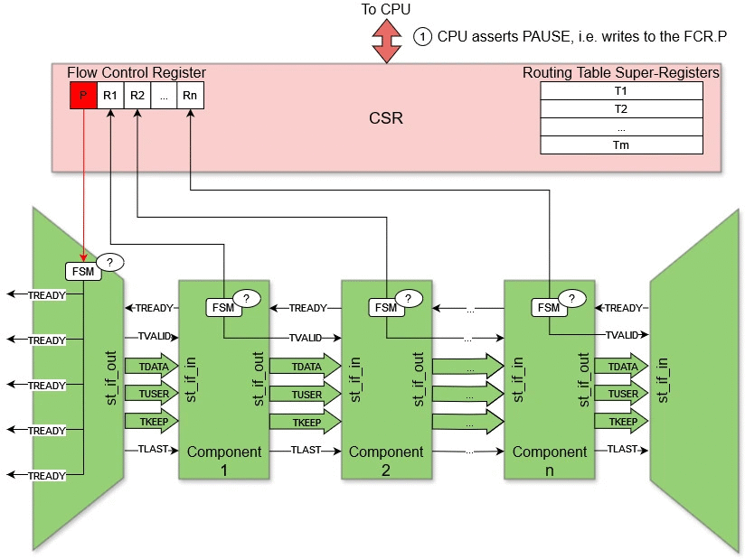
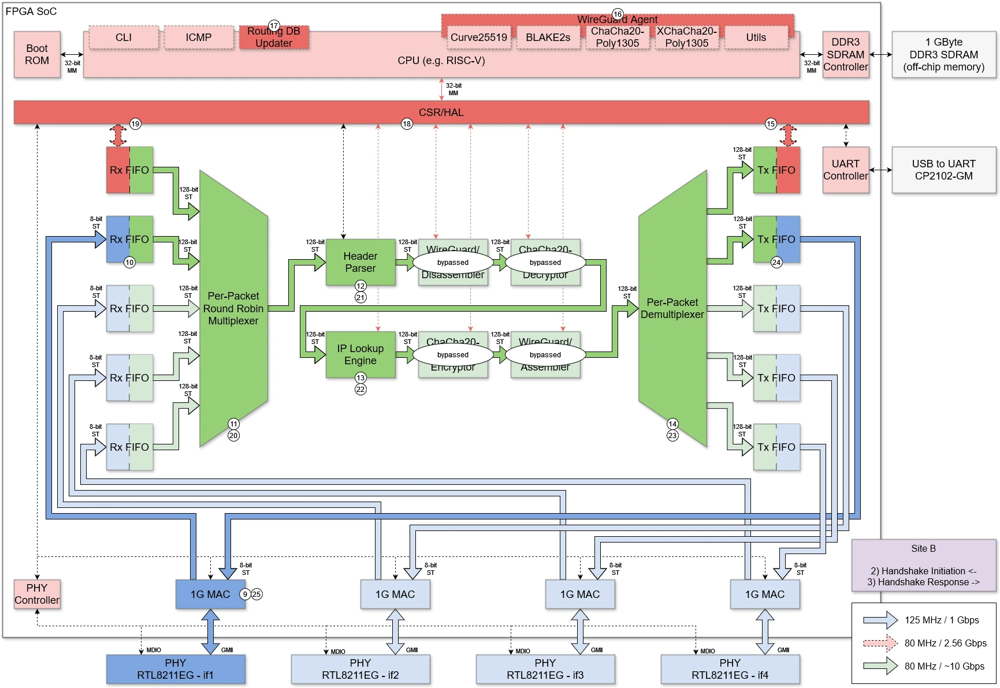
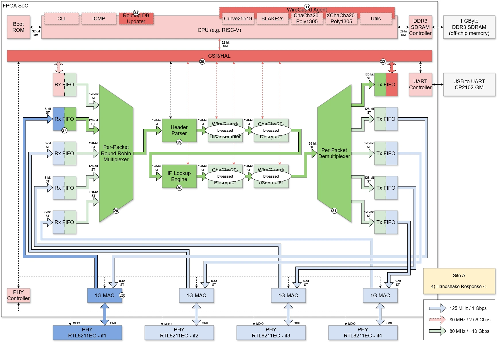

# Wireguard FPGA
Virtual Private Networks (VPNs) are the central and indispensable component of Internet security. They comprise a set of technologies that connect geographically dispersed, heterogeneous networks through encrypted tunnels, creating the impression of a homogenous private network on the public shared physical medium. 
<p align="center">
  
</p>
With traditional solutions (such as OpenVPN / IPSec) starting to run out of steam, Wireguard is increasingly coming to the forefront as a modern, secure data tunneling and encryption method, one that's also easier to manage than the incumbents. Both software and hardware implementations of Wireguard already exist. However, the software performance is far below the speed of wire. Existing hardware approaches are both prohibitively expensive and based on proprietary, closed-source IP blocks and tools.<br> 

- The intent of this project is to bridge these gaps with an FPGA open-source implementation of Wireguard, written in SystemVerilog HDL.

## A Glimpse into History 
We have contributed to the **Blackwire** project, which is a 100Gbps hardware implementation of Wireguard switch based on AMD/Xilinx-proprietary AlveoU50 PC-accelerator card (SmartNIC form-factor), and implementable only with proprietary Vivado toolchain. 

While working on the _Blackwire_, we have touched multiple sections, and focused on the novel algorithm for [_Balanced Binary Tree Search_](0.doc/Wireguard/Scalable-Balanced-Pipelined-IPv6-Lookup.pdf) of IP tables. However, the _Blackwire_ hardware platform is expensive and priced out of reach of most educational institutions. Its gateware is written in SpinalHDL, a nice and powerfull but a niche HDL, which has not taken roots in the industry. While _Blackwire_ is now released to open-source, that decision came from their financial hardship -- It was originaly meant for sale. Moreover, the company behind it is subject to disputes and obligations that bring into question the legality of ownership over the codebase they "donated" to the open source community. 

## Back to the Future
To make the hardware Wireguard truly accessible in the genuine spirit of open-source movement, this project implements it:
-	for an [inexpensive hardware platform](https://www.alinx.com/en/detail/611) with four 1000Base-T ports
-	in a self-sufficient way, i.e. w/o requiring PC host
-	using a commodity Artix7 FPGA
-	which is supported by open-source tools  
-	and with all gateware written in the ubiquitous Verilog / System Verilog

<p align="center">
  
  
</p>

## References

**[Ref1]** Wireguard implementations in software:
>- [Netbird](https://github.com/netbirdio/netbird)
>- [Tailscale](https://tailscale.com/blog/more-throughput)
>- [Linux Kernel](https://thenewstack.io/wireguard-vpn-protocol-coming-to-a-linux-kernel-near-you)
  
**[Ref2]** 100Gbps [_Blackwire_](https://github.com/brightai-nl/BrightAI-Blackwire) Wireguard 
  
**[Ref3]** [Corundum](https://github.com/corundum/corundum), open-source FPGA-NIC platform 
  
**[Ref4]** [ChaCha20-Poly1305](https://github.com/mrdcvlsc/ChaCha20-Poly1305) open-source Crypto RTL 
  
**[Ref5]** Cookie Cutter [SOC](https://github.com/chili-chips-ba/openXC7-TetriSaraj)

**[Ref6]** [RISC-V ISS](https://github.com/wyvernSemi/riscV/tree/main/iss)

**[Ref7]** [10Gbps Ethernet Switch](https://github.com/ZipCPU/eth10g)
  
**[Ref8]** [OpenXC7](https://github.com/openXC7) open-source tools for Xilinx Series7

# Project Outline

## Scope
The Phase1 (This!) is primarily **Proof of Concept**, i.e. not full-featured, and definitely not a deployable product. It is envisoned as a mere on-ramp, a springboard for future build-up and optimizations.

The Phase2 continuation project is therefore also in the plans, to maximize efficiency and overall useability, such as by increasing the number of channels, facilitating management with GUI apps, or something else as identified by the community feedback.

## Recognized Challenges 
1) HW/SW partitioning, interface, interactions and workload distribution
> - While, contrary to _Blackwire_, we don’t rely on an external PC connected via PCIE, we will still have an on-chip RISC-V CPU with intricate hardware interface and significant Embedded Software component that controls the backbone of wire-speed datapath

2) HW/SW co-development, integration and debugging
> - Standard simulation is impractical for the project of this size and complexity. We therefore intend to put to test and good use the very promissing new [VProc ISS](https://www.linkedin.com/posts/simon-southwell-7684482_riscv-iss-embeddedsoftware-activity-7217116220754411520-08xZ?utm_source=share&utm_medium=member_desktop) [Ref6]
> - It’s also impractical and expensive to provide full test systems with real traffic generators and checkers to all developers. We therefore plan to rent some space for a central lab that will host two test systems, then provide remote access to all developers
3)	Real-life, at-speed testing
4)	Extent of open-source tools support for SystemVerilog and all needed FPGA primitives and IP functions
5)	QOR of the (still maturing) open-source tools
> - _Blackwire_ used commercial, AMD/Xilinx-proprietary Vivado toolchain, as well as high-end Alveo U50 FPGA silicon. Even then, they ran into multiple timing closure, utilization and routing congestion challenges.
6) Financial resources
> - Given that this is a complex, multi-disciplinary dev effort, the available funding may not be sufficient to bring it to completion. _Blackwire_, despite a larger allocated budget, ended up with funding crisis and abrupt cessation of dev activities.

# Project Execution Plan / Tracking

This project is WIP at the moment. The checkmarks below indicate our status. Until all checkmarks are in place, anything you get from here is w/o guaranty -- Use at own risk, as you see fit, and don't blame us if it is not working 🌤️

## Take1
**Board bring up. In-depth review of Wireguard ecosystem and prior art. Design Blueprint**

While the board we're using is low cost, it is also not particularly known in the open-source community. We certainly don’t have prior experience with it. In this opening take we will build a solid foundation for efficient project execution. Good preparation is crucial for a smooth run. We thus seek to first _`understand and document what we will be designing: SOC Architecture, Datapath Microarchitecture, Hardware/Software Partitioning, DV and Validation Strategy`_. 

Getting a good feel for our Fmax is also a goal of this take. Artix-7 does not support High-Performance (HP) I/O. Consequently, we cannot push its I/O beyond 600MHz, nor its core logic beyond 100 MHz. 

- [ ] Familiarization with HW platform
- Create our first FPGA program that blinks LEDs
- Verify pinouts and connectivity using simple test routines
- Generate a few Ethernet test patterns 

- [ ] Familiarization with SW platform
- Initial bring up of embedded CPU within a _cookie-cutter_ SOC, such as [Ref5]
- Design and test a simple SW interface to rudimentary HW Ethernet datapath

- [x] Detailed analysis and comparisons of:
- Wireguard [White Papers](https://www.ndss-symposium.org/wp-content/uploads/2017/09/ndss2017_04A-3_Donenfeld_paper.pdf)
- existing implementations in software [Ref1]
- vs. _Blackwire_ hardware implementation [Ref2]
- [cryptographic algorithms](https://eprint.iacr.org/2018/080.pdf) used for Wireguard, esp. **ChaCha20** for encryption, **Poly1305** for authentication [Ref4] and, to a lesser extent, _Curve25519_ for key exchange and _blake2_ for hashing
  
- [x] Identification and assimilation of prior art and building IP blocks, in particular **Corundum** [Ref3] and, to a lesser extent, _10GE Switch_ [Ref7] 

- [x] Architecture/uArch Design. HW/SW Partitioning. Verification Plan

- [x] Creation of sufficient initial documentation for project divide-and-conquer across a multi-disciplinary team of half a dozen developers

## Take2
**Implementation of a basic, statically pre-configured Wireguard link**

It it in this take that we start creating hardware Datapath and hardening Wireguard encryption protocols, all using Vivado and Xilinx primitives.

- [ ] Integration of collected RTL blocks into a coherent HW system that implements the basic Wireguard datapath for a handful of manually pre-configured channels.
- Corundum FPGA-based NIC and platform for opensource Ethernet development [Ref3]
-	IP Core for **ChaCha20-Poly1305** [Ref4] -- Definitely in hardware from the get-go
> - https://github.com/Goshik92/FpgaCha
> - https://github.com/secworks/ChaCha20-Poly1305
- _Curve25519_ module for key exchange -- Likely in software at this point
> - https://github.com/kazkojima/x25519-fpga
- _blake2_ module for hashing -- Likely in software at this point
> - https://github.com/secworks/blake2
- [ ] Timing closure. Resolution of FPGA device utilization and routing congestion issues
- [ ] Creation of cocoTB DV in the CI/CD environmenT, and representative test cases for datapath simulation

## Take3
**Development and integration of embedded management software (Control Plane)**

This work package is about hardware/software codesign and integration. The firmware will run on a soft RISC V processor, inside the FPGA. Our vanilla SOC is at this point starting to be customized to Wireguard needs. This work can to some extent go on in parallel with hardware activities of Take2. 

- [ ]	SW design for the embedded on-chip processor
- Code is to be written in the bare-metal C with, as necessary, few sections in Assembly
- SW is responsible for configuration and management of hardware blocks
- SW must not participate in the bulk datapath transfers
- SW may however intercept the low-frequency management packets
- For quick bring up, the IP Address Search (using novel balanced binary tree algorithm) may initially be hosted in software, then ported to hardware at a later point
- SW will also cover KMM function -- Key Management Module

- [ ] HW/SW Integration

## Take4
**VPN Tunnel: Session initialization, maintenance, and secure closure**

This is about managing the bring-up, maintenance and tear-down of VPN tunnels between two devices.
- [ ] Session Initialization: Starting the handshake process to establish secure communication with another device
- [ ] Session Maintenance: Keeping the session active through the regular exchange of control messages, which allows detection and recovery from problems such as connection interruptions
- [ ] Session Closure: Securely close the VPN tunnel when communication is no longer needed, ensuring that all temporary keys and sensitive data are deleted

## Take5
**Testing, Profiling and Porting to OpenXC7**

- [ ] Functional testing on the real system. Does it work as intended? Bug fixes

- [ ] Performance testing. HW/SW profiling, updates and enhancements to ensure the design indeed operates at close to the wire speed on all preconfigured channels

- [ ] Porting to openXC7 [Ref8] using [SV2V](https://github.com/zachjs/sv2v), in the GoCD CI/CD setting 
> This is challenging, as openXC7 has thus far been crashing for NES SV

- [ ] Timing closure with openXC7
> This is definitely challenging, given that openXC7 is currently without accurate timing-driven STA

- [ ] Filing bug tickets with open source developers for issues found in their tools, supporting them all the way to the resolution
      
- [x] Creation and maintenance of an attractive and well-documented Github repo, to entice community interest
      
- [ ] Ongoing documentation updates and CI/CD script maintenance to keep it valid in the light of inevitable design mutations compared to the original Design Blueprint.

## Take6 (time-permitting Bonus)
**Flow control module for efficient and stable VPN tunnel data management**

The objective of this optional deliverable is to ensure stable and efficient links, thus taking this project one step closer to a deployable product.

- [ ] Develop software components for management of data flow within VPN tunnels

# Design Blueprint (WIP)
[//]: 

## HW/SW Partitioning
Since the Wireguard node essentially functions as an IP router with Wireguard protocol support, we have decided to design the system according to a two-layer architecture: a control plane responsible for managing IP routing processes and executing the Wireguard protocol (managing remote peers, sessions, and keys), and a data plane that will perform IP routing and cryptography processes at wire speed. The control plane will be implemented as software running on a soft CPU, while the data plane will be fully realized in RTL on an FPGA.



In the HW/SW partitioning diagram, we can observe two types of network traffic: control traffic, which originates from the control plane and goes toward the external network (and vice versa), and data traffic, which arrives from the external network and, after processing in the data plane, returns to the external network. Specifically, control traffic represents Wireguard protocol handshake messages, while data traffic consists of end-user traffic, either encrypted or in plaintext, depending on the perspective.

## Hardware Architecture
### HW Block Diagram


### HW Theory of Operation
The hardware architecture essentially follows the HW/SW partitioning and consists of two domains: a soft CPU for the control plane and RTL for the data plane.

The soft CPU is equipped with a Boot ROM and a DDR3 SDRAM controller for interfacing with off-chip memory. External memory is exclusively used for control plane processes and does not store packets. The connection between the control and data planes is established through a CSR-based HAL.

The data plane consists of several IP cores, which are listed and explained in the direction of network traffic propagation:
- _PHY Controller_ - initial configuration of Realtek PHYs and monitoring link activity (link up/down events)
- _1G MAC_ - execution of the 1G Ethernet protocol (framing, flow control, FCS, etc.)
- _Rx FIFOs_ - clock domain crossing, bus width conversion, and store & forward packet handling
- _Per-Packet Round Robin Multiplexer_ - servicing Rx FIFOs on a per-packet basis using a round-robin algorithm
- _Header Parser_ - extraction of Wireguard-related information from packet headers (IP addresses, UDP ports, Wireguard message type, peer ID, etc.)
- _Wireguard/UDP Packet Disassembler_ - decapsulation of the payload from the Wireguard data packet for decryption of tunneled traffic
- _ChaCha20-Poly1305 Decryptor_ - decryption and authentication of tunneled traffic
- _IP Lookup Engine_ - routing/forwarding table lookup, mapping packets to the appropriate Wireguard peer, and making packet accept/reject decisions
- _ChaCha20-Poly1305 Encryptor_ - encryption and authentication of traffic to be tunneled
- _Wireguard/UDP Packet Assembler_ - encapsulation of the encrypted packet into a Wireguard data packet for tunneling to the remote peer
- _Per-Packet Demultiplexer_ - forwarding packets to Tx FIFOs based on packet type and destination
- _Tx FIFOs_ - clock domain crossing, bus width conversion, and store & forward packet handling

_ChaCha20-Poly1305 Encryptor/Decryptor_ are using [RFC7539's](https://datatracker.ietf.org/doc/html/rfc7539) AEAD (Authenticated Encryption Authenticated Data) construction based on [ChaCha20](http://cr.yp.to/chacha.html) for symmetric encryption and [Poly1305](http://cr.yp.to/mac.html) for authentication.

## Software Architecture
### SW Conceptual Class Diagram


### SW Theory of Operation
The conceptual class diagram provides an overview of the components in the software part of the system without delving into implementation details. The focus is on the Wireguard Agent, which implements the protocol's handshake procedures, along with the following supplementary components:
- [Curve25519](http://cr.yp.to/ecdh.html) - an ECDH algorithm implementation for establishing a shared secret using a public-private key pair between two remote parties connected via an insecure channel, such as the Internet
- ChaCha20-Poly1305 - an AEAD algorithm implementation for encryption and authentication of static keys and nonce values to prevent replay attacks
- XChaCha20-Poly1305 - a XAEAD algorithm implementation for encrypting and authenticating nonce values in Cookie Replay messages to mitigate potential DoS attacks
- [BLAKE2s](https://www.blake2.net) - an implementation of the BLAKE2s hash function for MAC authentication and keyed hashing, per [RFC7693](https://datatracker.ietf.org/doc/html/rfc7693)
- RNG - a random number generator used to initialize the DH key generator and generate peer identifiers
- Timer - timers for rekey, retry, and keepalive procedures
- [HKDF](https://eprint.iacr.org/2010/264) - an implementation of the algorithm for expanding the ECDH result
- RTC - a real-time clock used to generate the TAI64N timestamp
- [SipHash](https://en.wikipedia.org/wiki/SipHash) - a simple non-cryptographic function used for implementing a hashtable for fast lookup of decrypted static public keys of remote peers
- Routing DB Updater - a subsystem for maintaining the cryptokey routing table content and deploying it to the data plane via the HAL/CSR interface
- ICMP - implementing basic ICMP protocol functions (echo request/reply, TTL exceeded, etc.)
- CLI - a USB/UART-based command-line interface for configuring the Wireguard node (setting the local IP address, remote peer IP addresses, network addresses, keys, etc.)
- HAL/CSR Driver - a CSR-based abstraction for data plane components with an interface for reading/writing the corresponding registers

## Hardware Data Flow
### HW Flow Chart, Throughputs and Pushbacks
The hardware architecture features three clock signal domains:
- 125 MHz domain with an 8-bit bus for interfacing data plane with 1G MAC cores (marked in blue)
- 80 MHz domain with a 32-bit bus for interfacing data plane with the CPU (marked in red)
- 80 MHz domain with a 128-bit bus for the packet transfer through the data plane pipeline (marked in green)

The blue domain is defined based on the SDR GMII interface, which operates at 125 MHz and connects the Realtek PHY controller with the MAC cores on the FPGA.

The red domain encompasses the entire CSR with all peripherals. The clock signal frequency and bus width are defined based on the assumption that Wireguard peers exchange handshake messages sporadically—during connection initialization and periodically, typically every few minutes, for key rotation. Since handshake signaling does not significantly impact network traffic, we decided to implement the connection between the data and control planes without DMA, utilizing direct CPU interaction with Tx/Rx FIFOs through a CSR interface.

Although the Data Plane Engine (green domain) transfers packets at approximately 10 Gbps, the cores in the DPE pipeline are not expected to process packets at such a rate. Given that we have 4 x 1Gbps Ethernet interfaces, the cryptographic cores must process packets at a rate of at least 4 Gbps to ensure the system works at wire speed. For some components, such as the _IP Lookup Engine_, packet rate is more critical than data rate because their processing focuses on the packet headers rather than the payload. Assuming that, in the worst-case scenario, the smallest packets (64 bytes) arrive via the 1 Gbps Ethernet interface, the packet rate for each Ethernet interface would be 1,488,096 packets per second (pps). Therefore, in the worst-case scenario, such components must process packets at approximately 6 Mpps rate (e.g. 6 million IP table lookups per second).


The cores within the DPE transmit packets via the AXI4-Stream interface. Although data transfer on the TDATA bus is organized as little-endian, it is important to note that the internal organization of fields within the headers of Ethernet, IP, and UDP protocols follows big-endian format (also known as network byte order). On the other hand, the fields within the headers of the WireGuard protocol are transmitted in little-endian format.



## Software Control Flow

### SW Flow Chart, Messages and HW Intercepts

During the initial WireGuard handshake and subsequent periodic key rotations,  the control plane must update the cryptokey routing table implemented in register memory within the CSR. Since the CSR manages the operation of the DPE, such changes must be made atomically to prevent unpredictable behavior in the DPE.
One way to achieve this is by using [write-buffered registers](https://peakrdl-regblock.readthedocs.io/en/latest/udps/write_buffering.html) (WBR). However, implementing 1 bit of WBR  memory requires three flip-flops: one to store the current value, one to hold the future value, and one for the write-enable signal. Therefore, we consider an alternative mechanism for atomic CSR updates based on flow control between the CPU and the DPE. Suppose the CPU needs to update the contents of a routing table implemented using many registers. Before starting the update, the CPU must pause packet processing within the DPE. However, such a pause cannot be implemented using the inherent stall mechanism supported by the AXI protocol (by deactivating the TREADY signal at the end of the pipeline), as a packet that has already entered the DPE must be processed according to the rules in effect at the time of its entry. We introduce a graceful flow control mechanism coordinated through a dedicated Flow Control Register (FCR) to address this.


The atomic CSR update mechanism works as follows:
1. When the CPU needs to update the routing table, it activates the PAUSE signal by writing to the FCR.P register.
2. The active FCR.P signal instructs the input multiplexer to transition into the PAUSED state after completing the servicing of the current queue. The CPU periodically checks the ready bits in the FCR register.
3. Once the first component finishes processing its packet and clears its datapath, it deactivates the TVALID signal and transitions to the IDLE state. The CPU continues to check the ready bits in the FCR register.
4. The processing of remaining packets and datapath clearing continues until all components transition to the IDLE state. The CPU monitors the ready bits in the FCR register, which now indicates that the DPE has been successfully paused.
5. The CPU updates the necessary registers (e.g., the routing table) over multiple cycles.
6. Upon completing the updates, the CPU deactivates the PAUSE signal (FCR.P).
7. The multiplexer returns to its default operation mode and begins accepting packets from the next queue in a round-robin fashion.
8. As packets start arriving, all components within the DPE gradually transition back to their active states.



## HW/SW Working Together as a Coherent System
The example is based on a capture of real Wireguard traffic, recorded and decoded using the Wireshark tool ([encrypted](https://gitlab.com/wireshark/wireshark/-/blob/master/test/captures/wireguard-ping-tcp.pcap) and [decrypted](https://gitlab.com/wireshark/wireshark/-/blob/master/test/captures/wireguard-ping-tcp-dsb.pcapng)). The experimental topology consists of four nodes:
- 10.10.0.2 - the end-user host at site A
- 10.9.0.1 - Wireguard peer A
- 10.9.0.2 - Wireguard peer B
- 10.10.0.1 - the end-user host at site B


To illustrate the operation of the system as a whole, we will follow the step-by-step passage of packets through the system in several phases:
- Sending a Handshake Initiation from peer A
- Receiving the Handshake Initiation on peer B and sending a Handshake Response back to peer A
- Receiving the Handshake Response on peer A
- Encryption and tunneling of the ICMP Echo Request packet (from host A to host B via peer A)
- Detunneling and decryption of the ICMP Echo Request packet (from host A to host B via peer B)


1. The WireGuard Agent on peer A initiates the establishment of the VPN tunnel by generating the contents of the _Handshake Initiation_ packet.
2. The CPU transfers the _Handshake Initiation_ packet from RAM to the Rx FIFO via the CSR interface towards the data plane.
3. Once the entire packet is stored in the Rx FIFO, the Round Robin Multiplexer services the packet from the FIFO and injects it into the data plane pipeline.
4. In the first three cycles of the packet transfer, the Header Parser extracts important information from the packet header (including the destination IP address and type of WireGuard message) and supplements the extracted metadata to the packet before passing it along. Now, knowing the message type (_Handshake Initiation_), the WireGuard/UDP Packet Disassembler and ChaCha20-Poly1305 Decryptor forward the packet without any further processing.
5. The IP Lookup Engine searches the routing table based on the destination IP address and determines the outgoing Ethernet interface, supplementing this information to the packet before forwarding it. Similar to the previous step, the WireGuard/UDP Packet Assembler and ChaCha20-Poly1305 Encryptor forward the packet without any additional processing.
6. Based on the accompanying metadata, the Demultiplexer directs the packet to the corresponding Tx FIFO (to _if1_).
7. Once the entire packet is stored in the Tx FIFO, it is dispatched to the MAC core of the outgoing interface _if1_, provided that the corresponding 1 Gbps link is active and ready.
8. The 1G MAC writes its MAC address as the source address, calculates the FCS on the fly, adds it to the end of the Ethernet frame, and sends it to peer B.



9. On peer B, the 1G MAC receives the incoming Ethernet frame and calculates the FCS on the fly. If the frame is valid, it is forwarded to the Rx FIFO (from _if1_).
10. Once the entire packet is stored, the Rx FIFO signals the Round-Robin Multiplexer.
11. The Round-Robin Multiplexer services the packet from the FIFO and injects it into the data plane pipeline.
12. The Header Parser extracts important information from the packet header (including the destination IP address and type of WireGuard message) and supplements the extracted metadata to the packet before passing it along. Now, knowing the message type (_Handshake Initiation_), the WireGuard/UDP Packet Disassembler and ChaCha20-Poly1305 Decryptor forward the packet without any further processing.
13. The IP Lookup Engine searches the routing table based on the destination IP address and determines that the control plane is the destination, supplementing this information to the packet before forwarding it. Similar to the previous step, the WireGuard/UDP Packet Assembler and ChaCha20-Poly1305 Encryptor forward the packet without any additional processing.
14. Based on the accompanying metadata, the Demultiplexer directs the packet to the corresponding Tx FIFO (toward the CPU).
15. Once the entire packet is stored in the Tx FIFO, the CPU transfers the packet from the FIFO to RAM via the CSR-based interface and hands it over to the WireGuard Agent for further processing.
16. The WireGuard Agent processes the _Handshake Initiation_ request and generates the _Handshake Response_.
17. The Routing DB Updater updates the routing table per the WireGuard Agent's instructions (adding the peer's IP address and WireGuard-related data).
18. The CPU updates the registers from which the data plane reads the routing table and the corresponding cryptographic keys via the CSR interface.
19. The CPU transfers the _Handshake Response_ packet from RAM to the Rx FIFO (to the data plane) via the CSR interface.
20. The Round-Robin Multiplexer services the packet from the FIFO and injects it into the data plane pipeline.
21. The Header Parser extracts important information from the packet header (including the destination IP address and type of WireGuard message) and supplements the extracted metadata to the packet before passing it along. Now, knowing the message type (_Handshake Response_), the WireGuard/UDP Packet Disassembler and ChaCha20-Poly1305 Decryptor forward the packet without any further processing.
22. The IP Lookup Engine searches the routing table based on the destination IP address and determines the outgoing Ethernet interface, supplementing this information to the packet before forwarding it. Similar to the previous step, the WireGuard/UDP Packet Assembler and ChaCha20-Poly1305 Encryptor forward the packet without any additional processing.
23. Based on the accompanying metadata, the Demultiplexer directs the packet to the corresponding Tx FIFO (toward _if1_).
24. Once the entire packet is stored in the Tx FIFO, it is dispatched to the MAC core of the outgoing interface _if1_, provided that the corresponding 1 Gbps link is active and ready.
25. The 1G MAC writes its MAC address as the source address, calculates the FCS on the fly, adds it to the end of the Ethernet frame, and sends it to peer A.



26. On peer A, the 1G MAC receives the incoming Ethernet frame and calculates the FCS on the fly. If the frame is valid, it is forwarded to the Rx FIFO (from _if1_).
27. Once the entire packet is stored, the Rx FIFO signals the Roung-Robin Multiplexer.
28. The Round-Robin Multiplexer services the packet from the FIFO and injects it into the data plane pipeline.
29. The Header Parser extracts important information from the packet header (including the destination IP address and type of WireGuard message) and supplements the extracted metadata to the packet before passing it along. Now, knowing the message type (_Handshake Response_), the WireGuard/UDP Packet Disassembler and ChaCha20-Poly1305 Decryptor forward the packet without any further processing.
30. The IP Lookup Engine searches the routing table based on the destination IP address and determines that the control plane is the destination, supplementing this information to the packet before forwarding it. Similar to the previous step, the WireGuard/UDP Packet Assembler and ChaCha20-Poly1305 Encryptor forward the packet without any additional processing.
31. Based on the accompanying metadata, the Demultiplexer directs the packet to the corresponding Tx FIFO (toward the CPU).
32. Once the entire packet is stored in the Tx FIFO, the CPU transfers the packet from the FIFO to RAM via the CSR-based interface and hands it over to the WireGuard Agent for further processing.
33. The WireGuard Agent processes the _Handshake Response_.
34. The Routing DB Updater updates the routing table per the WireGuard Agent's instructions (adding the peer's IP address and WireGuard-related data).
35. The CPU updates the registers from which the data plane reads the routing table and the corresponding cryptographic keys. The session is now officially established, and the exchange of user data over the encrypted VPN tunnel can commence.


36. On peer A, an end-user packet (_ICMP Echo Request_) arrives via the _if2_ Ethernet interface. The 1G MAC receives the incoming Ethernet frame and calculates the FCS on the fly. If the frame is valid, it is forwarded to the Rx FIFO (from _if2_).
37. Once the entire packet is stored, the Rx FIFO signals the Round-Robin Multiplexer.
38. The Round-Robin Multiplexer services the packet from the FIFO and injects it into the data plane pipeline.
39. The Header Parser extracts important information from the packet header (including the destination IP address and protocol type) and supplements the extracted metadata to the packet before passing it along. Now, knowing the protocol type (ICMP), the WireGuard/UDP Packet Disassembler and ChaCha20-Poly1305 Decryptor forward the packet without any further processing.
40. The IP Lookup Engine searches the routing table based on the destination IP address and determines the target WireGuard peer and the outgoing Ethernet interface, supplementing this information to the packet before forwarding it.
41. Based on the information about the target peer and the corresponding key, the ChaCha20-Poly1305 Encryptor encrypts the packet and adds an authentication tag.
42. The WireGuard/UDP Packet Assembler adds WireGuard, UDP, IP, and Ethernet headers filled with the appropriate data to the encrypted packet and forwards it.
43. Based on the accompanying metadata, the Demultiplexer directs the packet to the corresponding Tx FIFO (toward _if1_).
44. Once the entire packet is stored in the Tx FIFO, it is sent to the MAC core of the outgoing interface _if1_, provided that the corresponding 1 Gbps link is active and ready.
45. The 1G MAC writes its MAC address as the source, calculates the FCS on the fly, which it ultimately appends to the end of the Ethernet frame, and then sends it to peer B.


46. On peer B, the 1G MAC receives the incoming Ethernet frame and calculates the FCS on the fly. If the frame is valid, it is forwarded to the Rx FIFO (from _if1_).
47. Once the entire packet is stored, the Rx FIFO signals the Round-Robin Multiplexer.
48. The Round-Robin Multiplexer services the packet from the FIFO and injects it into the data plane pipeline.
49. The Header Parser extracts important information from the packet header (including source/destination IP addresses and the type of WireGuard message) and supplements the extracted metadata to the packet before passing it along.
50. Based on the destination IP address, the WireGuard/UDP Packet Disassembler knows that the packet is intended for this peer, extracting the encrypted payload and forwarding it for further processing.
51. The ChaCha20-Poly1305 Decryptor decrypts the packet and, after verifying the authentication tag, forwards it further.
52. The IP Lookup Engine now receives the decrypted plaintext user packet (_ICMP Echo Request_). After searching the cryptokey routing table based on the source IP address of the decrypted plaintext packet, a decision is made to accept or reject the packet. If the packet correspondingly routes, it is forwarded.
53. Based on the accompanying metadata, the Demultiplexer directs the packet to the corresponding Tx FIFO (toward _if2_).
54. Once the entire packet is stored in the Tx FIFO, it is sent to the MAC core of the outgoing interface _if2_, provided that the corresponding 1 Gbps link is active and ready.
55. The 1G MAC writes its MAC address as the source, calculates the FCS on the fly, which it ultimately appends to the end of the Ethernet frame, and then sends it to the end-user host of peer B.

## Simulation Test Bench
#### References:
- [VProc](https://github.com/wyvernSemi/vproc)
- [mem_model](https://github.com/wyvernSemi/mem_model)
- [TCP/IP Packet Generator](https://github.com/wyvernSemi/tcpIpPg)
- [riscV and ISS](https://github.com/wyvernSemi/riscV)
- [Surfer](https://gitlab.com/surfer-project/surfer)
- [Verilator](https://verilator.org/guide/latest/install.html)
- [SystemRDL](https://www.accellera.org/downloads/standards/systemrdl)

The WireGuard test bench aims to have a flexible approach to simulation which allows a common test envoironment to be used whilst selecting between alternative CPU components, one of which uses the VProc virtual processor co-simulation element. This allows simulations to be fully HDL, with a RISC-V processor RTL implementation such as picoRV32 or EDUBOS5, or to co-simulate software using the virtual processor, with a significant speed up in simulation times.

The VProc component is wrapped up into an <tt>soc_cpu.VPROC</tt> component with identical interfaces to the RTL. Some converion logic is added to this BFM to convert between VProc's generic memory mapped interface and the <tt>soc_if</tt> defined interface. This is very lightweight logic, with less than ten combinatorial gates to match the control signals. In addition, the <tt>soc_cpu.VPROC</tt> component has a <tt>mem_model</tt> component instantiated. This is a 'memory port' to the <tt>mem_model</tt> C software implementation of a sparse memory model, allowing updates to the RISC-V program, if using the rv32 RISC-V ISS model (see below). The diagram below shows a block diagram of the test bench HDL.

<p align="center">

</p>

Shown in the diagram is the WireGuard top level component (<tt>top</tt>) with the <tt>soc_cpu.VPROC</tt> component instantiated in it as one of three possible selected devices for the soc_cpu. The IMEM write port is connected to the UART for program updates and the <tt>soc_if</tt> from  <tt>soc_cpu.VPROC</tt> is connected to the interconnect fabric (<tt>soc_fabric</tt>), just as for the two RTL components. The test bench around the top level WireGuard component has a driver for the UART (<tt>bfm_uart</tt>) and the four GMII interfaces (includeing MDIO signalling) come from the WireGuard core to some verification IP to drive this signalling. This VIP implementation is **TBD**, but might be based on a modified tcpIpPg model, which is only XGMII compliant at this time. Finally the test bench generates clocks and key press resets that go to the top level's <tt>clk_rst_gen</tt> and <tt>debounce</tt> components.

#### Auto-selection of soc_cpu Component

The WireGuard's top level component has the required RTL files listed in <tt>1.hw/top.filelist</tt>. This includes files for the soc_cpu, under the directory <tt>ip.cpu</tt>. The simulation build make file (see below) will process the <tt>top.filelist</tt> file to generate a new local copy, having removed all references to the files under the <tt>ip.cpu</tt> directory. Since the VProc <tt>soc_cpu</tt> component is a test model, the <tt>soc_cpu.VPROC.sv</tt> HDL file is placed in <tt>4.sim/models</tt> whilst the rest of the HDL files come from the VProc and mem_model repositories (auto-checked out by the make file, if necessary). These are referenced within the make file, along with the other test models that are used in the test bench. Thus the VProc device is selected for the simulation as the CPU component.

#### VProc Software

The VProc software consists of DPI-C code for communication and sycnronisation with the simulation, for both the memory model and VProc itself. On top of this are the APIs for VProc and mem_model for use by the running code. In the case of VProc there is a low level C API or, if preferred, a C++ API. In WireGuard, the VProc <tt>soc_cpu</tt> is node 0, and so the entry point for user software is <tt>VUserMain0</tt>, in place of <tt>main</tt>.

The C++ API is defined in a class <tt>VProc</tt> (defined in <tt>VProcClass.h</tt>) from the VProc repository, and a constructor creates an API object, defining the node for which is connected:

```
VProc (const unsigned node);
```

For the C++ VProc API there are two basic word access methods:

```
    int  write (const unsigned   addr, const unsigned    data, const int delta=0);
    int  read  (const unsigned   addr,       unsigned   *data, const int delta=0);
```

For these methods, the address argument is agnostic to being a byte address or a word address, but for the WireGuard implementation these are **byte addresses**. The delta argument is unused in WireGuard, and should be left at its default value, with just the address and data arguments used in the call to these methods. Along with these basic methods is a method to advance simulation time without doing a read or write transaction.

```
int  tick (const unsigned ticks);
```
This method's units of the <tt>ticks</tt> argument are in clock cycles, as per the clock that the VProc HDL is connected to. A basic VProc program, then, is shown below:

```
#include "VProcClass.h"
extern "C" {
#include "mem.h"
}

static const int node    = 0;

extern "C" void VUserMain0(void)
{   
    // Create VProc access object for this node
    VProc* vp0 = new VProc(node);
    
    // Wait a bit
    vp0->tick(100);
    
    uint32_t addr  = 0x10001000;
    uint32_t wdata = 0x900dc0de;
    
    vp0->write(addr, wdata);
    VPrint("Written   0x%08x  to  addr 0x%08x\n", wdata, addr);
    
    vp0->tick(3);
    
    uint32_t rdata;
    vp0->read(addr, &rdata);
    
    if (rdata == wdata)
    {
        VPrint("Read back 0x%08x from addr 0x%08x\n", rdata, addr);
    }
    else
    {   VPrint("***ERROR: data mis-match at addr = 0x%08x. Got 0x%08x, expected 0x%08x\n", addr, rdata, wdata);
    }

    // Sleep forever
    while(true)
        vp0->tick(GO_TO_SLEEP);
}
```
The above code is a slightly abbreviated version of the code in <tt>4.sim/usercode</tt>. Note that the <tt>VUserMain0</tt> function must have C linkage as the VProc software that calls it is in C (as all the programming logic interfaces, including DPI-C, are C). The API also has a set of other methods for finer access control which are listed below, and more details can be found in the [VProc manual](https://github.com/wyvernSemi/vproc/blob/master/doc/VProc.pdf).

```
    int  writeByte    (const unsigned   byteaddr, const unsigned    data, const int delta=0);
    int  writeHword   (const unsigned   byteaddr, const unsigned    data, const int delta=0);
    int  writeWord    (const unsigned   byteaddr, const unsigned    data, const int delta=0);
    int  readByte     (const unsigned   byteaddr,       unsigned   *data, const int delta=0);
    int  readHword    (const unsigned   byteaddr,       unsigned   *data, const int delta=0);
    int  readWord     (const unsigned   byteaddr,       unsigned   *data, const int delta=0);

```
The other methods is this class are not, at this point, used by WireGuard. These methods can now be used to write test code to drive the <tt>soc_if</tt> bus of the <tt>soc_cpu</tt> component, and is the basic method to write test code software. As well as the VProc API, the user software can have direct access to the sparse memory model API by including <tt>mem.h</tt>, which are a set of C methods (and <tt>mem.h</tt> must be included as <tt>extern "C"</tt> in C++ code). The functions relevant to WireGuard are shown below:

```
void     WriteRamByte  (const uint64_t addr, const uint32_t data, const uint32_t node);
void     WriteRamHWord (const uint64_t addr, const uint32_t data, const int little_endian, const uint32_t node);
void     WriteRamWord  (const uint64_t addr, const uint32_t data, const int little_endian, const uint32_t node);
uint32_t ReadRamByte   (const uint64_t addr, const uint32_t node);
uint32_t ReadRamHWord  (const uint64_t addr, const int little_endian, const uint32_t node);
uint32_t ReadRamWord   (const uint64_t addr, const int little_endian, const uint32_t node);
```
 
Note that, as C functions, there are no default parameters and the <tt>little_endian</tt> and <tt>node</tt> arguments must be passed in, even though they are constant. The <tt>little_endian</tt> argument is non-zero for little endian and zero for big endian. The <tt>node</tt> argument is **not** the same as for VProc, but allows multiple separate memory spaces to be modelled, just as for VProc multiple virtual processor instantiations. For WireGuard, this is always 0. All instantiated <tt>mem_model</tt> components in the HDL have (through the DPI) access to the same memory space model as the API, and so data can be exchanged from the simulation and the running code, such as the RISC-V programs over the IMEM write interface. 
 
Compiling co-designed application code, either compiled for the native host machine, or to run on the <tt>rv32</tt> RISC-V ISS will need further layers on top of these APIs, which will be virtualised away by that point (see the sections below). The diagram below summarises the software layers that make up a program running on the VProc HDL component. The "native test code" use case, shown at the top left, is for the case just described above  that use the APIs directly.

<p align="center">

</p>

#### Other Software Use Cases

##### Natively Compiled Application

As well as the native test code case seen in the previous section, the WireGuard application can be compiled natively for the host machine, including the hardware access layer (HAL), generated from SystemRDL. The HAL software output from this is processed to generate a version that makes accesses to the VProc and mem_model APIs in place of accesses with pointers to and from memory (see the *Co-simulation HAL* section below). The rest of the application software has these details hidden away in the HAL and sees the same API as presented by the auto-generated code. In both cases transactions happen on the <tt>soc_if bus</tt> port of the <tt>soc_cpu</tt> component. The <tt>main</tt> entry point is also swapped for <tt>VUserMain0</tt>.

##### RISC-V Compiled Application

To execute RISC-V compiled application code, the <tt>rv32</tt> instruction set simulator is used as the code running on the virtual processor. The <tt>VUserMain0</tt> program now becomes software to creates an iss object and integrate with VProc. This uses the ISS's external memory access callback function to direct loads and stores either towards the sparse memory model, the VProc API for simulation transactions, or back to the ISS itself to handle. This ISS integration <tt>VUserMain0</tt> program is located in <tt>4.sim/models/rv32/usercode</tt>. When built the code here is compiled and uses the pre-built library in <tt>4.sim/models/rv32/lib/librv32lnx.a</tt> containing the ISS, with the headers for it in <tt>4.sim/models/rv32/include</tt> .

The ISS supports interrupts, but these are not currently used on WireGuard. The integration software can read a configuration file, if present in the <tt>4.sim/</tt> directory, called <tt>vusermain.cfg</tt>. This allows the ISS and other features to be configured at run-time. The configuration file is in lieu of command line options and the entries in the file are formatted as if they were such, with a command matching the VUserMain program:

```
vusermain0 [options]
```
One of the options is <tt>-h</tt> for a help message, which is as shown below:
```
Usage:vusermain0 -t <test executable> [-hHebdrgxXRcI][-n <num instructions>]
      [-S <start addr>][-A <brk addr>][-D <debug o/p filename>][-p <port num>]
      [-l <line bytes>][-w <ways>][-s <sets>][-j <imem base addr>][-J <imem top addr>]
      [-P <cycles>][-x <base addr>][-X <top addr>][-V <core>]
   -t specify test executable (default test.exe)
   -n specify number of instructions to run (default 0, i.e. run until unimp)
   -d Enable disassemble mode (default off)
   -r Enable run-time disassemble mode (default off. Overridden by -d)
   -C Use cycle count for internal mtime timer (default real-time)
   -a display ABI register names when disassembling (default x names)
   -T Use external memory mapped timer model (default internal)
   -H Halt on unimplemented instructions (default trap)
   -e Halt on ecall instruction (default trap)
   -E Halt on ebreak instruction (default trap)
   -b Halt at a specific address (default off)
   -A Specify halt address if -b active (default 0x00000040)
   -D Specify file for debug output (default stdout)
   -R Dump x0 to x31 on exit (default no dump)
   -c Dump CSR registers on exit (default no dump)
   -g Enable remote gdb mode (default disabled)
   -p Specify remote GDB port number (default 49152)
   -S Specify start address (default 0)
   -I Enable instruction cache timing model (default disabled)
   -l Specify number of bytes in icache line (default 8)
   -w Specify number of ways in icache (default 2)
   -s Specify number of sets in icache (default 256)
   -j Specify cached IMEM base address (default 0x00000000)
   -J Specify cached IMEM top address (default 0x7fffffff)
   -P Specify penalty, in cycles, of one slow mem access (default 4)
   -x Specify base address of external access region (default 0xFFFFFFFF)
   -X Specify top address of external access region (default 0xFFFFFFFF)
   -V Specify RISC-V core timing model to use (default "DEFAULT")
   -h display this help message
```
With these options the model can load an elf executable to memory directly and be set up with some execution termination conditions. Disassembly output can also be switched on and registers dumped on exit. More details of all these features can be found in the <tt>rv32</tt> [ISS manual](https://github.com/wyvernSemi/riscV/blob/main/iss/doc/iss_manual.pdf).

Specific to the WireGuard project is the ability to specify the region where memory loads and stores will make external simulation transactions rather than use internal memory modelling or peripherals, using the <tt>-x</tt> and <tt>-X</tt> options. This is useful to allow access to the CSR registers in the HDL whilst mapping all of the memory internal using the sparse C memory model of <tt>mem_model</tt>. The cache model can be enabled with the <tt>-I</tt> option and the cache configured. The <tt>-l</tt> option specifies the number of bytes in a cache line, which can be 4, 8 or 16. The number of ways is set with <tt>-w</tt> and can be either 1 or 2, and the number of sets is specified with the <tt>-s</tt> options and can be 128, 256, 512 or 1024. A set of pre-configured timing models can be specified with the <tt>-V</tt> option. The argument must be one of the following:

* DEFAULT
* PICORV32
* EDUBOS5STG2
* EDUBOS5STG3
* IBEXMULSGL
* IBEXMULFAST
* IBEXMULSLOW

This reflects the available models as detailed in the _Configuring ISS timing model_ section below.

#### Building and Running Code (**Work in Progress**)

A <tt>MakefileVProc.mk</tt> file is provided in the <tt>4.sim/</tt> directory to compile the user *VProc* software and to build and run the test bench HDL. The make file will compile all the user code or, where an ISS build is selected (see make file variables below), the provided user code that's the rv32 ISS integration software. The user software is compiled into a local static library, <tt>libuser.a</tt> which is linked to the simulation code within Verilator along with the precompiled <tt>libcosimlnx.a</tt> (or <tt>libcosimwin.a</tt> for MSYS2/mingw64) in <tt>4.sim/models/cosim/lib</tt>, containing the precompiled code for *VProc* and *mem_model*. The headers for the *VProc* and *mem_model* API software are in <tt>4.sim/models/cosim/include</tt>. The HDL for these models is in <tt>4.sim/models/cosim</tt>, and the make file picks these up from there to compile with the rest of the test bench HDL.

The make file has a target <tt>help</tt>, which produces the following output:

```
make -f MakefileVProc.mk help          Display this message
make -f MakefileVProc.mk               Build C/C++ and HDL code without running simulation
make -f MakefileVProc.mk run           Build and run batch simulation
make -f MakefileVProc.mk rungui/gui    Build and run GUI simulation
make -f MakefileVProc.mk clean         clean previous build artefacts

Command line configurable variables:
  USER_C:       list of user source code files (default VUserMain0.cpp)
  USRCODEDIR:   directory containing user source code (default $(CURDIR)/usercode)
  OPTFLAG:      Optimisation flag for user VProc code (default -g)
  TIMINGOPT:    Verilator timing flags (default --timing)
  TRACEOPTS:    Verilator trace flags (default --trace-fst --trace-structs)
  TOPFILELIST:  RTL file list name (default top.filelist)
  SOCCPUMATCH:  string to match for soc_cpu filtering in h/w file list (default ip.cpu)
  USRSIMOPTS:   additional Verilator flags, such as setting generics (default blank)
  WAVESAVEFILE: name of .gtkw file to use when displaying waveforms (default waves.gtkw)
  BUILD:        Select build type from DEFAULT or ISS (default DEFAULT)
  TIMEOUTUS:    Test bench timeout period in microseconds (default 15000)
```

By default, without a named target, the simulation executable will be built but not run. With a <tt>run</tt> target, the simulation executable is built and then executed. To fire up waveforms after the run, a target of <tt>rungui</tt> or </tt>gui</tt> can be used. A target of <tt>clean</tt> removes all intermediate files.

The make file has a set of variables (with default settings) that can be overridden on running <tt>make</tt>. E.g. <tt>make VAR=NewVal</tt>. The help output shows these variables with brief decriptions. Entries with multiple values should be enclosed in double quotes. By default native test code is built, but if <tt>BUILD</tt> is set to <tt>ISS</tt>, then the rv32 ISS and VProc program is compiled and, in this case, the <tt>USER_C</tt> and <tt>USRCODEDIR</tt> are ignored as the makfiles compiles the supplied source code for the ISS. 

The user code variable allow different (and multiple) file names from the default, and to change the location of where the user code is located (if not the ISS build). This allows different programs to be run by simply changing these variable, and to organise the different source code in different directories etc. By default, the VProc code is compiled for debugging (<tt>-g</tt>), but this can be overridden by changing <tt>OPTFLAG</tt>. The trace and timing options can also be overridden to allow a faster executable. The WireGuard <tt>top.filelist</tt> filename can be overridden to allow multiple configurations to be selected from, if required. The processing of this file to remove the listed <tt>soc_cpu</tt> HDL files is selected on a pattern (<tt>ip.cpu</tt>) but this can be changed using <tt>SOCCPUMATCH</tt>. If any additional options for Verilator are required, then these can be added to <tt>USRSIMOPTS</tt>. The GTKWave waveform file can be selected with <tt>WAVESAVEFILE</tt>.

Control of when the simulation exits can be specified with the <tt>TIMEOUTUS</tt> variable in units of microseconds.

##### Configuring ISS timing model

Configuration of the timing model can done from the supplied integration code in <tt>VUserMain0.cpp</tt>. The main <tt>pre_run_setup()</tt> function, in <tt>VUserMain0.cpp</tt>, creates an <tt>rv32_timing_config</tt> object (<tt>rv32_time_cfg</tt>) which has an <tt>update_timing</tt> method that takes a pointer to the iss object and an enumerated type to select the model to use for the particular core timings required. This second argument is selected from one of the following:

* <tt>rv32_timing_config::risc_v_core_e::DEFAULT&nbsp;&nbsp;&nbsp;&nbsp;&nbsp;</tt> : Default timing values
* <tt>rv32_timing_config::risc_v_core_e::PICORV32&nbsp;&nbsp;&nbsp;&nbsp;</tt> : picoRV32 timings
* <tt>rv32_timing_config::risc_v_core_e::EDUBOS5STG2&nbsp;</tt> : 2 stage eduBOS5
* <tt>rv32_timing_config::risc_v_core_e::EDUBOS5STG3&nbsp;</tt> : 3 stage eduBOS5
* <tt>rv32_timing_config::risc_v_core_e::IBEXMULSGL&nbsp;&nbsp;</tt> : IBEX single cycle multipler
* <tt>rv32_timing_config::risc_v_core_e::IBEXMULFAST&nbsp;</tt> : IBEX fast multi-cycle multiplier
* <tt>rv32_timing_config::risc_v_core_e::IBEXMULSLOW&nbsp;</tt> : IBEX slow multi-cycle multiplier

As detailed in the _RISC-V Compiled Application_ section above, the ISS can be configured via the <tt>vusermain.cfg</tt> file using the <tt>-V</tt> option.

##### Running ISS code

When the test bench is built for the rv32 ISS, the actual 'user' application code is run on the RISC-V ISS model itself, and is compiled using the normal RISC-V GNU toochain to produce a binary file that the ISS can load and run. As described above, the code that is run is slected with the </tt>vusermain.cfg</tt> file and the </tt>-t</tt> option. The various flags configure the ISS and determines when the ISS is halted (if at all). An example assembly file is provided in <tt>4.sw/models/rv32/riscvtest/main.s</tt> (as well as a recompiled <tt>main.bin</tt>). This assembly code reproduces the functionality of the example <tt>VuserMain0.cpp</tt> program discussed previously, writing to memory, reading back and comparing for a mismatch. The example assembly code is compiled with:

```
$riscv64-unknown-elf-as.exe -fpic -march=rv32imafdc -aghlms=main.list -o main.o main.s
$riscv64-unknown-elf-ld.exe main.o -Ttext 0 -Tdata 1000 -melf32lriscv -o main.bin
```
In this instance, the code is set to compile to use the MAFDC extensions (maths, atomic, float, double and compressed). To run this code the <tt>vusermain.cfg</tt> is set to:

```
vusermain0 -x 0x10000000 -X 0x20000000 -rEHRca -t ./models/rv32/riscvtest/main.bin
```
This sets the address region that will be sent to the HDL <tt>soc_cpu</tt> bus to be between byte addresses 0x10000000 and 0x1FFFFFFF. All other accesses will use the direct memory model's API, with no simulation transactions. The next set of options turn on run-time disassembly (<tt>-r</tt>), exit on <tt>ebreak</tt> (<tt>-E</tt>) or unimplemented instruction (<tt>-H</tt>), dump registers (<tt>-R</tt>) and CSR register (<tt>-c</tt>) and display the registers in ABI format (<tt>-a</tt>). The pre-compiled example program binary is then selected with the <tt>-t</tt> option. Of course, many of these options are not necessary and, for example, the output flags (<tt>-rRca</tt>) can be removed and the program will still run correctly. In the <tt>4.sim/</tt> directory, using <tt>make</tt> to build and run the code gives the following output:

```
$make -f MakefileVProc.mk BUILD=ISS run
- V e r i l a t i o n   R e p o r t: Verilator 5.024 2024-04-05 rev v5.024-42-gc561fe8ba
- Verilator: Built from 2.145 MB sources in 40 modules, into 0.556 MB in 20 C++ files needing 0.001 MB
- Verilator: Walltime 0.298 s (elab=0.020, cvt=0.087, bld=0.000); cpu 0.000 s on 1 threads; alloced 14.059 MB
Archive ar -rcs Vtb__ALL.a Vtb__ALL.o
VInit(0): initialising DPI-C interface
  VProc version 1.11.4. Copyright (c) 2004-2024 Simon Southwell.
                   0 TOP.tb.error_mon (0) - ERROR_CLEARED

  ******************************
  *   Wyvern Semiconductors    *
  * rv32 RISC-V ISS (on VProc) *
  *     Copyright (c) 2024     *
  ******************************

00000000: 0x00001197    auipc     gp, 0x00000001
00000004: 0x0101a183    lw        gp, 16(gp)
00000008: 0x0001a103    lw        sp, 0(gp)
0000000c: 0x10001237    lui       tp, 0x00010001
00000010: 0x00222023    sw        sp, 0(tp)
00000014: 0x00022283    lw        t0, 0(tp)
00000018: 0x00229663    bne       t0, sp, 12
0000001c: 0x00004505'   addi      a0, zero, 1
0000001e: 0x00004501'   addi      a0, zero, 0
00000020: 0x05d00893    addi      a7, zero, 93
00000024: 0x00009002'   ebreak   
    *

Register state:

  zero = 0x00000000   ra = 0x00000000   sp = 0x900dc0de   gp = 0x00001000 
    tp = 0x10001000   t0 = 0x900dc0de   t1 = 0x00000000   t2 = 0x00000000 
    s0 = 0x00000000   s1 = 0x00000000   a0 = 0x00000000   a1 = 0x00000000 
    a2 = 0x00000000   a3 = 0x00000000   a4 = 0x00000000   a5 = 0x00000000 
    a6 = 0x00000000   a7 = 0x0000005d   s2 = 0x00000000   s3 = 0x00000000 
    s4 = 0x00000000   s5 = 0x00000000   s6 = 0x00000000   s7 = 0x00000000 
    s8 = 0x00000000   s9 = 0x00000000  s10 = 0x00000000  s11 = 0x00000000 
    t3 = 0x00000000   t4 = 0x00000000   t5 = 0x00000000   t6 = 0x00000000 
  
CSR state:

  mstatus    = 0x00003800
  mie        = 0x00000000
  mvtec      = 0x00000000
  mscratch   = 0x00000000
  mepc       = 0x00000000
  mcause     = 0x00000000
  mtval      = 0x00000000
  mip        = 0x00000000
  mcycle     = 0x0000000000000037
  minstret   = 0x000000000000000b
  mtime      = 0x0006263f2bfc6bcf
  mtimecmp   = 0xffffffffffffffff
Exited running ./models/rv32/riscvtest/main.bin
- /mnt/hgfs/winhome/simon/git/wireguard-fpga/4.sim/tb.sv:44: Verilog $finish
```
Note that the disassembled output is a mixture of 32-bit and compressed 16-bit instructions, with the compressed instruction hexadecimal values shown followed by a <tt>'</tt> character and the instruction heximadecimal value in the lower 16-bits. Unlike for the native compiled code use cases, unless the HDL has changed, the test bench does not need to be re-built when the RISC-V source code is changed or a different binary is to be run, just the RISC-V code is re-compiled or the <tt>vusermain.cfg</tt> updated to point to a different binary file.

#### Debugging Code

In each of the three usage cases of software, each can be debugged using <tt>gdb</tt>, either for the host computer or the gnu RISC-V toolchain's gdb.

##### Natively Compiled code

For natively compiled code, whether test code or natively compiled application code, so long as each was compiled with the -g flag set (see above for make file options) then the Verilator compiled simulation is an executable file (compiled into an <tt>output/</tt> directory) that contains the all the compiled user code. Therefore, to debug using <tt>gdb</tt>, this executable just needs to be run with the host computer's <tt>gdb</tt>. E.g., from the <tt>4.sim/</tt> directory:

```
gdb output/Vtb
```

Debugging then proceeds just as for any other executable.

##### ISS Software
The ISS has a remote <tt>gdb</tt> interface (enable with the <tt>-g</tt> option in the <tt>vusermain.cfg</tt> file) allowing the loading of programs via this connection, and of doing all the normal debugging steps of the RISC-V code. The [ISS manual](https://github.com/wyvernSemi/riscV/blob/main/iss/doc/iss_manual.pdf) details how to use the <tt>gdb</tt> remote debug interface but, to summarise, when the ISS is run in GDB mode, it will create a TCP socket and advertise the port number to the screen (e.g. <tt>RV32GDB: Using TCP port number: 49152</tt>). The RISC-V <tt>gdb</tt> is then run and a remote connection is made with a command:

 ```
 (gdb) target remote :49152
 ```

A blank before the colon character in the port number indicates the connection is on the local host, but a remote host name can be used to do remote debugging from another machine on the network, or even over the internet, if sufficient access permissions. The program (if not done so by other means) can be loaded over this connection and then debugging commence as normal.

The [ISS manual](https://github.com/wyvernSemi/riscV/blob/main/iss/doc/iss_manual.pdf) has more details on this and also has an appendix showing how to setup an Eclipse IDE project to debug the code via <tt>gdb</tt>.

## Co-simulation HAL

The WireGuard control and status register harware abstraction layer (HAL) software is auto-generated, as is the CSR RTL, using `peakrdl`. For co-simulation purposes an additional layer is auto-generated from the same SystemRDL specification using `systemrdl-compiler` that accompanies the `peakrdl` tools. This produces two header files that define a common API to the application layer for both the RISC-V platform and the *VProc* based co-simulation verification environment. The platform targetted header uses the `peakrdl c-header` output directly and unmodified. The `peakrdl` output is produced using the following command:

```
    peakrdl c-header csr_cosim.rdl -b ltoh -o csr.h
```

The `csr_cosim.hdl` is a filtered version of `3.build/csr_build/csr.rdl` that removes buffer write commands that are not understood by `systemrdl-compiler` and are not used for `c-header` generation. Other than that, the RDL is identical.

The wrapper HAL headers are generated with a Python script `sysrdl_cosim.py` which has some command line options:

```
usage: sysrdl_cosim.py [-h] [-r RDLFILE] [-o OUTFILE] [-c] [-v VPNODE] [-d DELAY]

Process command line options.

options:
  -h, --help            show this help message and exit
  -r RDLFILE, --rdl_file RDLFILE
                        Specify the RDL file for processing
  -o OUTFILE, --output_file OUTFILE
                        Specify an ouput header file
  -c, --cosim           Generate cosim header
  -v VPNODE, --vp_node VPNODE
                        Specify VProc node number for soc_cpu (cosim only)
  -d DELAY, --delay_range DELAY
                        Specify maximum delay between transactions (cosim only)

```

The main options used are to specify the RDL file (`-r` or `--rd_file`) and to specify the output file (`-o` or `-output_file`). To select generation of the co-simulation header the `-c` or `--cosim` option is used, otherwise the hardware header is generated. By default the co-simulation header assumes it is running on a *VProc* node numbered 0, matching the current WireGuard test bench. However, this can be changed by using the `-v` or `--vp_node` option, should the need arise. Code running on a *VProc* virtual processor runs infinitely fast with respect to simulation time when not doing a read or write transaction to the logic. In order to emulate processing time, after each read or write access, a random delay is inserted to advance the simulation a number of ticks. The maximum number of ticks can be specified using the `-d` or `--delay_range` option meaning the delay can range from 0 to `DELAY` clock cycles. The default for this is 32 clock cycles. The `-v` and `-d` options have no affect if the `-c` option is not used.

To generate all the required HAL headers a make file is provided as `3.build/MakefileCosim` to wrap app the script calls. Running this make file (`make -f MakefileCosim`) produces the following files in `3.build/csr_build/generated-files`:

  * `csr_cosim.rdl` : The intermediate filtered RDL specification
  * `csr.h`         : The `peakrdl c-header` output file used by the target header
  * `csr_hw.h`      : The HAL for the RISC-V hardware target (and for the *rv32* ISS), which uses `csr.h`
  * `csr_cosim.h`   : The HAL for the *VProc* based WireGuard logic simulation test bench

The `csr_hw.h` and `csr_cosim.h` files present the same API to the application and can be appropriately selected at compile time using something like the following:

```
ifdef VPROC
#include "csr_cosim.h"
#else
#include "csr_hw.h"
#endif
```
This might more usefully be placed in a common header, such as `wireguard_csr.h` to hide the selection from the application, and the `VPROC` definition will be defined when compiling for the *VProc* test beanch, with the default being to compile for the target hardware.

### Using the HAL

The HAL provides a hierarchical access to the registers via a set of pointer dereferencing and a final access method (for reads and writes of registers and their bit fields) that reflects the hierarchy of the RDL specification. The following shows some example accesses, based on the `3.build/csr_build/csr.rdl` (as at its first revision on 10/11/2024):

```
    // Create a CSR register object. A base address can be specified
    // but defaults to the address specified in RDL
    csr_vp_t* csr = new csr_vp_t();

    // Write to address field and read back.
    csr->ip_lookup_engine->table[0]->allowed_ip[0]->address(0x12345678);
    printf("address = 0x%08lx\n\n", csr->ip_lookup_engine->table[0]->allowed_ip[0]->address());
    
    // Write to whole endpoint register
    csr->ip_lookup_engine->table[3]->endpoint->full(0x5555555555555555ULL);
    
    // Write to bit field in endpoint register
    csr->ip_lookup_engine->table[3]->endpoint->interface(0x7);
    
    // Read back bit field in endpoint register
    printf("interface = 0x%1lx\n\n", csr->ip_lookup_engine->table[3]->endpoint->interface());
```
The above code will compile either natively for *VProc* or for the RISC-V hardware, with the appropriate header, as decribed above. Write accesses use a method with the final register bit field name with an appropriate argument (this is either a `uint64_t` or `uint32_t` as appropriate to the register's definition). A read access is done in the same manner bit without an argument and returns a value (either a `uint64_t` or `uint32_t` as appropriate).

A convention has been used where to access a whole register the 'bit field' access method is named `full`, with bit field accesses using their declared names, as normal. Some assumptions have been made with the script as it stands based on the current `csr.rdl` (but new features can be added). The main one currently is that arrays can't be multi-dimensional (hierarchy can be used to achieve the same thing) and an error is thrown if detected.

### Other Co-simulation considerations

The HAL software abstracts away the details of hardware and co-simulation register accesses but a couple of other consideration are needed to allow code to compile both for hardware and simulation. The first of these is the `main` entry point.

A normal application compiled for the target has a `main()` entry point function. In *VProc* co-simulation, this is not the case as the logic simulation itself has a `main()` function already defined and there can be multiple *VProc* node instantiations, each with their own entry point. These are named `VUserMain<n>`, where `<n>` is the node number. So, node 0 has an entry point function `VUserMain0`. Application code, to compile for both environments, must take care of this:

```
#ifdef VPROC
#  ifdef __cplusplus
#    define WGMAIN  extern "C" VUserMain0
#  else
#    define WGMAIN  VUserMain0
#  endif
#else
#  define WGMAIN  main
#endif

// Application top level
WGMAIN (void)
{
  // Top level source code here
}
```
As for the header selection, the compile option definition selection can be abstracted away into a common header (perhaps the same one).

The second consideration is the use of delay functions. This can be in the form of standard C functions, such as `usleep`, or application specific functions using instruction loops. In either case, these should be wrapped in a commonly named function&mdash;e.g., `wg_usleep(int time)`. The wrapper delay library function will then need to have `VPROC` selected code to either call the application specific target delay function, or to convert the specified time to clock cycles and call the *VProc* API function `VTick` (or its c++ API equivalent) to advance simulation time the appropriate amount.

## Lab Test and Validation Setup
TODO

## Shared Linux Server with tools
**WIP**

### Tool Versions
#### Simulation
* _Verilator_ **v5.024**
* _VProc_ **v1.12.2**
* _Mem Model_ **v1.0.0**
* _rv32_ ISS **v1.1.4**

Note: the test bench make file (`4.sim/MakefileVProc.mk`) will check out *VProc* and *mem_model* to the specified revisions when not already present. The *rv32* ISS has a pre-compiled library and associated headers already present in the `4.sim/models/rv32` directory at the specified version.

## Build process
### Hardware
TODO
### Software
TODO

## CPU Live debug and reload
TODO

## Closing Notes
TODO

### Acknowledgements
We are grateful to NLnet Foundation for their sponsorship of this development activity.

<p align="center">
   
   
</p>

### Public posts:
- [LinkedIn-2024-09-19](https://www.linkedin.com/posts/chili-chips_fpga-cpu-ethernet-activity-7242729037771522048-as-C?utm_source=share&utm_medium=member_desktop)
- [Linkedin-2024-10-27](https://www.linkedin.com/posts/simon-southwell-7684482_riscv-iss-embeddedsoftware-activity-7256311551178027008-1nlZ?utm_source=share&utm_medium=member_desktop)

#### End of Document
